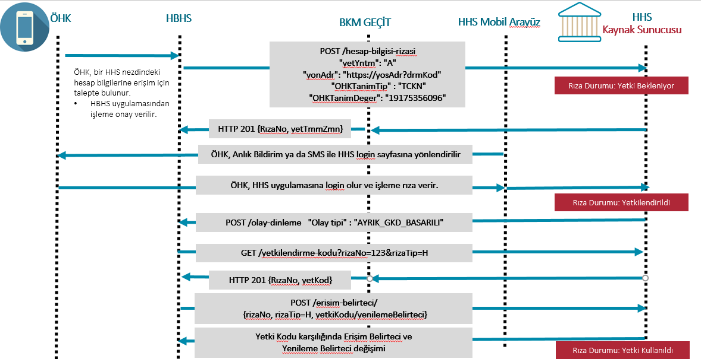

# 5.	Güçlü Kimlik Doğrulama  
Müşteri için güçlü kimlik doğrulama, ÖHK’nın (müşterinin) kimliğinin doğrulamada kullanılan ve bir bileşenin ele geçirilmesinin diğer bileşenin güvenliğini tehlikeye atmayacağı en az iki bileşenden oluşan, bu iki bileşenin de müşterinin “bildiği”, “sahip olduğu” veya “biyometrik bir karakteristiği olan” bileşen sınıflarından farklı ikisine ait olacak şekilde seçildiği yöntemi tanımlar.  

Ödeme ve Elektronik Para Kuruluşlarının Bilgi Sistemleri ile Ödeme Hizmeti Sağlayıcılarının Ödeme Hizmetleri Alanındaki Veri Paylaşım Servislerine İlişkin Tebliğ uyarınca hesap bilgisi hizmetinde müşterinin onayının alınması esnasında ve ödeme emri başlatma hizmetinde her bir ödeme emri başlatma işleminde **HHS tarafından müşteriye güçlü kimlik doğrulama (GKD) uygulanması esastır.** Buna göre:  

1.	Hesap bilgisi hizmetinde ÖHK’nın onayının alınması esnasında **Tebliğin 26 ncı maddesinin 1 inci fıkrası uyarınca** HHS tarafından ÖHK’ya GKD uygulanır.
2.	Ödeme emri başlatma hizmetinde, **Tebliğin 26 ncı maddesinin 2 nci fıkrası uyarınca** HHS tarafından ÖHK’ya güçlü kimlik doğrulama uygulanır ve işlem doğrulama kodu ile ÖHK’nın onayı alınır.
3.	Ödeme emri başlatma hizmetinde, **Tebliğin 26 ncı maddesinin 3 nci fıkrası uyarınca** HHS tarafından ÖHK’ya güçlü kimlik doğrulama uygulanmasına ilişkin istisna veya ilave güvenlik önlemleri işbu API İlke ve Kuralları belgesinde tanımlanır.
4.	HHS, güçlü kimlik doğrulama sürecinde ÖHK’nin sahip olduğu bileşen sınıfı olarak SMS OTP ya da SMS ile işlem doğrulama kodu kullanabilir.
5.	HHS, aşağıdaki hallerde veya **Tebliğin 10 uncu maddesinin ikinci fıkrasında** belirtilen risk değerlendirmesi sonucuna göre tek bileşen ile kimlik doğrulama yapabilir.  

     - Ödemenin göndereni ve alıcısının aynı olması,
     - Daha önce tanımlanmış güvenli alıcılar listesine ödeme yapılması, 
     - ÖHK’nin talimatına istinaden gerçekleştirilen düzenli bir ödeme olması.
6.	Tek bileşen ile kimlik doğrulama yapılan bu işlemlerle ilgili olarak gerçekleştirilen işlemin müşteri tarafından yapıldığını ispat etme yükümlülüğü HHS’ye ait olur.
7.	İşlem Doğrulamada **Tebliğin 3 üncü maddesinin birinci fıkrası ğğ bendindeki** işlem bilgisi tanımına uygun olarak aşağıdaki bilgiler ile **Tebliğin 3 üncü maddesinin birinci fıkrası hh bendinde** tanımlanan işleme özel üretilmiş işlem doğrulama kodu birlikte kullanılır.  

     - **Alıcı Unvan (Kolas akışında maskeli olarak)** (ödeme emri başlatma hizmeti)
     - Tutar (ödeme emri başlatma hizmeti)
     - Referans bilgisi (8 karakterden küçük ise alanın tüm değeri, büyük ise ilk 4 ve son 4 hanesi)   

    İşleme ait yukarıdaki bilgilerden en az biri değiştiği zaman **Tebliğin 3 üncü maddesinin birinci fıkrası hh bendinde** belirtildiği gibi yeni bir işlem doğrulama kodu üretilecek şekilde akış kurgulanmalıdır.  

8.	İşlem doğrulama kodunun gönderilmesinden HHS sorumludur. HHS, **Tebliğin 10 uncu maddesinin ikinci fıkrasında** belirtilen risk değerlendirmesi sonucuna göre işlem doğrulama kodu kullanmaksızın ÖHK’nın onayını alabilir. İşlem doğrulama kodu kullanılmayan işlemlerle ilgili olarak gerçekleştirilen işlemin ÖHK tarafından yapıldığını ispat etme yükümlülüğü HHS’ye aittir.  

9.	ÖHVPS API İlke ve Kuralları kapsamında iki adet Güçlü Kimlik Doğrulama (GKD) yöntemi kullanılacaktır:   

     - Yönlendirmeli (Redirect) GKD Yöntemi 
     - Ayrık (Decoupled) GKD Yöntemi  

10.	HHS asgari olarak tarayıcı tabanlı Yönlendirmeli GKD yöntemini desteklemek zorundadır. Hem web hem mobil uygulama hizmeti bulunan katılımcılar için her iki uygulama özelinde de yönlendirme yapılması zorunludur. Web ya da mobil uygulamalardan sadece birinin olması durumunda ilgili uygulama özelinde yönlendirme yapılması zorunludur.

11.  HHS’nin mobil uygulamasının bulunması durumunda tarayıcı tabanlı yönlendirmenin yanında uygulama tabanlı yönlendirme yapması zorunludur. Uygulama sahiplerinin uygulama tabanlı yönlendirme için uyumlanma son tarihleri 1 Ekim 2023’tür.    


## 5.1.	Yönlendirmeli Güçlü Kimlik Doğrulama

Yönlendirmeli GKD Yönteminde, müşteri kimlik doğrulama için YÖS tarafından HHS arayüzüne yönlendirilir.   

Müşteri HHS’ye (app veya web arayüzü vasıtasıyla) yönlendirildikten sonra müşterinin güçlü kimlik doğrulaması adım adım ve doğrudan HHS ile müşteri arasında yürütülür. GKD’nin tamamlanmasından sonra müşteri tekrar YÖS uygulamasına yönlendirilir.  

Yönlendirmeli GKD Yöntemi için üst düzey örnek iş akışı aşağıdaki adımlardan oluşur: 

1.	YÖS, GKD için HHS tarafından tanımlanan arayüze (tarayıcı ya da uygulama) yönlendirme yapar.
2.	Müşteri, YÖS arayüzünden ayrılır, yönlendirildiği HHS arayüzü üzerinde kimlik doğrulama işlemlerini gerçekleştirir.
3.	GKD tamamlandıktan sonra müşteri, YÖS arayüzüne tekrar yönlendirilir ve işlem sonucu görüntülenir.

Yönlendirmeli GKD için temel gereklilikler şunlardır:  

- Ödeme hizmeti (hesap bilgisi veya ödeme emri başlatma hizmeti) tarayıcı ya da uygulama tabanlı bir şekilde sunulabilir. Bu nedenle, YÖS ve HHS’lerin Yönlendirmeli GKD için asgari olarak tarayıcı tabanlı yönlendirme akışını desteklemeleri gerekmektedir. Web ya da mobil uygulamalardan sadece birinin olması durumunda ilgili uygulama özelinde yönlendirme yapılması zorunludur.


**Tarayıcı Tabanlı Yönlendirme**  

Yönlendirmeli GKD Yönteminde; rıza isteğine başarılı yanıt alındıktan sonra, ÖHK, kimlik doğrulama için YÖS tarafından HHS arayüzüne yönlendirilir.
YÖS, yönlendirme akışını kendi sunucusundan karşılayacağı bir istek ile başlatmalıdır. YÖS web arayüzündeki bu yapı, 302 yanıt kodu ve yanıt başlığındaki Location değeri ile ÖHK tarayıcısını HHS adresine yönlendirmelidir. Bu sayede GKD, HHS tarafında başlayabilir.

YÖS tarafındaki yönlendirme servisi için örnek response;
```
HTTP/1.1 302 Found
Location: {{hhsYonAdr}}
```

ÖHK, HHS’ye (uygulama veya web arayüzü vasıtasıyla) yönlendirildikten sonra ÖHK'nin güçlü kimlik doğrulaması HHS ile ÖHK arasında yürütülür. GKD’nin tamamlanmasından sonra ÖHK tekrar YÖS uygulamasına yönlendirilir. 

HHS, yönlendirme akışını kendi sunucusundan karşılayacağı bir istek ile başlatmalıdır. HHS web/app arayüzündeki bu yapı, ÖHK'nin oturumunu güvenli bir şekilde kapatmalıdır. Ardından 302 yanıt kodu ve yanıt başlığındaki Location değeri ile ÖHK tarayıcısını YÖS adresine yönlendirmelidir.

```
HTTP/1.1 302 Found
Location: {{yosYonAdr}}&rizaDrm=Y&yetKod=xx&rizaNo=yy&rizaTip=O
```

HHS’nin web arayüzüne,   
- HHS’nin mobil uygulamasının olmadığı,  
- ÖHK’nın ödeme hizmetini (hesap bilgisi veya ödeme emri başlatma hizmeti) sunduğu mobil cihazda HHS uygulamasının yüklü olmadığı,  
durumlarda yönlendirme yapılır.  

YÖS’ün mobil uygulaması varsa mobil cihazda uygulamadan tarayıcıya, YÖS’ün mobil uygulaması yoksa ödeme hizmetinin sunduğu cihazda (Kişisel Bilgisayar veya Mobil Cihaz) tarayıcı üzerinden yönlendirme yapılır. 


**Uygulama Tabanlı Yönlendirme**  

ÖHK’nın ödeme hizmetini (hesap bilgisi veya ödeme emri başlatma hizmeti) YÖS’ün mobil uygulaması ile kullanıyorsa, aynı mobil cihazda HHS’nin mobil uygulamasının yüklenmiş olması durumunda, ÖHK doğrulamasının HHS mobil uygulaması tarafından yapılması için uygulama tabanlı yönlendirme yapılır. Böylece ÖHK, ödeme hizmetine erişim için HHS’nin mobil kanalına erişim sırasında kullandığı doğrulama yöntemini ile doğrulanabilir.  

**HHS'nin mobil uygulaması olması durumunda hhsYonAdr olarak universal link kullanması gerekmektedir.**

**Tablo 5: Yönlendirmeli Güçlü Kimlik Doğrulama Kanalları**  

|Doğrulama Yöntemi |YÖS Olası Ortam |HHS Olası Ortam |
| --- | --- | --- | 
| **Tarayıcı Tabanlı Yönlendirme** | Kişisel Bilgisayar (masaüstü, dizüstü)/Mobil Cihaz | Kişisel Bilgisayar (masaüstü, dizüstü) / Mobil Cihaz | 
| **Uygulama Tabanlı Yönlendirme** | Mobil Cihaz | Mobil Cihaz | 


## 5.2.	Ayrık Güçlü Kimlik Doğrulama 

Ayrık Güçlü Kimlik Doğrulama, bir kullanıcının kimliğinin, bir işlem başlatıldıktan sonra ayrı bir şekilde doğrulandığı yönteme verilen addır. Bu GKD modelinde, kimlik doğrulama işlem sürecinden "ayrıştırılmıştır". Kullanıcılar, başka bir arayüze yönlendirilmek yerine ( tarayıcı veya uygulama tabanlı yönlendirme gibi), ayrı bir kanal üzerinden (telefonlarında bir uygulama bildirimi gibi) işlemi doğrulamaları için bildirim alır.
Kullanıcı, işlemi tamamen ayrı bir cihaz veya uygulama kullanarak doğrulayabilir. 

İlk fazda Ayrık GKD'de QR’lı modeller kullanılmayacaktır.

Ayrık GKD uygulamalarının farklı örnekleri bulunmaktadır. Ancak yaygın olan yaklaşım, bir web arayüzü ve bir mobil uygulamanın kombinasyonunu kullanmayı içerir. 

**Mobil uygulaması bulunan HHS'ler için Ayrık GKD desteklenmesi zorunludur.** HHS’nin web olduğu durumda Ayrık GKD akışı uygulanmayacaktır. Mobil uygulaması bulunup müşteri özelinde mobil aktiflik kontrol süreci HHS inisiyatifindedir. Ayrık GKD sürecinde HHS tarafında sadece mobil uygulama üzerinden GKD yapılmalıdır. ÖHK’nın web uygulamasına yönlendirme yapmaması gerekmektedir.

YÖS rolünde Ayrık GKD akışının ÖHK’ya sorularak başlatılmasına gerek bulunmamakla beraber bu bilginin ÖHK’ya sorulması YÖS inisiyatifindedir. YÖS olarak, Ayrık GKD iş akışları kapsamında ÖHK’ya ayrık GKD öncesi HHS mobil uygulamasının varlığı sorularak (bildirim ayarlarının açık olması gerektiği bilgisi de verilebilir) ilerlenebilir. Aynı zamanda Ayrık GKD ile rıza sürecinin başlatılması zorunlu değildir. Rıza süreci başlatılırken yetkilendirme yöntemi YÖS inisiyatifindedir.

Örnek bir akış şu şekildedir:

1.	**İşlem Başlatma (YÖS Web/Mobil Arayüzü):** ÖHK bir işlemi YÖS’ün web/mobil arayüzünde başlatır. YÖS uygulaması, ÖHK'nın tekil bir kullanıcı kimliğini rızaya ekleyerek bir rıza başlatma işlemini HHS’ye iletir. HHS, tekil kullanıcı kimliğini kullanarak ÖHK'nın mobil uygulamasına bir bildirim gönderir.
2.	**Kimlik Doğrulama İsteği (HHS Mobil Uygulama):** ÖHK Mobil uygulama bildirimi alır ve mobil uygulama ÖHK'ya  kimlik doğrulama isteği sunar. HHS’nin BDDK tarafından belirlenmiş GKD yöntemlerine uygun davranması beklenmektedir.
3.	**Kimlik Doğrulama Onayı (HHS Mobil Uygulama):** Mobil uygulama, ÖHK’nın kimlik doğrulama girişimini doğrular. Başarılı olursa rıza onayı sonrası mobil uygulama, 'Ayrık Yetkilendirme Başarılı' olay bildirimini YÖS’e gönderir.
4.	**İşlem Onayı (YÖS Web/Mobil Arayüzü):** YÖS,  HHS'den gelen 'Ayrık Yetkilendirme Başarılı' olay bildirimine konu olan rızayı kullanarak yetkilendirme koduna erişir. Bundan sonraki süreç erişim belirteci alınması servisi ile devam eder. 

**Ayrık Güçlü Kimlik Doğrulamanın Olay Bildirim Servisleri ile olan Bağımlılıkları**

Ayrık GKD sürecinde; HHS'nin yetkilendirme kodunu YÖS'e iletmesi için gerekli önkoşul olan ÖHK doğrulaması adımının tamamlanmasını olay bildirimi ile YÖS'e yapması gerekmektedir.
Bu nedenle YÖS'lerin eğer Ayrık GKD sürecini destekleyecek ise;  /olay-dinleme endpointini açarak olay bildirimi alması zorunludur. 

Özetle:

**Yönlendirmeli GKD**

-	HHS mobil uygulaması olması durumunda yönlendirme adresi olarak universalLink kullanmalı.
-	Bu link tanımı  uygulama var ise uygulamayı aç yoksa webden devam et şeklinde olmalı.
-	YÖS’ün mobilden mi webden mi geldiği HHS açısından önemli değildir. HHS olarak YÖS hangi adresi yonAdr değerinde göndermiş ise yetkilendirme süreci bittiğinde o adrese yönlendirme yapılmalıdır.

**Ayrık GKD**

-	Mobil uygulaması bulunan HHS'ler için Ayrık GKD desteklenmesi zorunludur. HHS’nin web olduğu durumda Ayrık GKD akışı uygulanmayacaktır. Mobil uygulaması bulunup müşteri özelinde mobil aktiflik kontrol süreci HHS inisiyatifindedir. Ayrık GKD sürecinde HHS tarafında sadece mobil uygulama üzerinden GKD yapılmalıdır. ÖHK’nın web uygulamasına yönlendirme yapmaması gerekmektedir.
-	ÖHK’nin Mobil uygulamasının olmadığını tespit edebildiğiniz her durum için rıza oluşturma aşamasında “TR.OHVPS.Business.CustomerMobileApplicationNotFound” hatası döülür. 
-	HHS, ÖHK’nın mobil uygulamasının bulunmadığı bilgisine ulaşamazsa kendisinin belirleyeceği bildirim yöntemlerinden biri ile ÖHK’ye bilgilendirme yapar. Bildirim yöntemi SMS ise ÖHK’ya mobil uygulamasını açtıracak şekilde adres iletir, Web uygulamayı açtıracak bir link iletilmemelidir. ÖHK bu bildirimi dikkate almazsa/alamazsa veya ÖHK’da mobil uygulama yok ise bu durumda rıza süre aşımından iptal olur. 
-	ÖHK mevcut bankacılık işlemlerinde bildirimi nasıl gönderiyorsanız (Örneğin: Anlık bildirim gönderildi, alınmadı, SMS’e dönüldü gibi.) aynı şekilde bildirim göndererek ÖHK’nin uygulama üzerinden rızayı onaylaması beklenir. Buradaki akış HHS’nin diğer ürünleri için verdiği müşteri deneyimi ile paralel olmalıdır.


### 5.2.1	Statik Model

YÖS'ün ÖHK'yı tanıdığı ve ÖHK'ya ait tanımlayıcı bilgileri HHS'ye aktarabildiği durumda kullanılmaktadır. Buradaki ÖHK'ya ait tanımlayıcı bilgiler TCKN, MNO , YKN, PNO, GSM, IBAN olarak belirlenmiştir. 
 
Akış aşağıdaki gibi kurgulanmıştır: 

  

- ÖHK, YÖS uygulaması üzerinde işlem başlatır.
- ÖHK, YÖS uygulaması içerisinde, farklı bir ortam üzerinden HHS doğrulamasını gerçekleştirmek istediğini belirtir. ÖHK'yı tanıma tip ve değerleri YÖS ÖHK'dan talep edebileceği gibi, YÖS sisteminde hali hazırda kayıtlı bilgilerle de akışı devam ettirebilir. <br>

- ÖHK, YÖS'ün müşterisi ve YÖS uygulamasına login ise tek seferlik ödeme akışı başlatamaz.

 -  **YÖS tarafından başlatılan tek seferlik bir Ödeme işleminin Ayrık GKD ile onaylanacağı durumda; 
YÖS’ün ilgili kullanıcıya ait “ÖHK Tanım Değer” verisinin yanında işleme ait ve ilgili ÖHK ile eşleştirilmiş olan  ve sadece YÖS ile ÖHK’nın bilebileceği bir değerin daha ÖHK tarafından sağlanması ve YÖS tarafından kontrol edilerek eşleşen Ödeme emrinin HHS’ye iletilmesi gerekmektedir. Örneğin; bu değer YÖS tarafında yapılan tek seferlik ödeme işlemine ait fatura numarası.** 
-  YÖS önyüzde ÖHK'dan aldığı ohkTanimTip ve ohkTanimDeger değerlerini kimlik tür ve kimlik değeri alanlarına atamamalıdır.
 
- YÖS, ayrık GKD ile işlem başlatabileceği HHS'lerin listesini HHS API'de yer alan "ayrikGKD"="E" parametresi ile alabilir.
- YÖS, ÖHK bilgileri ile rıza oluşturur. Rıza nesnesi içerisinde yer alan GKD nesnesinde ilgili parametreler aşağıdaki şekilde doldurulur:<br><br>
    - **ohkTanimTip ve ohkTanimDeger parametreleri**  
          Bu metodda; ayrikGkd nesnesi içerisindeki "ohkTanimTip" parametresi TR.OHVPS.DataCode.ohkTanimTip sıralı veri tiplerinden TCKN, MNO , YKN, PNO, GSM, IBAN değerlerinden birini alabilir. ohkTanimDeger parametresi de seçilen tipe ait ÖHK'ya ait değeri içermelidir.Rıza başlatma akışı içerisinde kimlik bilgisinin olduğu durumlarda; ÖHK'ya ait kimlik verisi(kmlk.kmlkVrs) ile ayrık GKD içerisinde yer alan OHK Tanım Değer alanı (ayrikGkd.ohkTanimDeger) birebir aynı olmalıdır.Kimlik alanı içermeyen tek seferlik ödeme emri akışlarında bu kural geçerli değildir. GSM ve IBAN değerleri sadece tek seferlik ödemelerde kullanılabilir.<br>

      YÖS'ten ohkTanimTip olarak gelen IBAN bilgisi sadece ÖHK'yı tanımak için kullanılabilir. Tanım tipi IBAN ile başlatılan bir işlemde ÖHK, başka bir IBAN ile ödeme başlatabilir.

      Kurumsal müşteriler için kmlkTur ve kmlkVrs alanları ohkTanimTip ve ohkTanimDeger alanlarında gönderilmelidir.<br> 
 
    - **yetYntm parametresi**  
      yetYntm parametresi  Ayrık GKD  akışını ifade eden "A" değerini almalıdır. <br>
  

Örnek bir istek :  
POST/ohvps/obh/s1.1/odeme-emri-rizasi  

RizaNesnesi

```
{
...
  "gkd": {
    "yetYntm": "A",
     "ayrikGkd" :{
         "ohkTanimTip" : "TCKN" 
         "ohkTanimDeger": "11232123212"
     }    
  },
...
}
```
- YÖS, ayrık GKD ile işlem başlatabileceği HHS'lerin listesini HHS API'de yer alan "ayrikGKD"="E" parametresi ile alabilir.
  YÖS, ayrık GKD desteklemeyen HHS'ye Ayrık GKD yöntemiyle rıza başlatma isteği yapması durumunda HHS tarafından **TR.OHVPS.Business.DecoupledAuthenticationNotSupported** hatası iletilmelidir. YÖS ilgili işlemi “Yönlendirmeli” akışa çekip süreci ilerletebilir.

- HHS tarafında ÖHK'nın mobil uygulaması bulunmaması durumu tespit edilebildiği durumda Ayrık GKD ile başlatılan rıza akışlarında hata mesajı vermelidir. HHS tarafından **TR.OHVPS.Business.CustomerMobileApplicationNotFound** hatası iletilmelidir. YÖS ilgili işlemi “Yönlendirmeli” akışa çekip süreci ilerletebilir. HHS, ÖHK’nın mobil uygulamasının bulunmadığı bilgisine ulaşamazsa kendisinin belirleyeceği bildirim yöntemlerinden biri ile ÖHK’ye bilgilendirme yapar. Bildirim yöntemi SMS ise ÖHK’ya mobil uygulamasını açtıracak şekilde adres iletir, Web uygulamayı açtıracak bir link iletilmemelidir.

- HHS, YÖS'ün AYRIK_GKD_BASARILI ve AYRIK_GKD_BASARISIZ olay tipleri için olay aboneliğinin varlığını kontrol eder. <br>YÖS iki olay tipine de abone olmak zorundadır. Eğer olay aboneliği yoksa HHS tarafından **TR.OHVPS.Business.EventSubscriptionNotFound** hata kodu iletilmelidir.

- HHS "gkd" nesnesi için alan kontrollerini gerçekleştirir. <br> "yetYntm" = "A" gönderilmiş ise "ayrikGkd" nesnesinin dolu gönderilmesi zorunludur. Gönderilmemesi durumunda HHS tarafından **TR.OHVPS.Resource.InvalidFormat** hata kodu iletilmelidir.

- Rıza başlatma akışı içerisinde kimlik bilgisinin olduğu durumlarda; ÖHK'ya ait kimlik verisi(kmlk.kmlkVrs) ile ayrık GKD içerisinde yer alan OHK Tanım Değer alanı (ayrikGkd.ohkTanimDeger) birebir aynı olmalıdır. Aynı olmadığı durumda HHS tarafından **TR.OHVPS.Business.CustomerInfoMismatch** hatası iletilmelidir.
Kimlik alanı içermeyen tek seferlik ödeme emri akışlarında bu kural geçerli değildir. GSM ve IBAN değerleri sadece tek seferlik ödemelerde kullanılabilir.

- Tek seferlik ödeme işlemlerinde "ohkTanimTip" = "GSM"/"IBAN" olarak gönderilmiş ise, HHS sisteminde bu GSM/IBAN ile eşleşen müşterileri taramalıdır. GSM/IBAN bilgisi ÖHK bazında tekil bir kullanıcıya erişim imkanı sağlamaz ise **TR.OHVPS.Business.InvalidCustomerInfo** hatasını iletmelidir.<br>

- Kontrollerin başarılı olması durumunda HHS rızayı oluşturur ve ÖHK tekil verisi ile ulaştığı ÖHK'ya bilgilendirme mesajı gönderir. <br>    Bilgilendirme mesajı kısa mesaj ya da anlık bildirim mesajı olabilir. ÖHK’nın birden fazla cihazda aktivasyonu varsa HHS’nin iç süreçlerine göre mevcut durumda nasıl bir bildirim süreci işletiliyorsa aynı şekilde ilerlenebilir. <br>
  
    - Kurumsal müşteriler için, hangi kullacıya bildirim gitmesi isteniyor ise, rıza aşamasında o kişi ayrikGkd nesnesinde gönderilir. HHS'nin rıza içerisindeki ohkTur değerine göre,  gelen bildirime verilen cevaba uygun uygulamasını açmalıdır. Kurumsal ÖHK için rıza geldi ise, kurumsal giriş sayfası; bireysel ÖHK için rıza geldi ise bireysel giriş sayfası müşterinin önüne açılmalıdır ve ilgili hesaplara erişime izin vermelidir. 

    - ÖHK'ya bir bildirim gelmemesi durumunda, HHS kendi sisteminde GKD sürecine devam edemez. 5 dakika sonunda rıza durumu Yetki Bekleniyor'dan Rıza İptal / Süre Aşımı (İptal kod 04) durumuna çeker.  

- ÖHK, HHS sisteminden gelen bildirim mesajını alır. HHS sistemine login olduktan sonra işleme onay verilmezse veya GKD kontrolleri başarısız olursa HHS Olay Bildirim servisleri aracılığı ile GKD sürecinin sonlandığını YÖS'e iletir. Olay tipi "AYRIK_GKD_BASARISIZ" olacak şekilde bir POST /olay-dinleme servis çağrısı yapılır.YÖS kendisine gelen olay bildirimi ile
rıza sorgulaması yaparak iptal detay kodunu öğrenebilir.

- ÖHK, HHS sisteminde login olduktan sonra işleme onay verirse; HHS tarafından rıza ile ilişkili yetkod değeri üretilir.HHS, YÖS'e ÖHK için "yetkod" değeri üretildiğinin bilgisini Olay Bildirim servisleri aracılığı ile iletir. Olay tipi "AYRIK_GKD_BASARILI" olacak şekilde bir POST /olay-dinleme servis çağrısı yapılır. 


- YÖS kendisine gelen olay bildirimi ile "yetkod" değerinin HHS'de üretildiğinin bilgisini alır. "yetkod" değerini öğrenebilmek için HHS'yi sorgulaması gerekmektedir. <br>
HHS'nin açacağı  [GET /yetkilendirme-kodu endpointi](erisim-belirteci.html#yetkilendirme-kodu-api)  ile bu bilgiye erişebilir. 

- YÖS, "yetkod" ile POST /erisim-belirteci endpointinden erişim belirteci alır. Böylelikle ÖHK'nın Ayrık GKD süreci tamamlanmış olur. 


## 5.3.	Yönlendirme/Bildirim Adresleri ve Durum Kodu Parametresi  

CSRF Ataklarından korunmak için ve YÖS uygulamasının bir önceki durumunu restore edebilmesi için; YÖS tarafından iletilen yönlendirme ve bildirim adreslerine , Oauth2 standartlarındaki state parametresine eşdeğer,  **durum kodu (drmKod)** parametresinin eklenmesi gerekmektedir. Durum kodu parametresi YÖS tarafından üretilen, tekil ve kolay tahmin edilemeyen bir değer olmalıdır. Rıza isteği gönderimi aşamasında oluşturulmalıdır. YÖS uygulamasında uygun bir yerde saklanmalıdır (cookie, session, local storage gibi) .   

Durum kodu, rıza isteğindeki yönlendirme adresine parametre olarak eklenir.  GKD süreci sonrasında yetki kodu ile birlikte bu bilgi, HHS tarafından YÖS’e iletilir. YÖS sakladığı değer ile parametre olarak gelen değerin eşitliğini kontrol eder. Aynı ise erişim belirteci almak üzere akışı ilerletir. Farklı ise işlemi keser. 


## 5.4  Güçlü Kimlik Doğrulama Kontrolleri 

ÖHK, GKD için HHS uygulamasına yönlendirildiğinde, HHS’nin çeşitli kontroller yaparak işlemin doğruluğunu teyit etmesi gerekmektedir.
Yapılması gereken kontrollere ait temel senaryolar aşağıdaki tabloda belirtilmiştir. Bu senaryolar baz alınarak HHS’ler tarafından zenginleştirilebilir.   

Aşağıdaki tabloda yer alan 07-13 arası Rıza İptal Detay Kodlarının oluştuğu senaryolar, HHS uygulamasında yapılan kullanıcı doğrulama öncesi ve sonrası olarak iki adımda incelenmelidir.  

HHS tarafında, kullanıcı doğrulama öncesinde yapılan kontroller neticesinde verilemeyen rızalar için ‘04’ : Süre Aşımı : Yetki Bekleniyor iptal kodu atanır. HHS'nin YÖS uygulamasına 04 kodunu iletmesi beklenmez. YÖS zaman aşımı neticesinde rıza statüsünü sorgulayarak öğrenir.   
Kullanıcı doğrulandıktan sonra rıza verilemiyorsa ilgili hata kodunun YÖS'e iletilmesi beklenmektedir. Kullanıcı doğrulama sonrası YÖS'e iletilen rıza iptal detay kodu ile HHS veri modelinde tutulan rıza ile ilişkili rıza iptal detay kodu, aynı değeri alacak şekilde güncellenmelidir. YÖS, HHS tarafından kendine iletilen rıza iptal detay kodunu kendi veri modelinde güncellemelidir.
 

Zorunlu olarak belirtilen hata durumlarının HHS’ler tarafından gerçeklenmesi ve uygun hata kodlarının YÖS’e iletilmesi; ileride oluşabilecek mutabakatlaşma sorunlarını ortadan kaldırabilecek, yapılacak raporlamalar kapsamında sistem ve süreç iyileştirmelerine katkı sağlayacak, son kullanıcı açısından da alınan hataya yönelik bilgilendirici içerik sağlayacaktır.  


Hata açıklamaları; hata koduna uygun ya da uyumlu olmak kaydıyla, HHS ve YÖS tarafından farklı şekillerde sunulabilir.  


**GKD Sırasında yapılması gereken kontroller**

| Rıza İptal Detay Kodu  | HHS hata açıklaması* | Yös ekranında listelenecek örnek mesaj metni* | Örnek Senaryo | Zorunlu / Opsiyonel |
| --- | --- | --- | --- |--- |
| 07 | Rıza mevcut ve durumu "Yetkilendirildi" veya "Yetki Kullanıldı" | Yetki Hatası | ÖHK, **kullanıcı doğrulama işlemi tamamlandıktan sonra** YÖS ekranında ileri - geri yaparak ya da ÖHK'nın yönlendirme adresini kopyalayarak tarayıcıya yapıştırması ile tekrar HHS'ye yönlendirir. Bu durumda HHS bu rıza iptal detay kodunu iletir.<br><br>HHS ve YÖS'ler veri modellerini bu bilgi doğrultusunda güncellemelidir.   | Zorunlu |
| 08 | Rızano ile kimlik bilgileri uyuşmazlığı. | İşlem gerçekleştirilememiştir. | YÖS tarafından başlatılan rıza içerisinde yer alan kimlik bilgisi (örn:TCKN) ile HHS'de başarılı kimlik doğrulama yapılan ÖHK'nın bilgilerinin uyuşmadığı durumda <br><br>HHS ve YÖS'ler veri modellerini bu bilgi doğrultusunda güncellemelidir.  |Zorunlu |
| 09 | ÖHK'nın HHS'de ilgili ürününün olmadığı durum (hesap/kart) | Gösterilebilecek hesap/kart bulunamamıştır. | HHS, kullanıcı doğrulama yaptıktan sonra, ÖHK'nın uygun statülü hesabının olmadığı durumda <br><br>HHS ve YÖS'ler veri modellerini bu bilgi doğrultusunda güncellemelidir.  | Zorunlu|
| 10 | ÖHK'nın Açık Bankacılık kanalı işleme kapalı | ÖHK'nın Açık Bankacılık kanalı işleme kapalı | Açık bankacılığı ayrı bir kanal olarak tanımlamış HHS'lerde, <br>ÖHK kullanıcı doğrulama yaptıktan sonra yapılan kontrollerde, ÖHK'nın işlemlerini AB kanalına kapatmış olması durumunda  <br><br>HHS ve YÖS'ler veri modellerini bu bilgi doğrultusunda güncellemelidir.   | Opsiyonel |
| 11 | ÖHK'nın HHS'deki hesaplarında yeterli yetkisinin olmaması | Yetki hatası | 1- Kurumsal firma kullanıcılarının hesaplar üzerinde işlem yetkisinin olmaması durumunda <br> 2- Bireysel ortak hesaplarda hesap kısıtı bulunuyorsa (para çıkışına izin verilmediği durum) <br><br>HHS ve YÖS'ler veri modellerini bu bilgi doğrultusunda güncellemelidir.  | Zorunlu |
| 12 | HHS’nin,  ÖHK özelinde yaptığı kontrollerin başarısız olması | Yetki hatası | HHS'nin, kullanıcı doğrulama sonrası ÖHK için iç sistemlerinde yaptığı kontrollerin başarısız olması. Örneğin: Müşterinin henüz bankacılık hizmet sözleşmesi gibi Internet şubesi üzerinde işlem yapmasını engelleyen eksikleri olması durumunda veya kurumsal kullanıcıda vekalet süresinin dolması/eksik doküman olması durumunda kanal üzerinde işlem yapamadığı durum <br><br>HHS ve YÖS'ler veri modellerini bu bilgi doğrultusunda güncellemelidir. | Opsiyonel |
| 13 | ÖHK isteği ile GKD’den vazgeçilmesi  | Müşteri işlemden vazgeçmiştir. |  HHS ekranında yer alan VAZGEÇ butonuna basılması durumu (ÖHK,HHS uygulamasında kullanıcı doğrulama yaptıktan sonra VAZGEÇ butonu olabilir.)  | Zorunlu |
| 14 | GKD İptali: Fraud Şüphesi| İşlem gerçekleştirilememiştir. | HHS Fraud şüphesi nedeniyle işlemin devamına izin vermez.<br>HHS'nin, fraud kontrollerinin ödeme başlatma hizmeti için yapması ve “14- GKD İptali: Fraud Şüphesi” ile rıza iptalini gerçekleştirmelidir. HBH servislerinde HHS'nin rıza iptal kodu 14 ile işlemi kesmesi HHS'nin kendi insiyatifindedir yani opsiyoneldir. | Koşullu |
| 99 | Diğer | İşlem gerçekleştirilememiştir. | Oluşabilecek diğer senaryolar. | Zorunlu |

GKD sırasında iletilen rıza no eğer HHS’nin sisteminde bulunamazsa durumu güncellenecek bir rıza no da olmayacaktır. HHS kendi önyüzünde bu duruma uygun bir mesaj gösterebilir. YÖS’e de Diğer hata kodu ile bu durumu iletebilir. 


