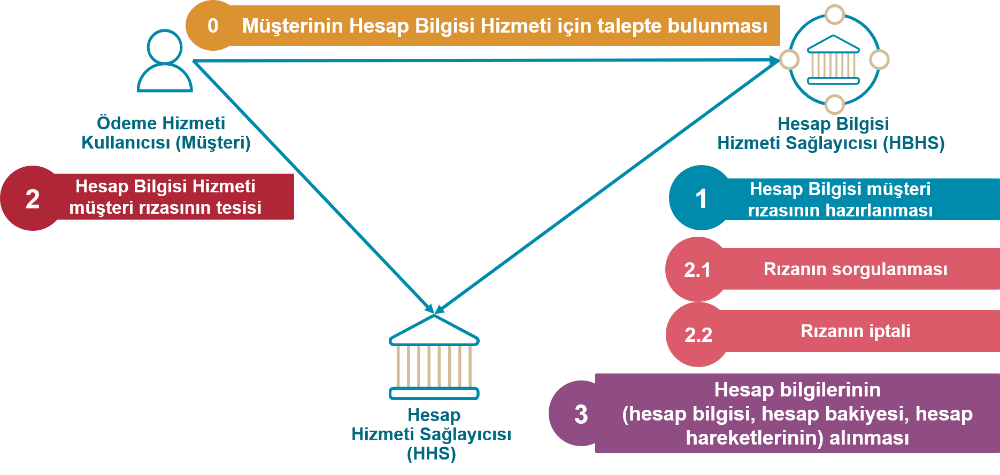

# 7.	Hesap Bilgisi Hizmeti <!-- omit in toc -->
<!--
- [Genel Bilgiler](#genel-bilgiler)
- [Hesap Bilgisi Hizmeti İçin Erişim Adresleri](#hesap-bilgisi-hizmeti-icin-erisim-adresleri)
- [ADIM 0: ÖHK Talebi](#adim-0-ohk-talebi)
- [ADIM 1: ÖHK Rızasının Hazırlanması](#adim-1-ohk-rızasının-hazırlanması)  
  - [Başarılı İstek](#basarılı-istek)
  - [Başarılı Yanıt](#basarılı-yanıt)
  - [İzinler](#izinler)
- [ADIM 2: ÖHK Rızasının Tesisi](#adim-2-ohk-rızasının-tesisi)
  - [ADIM 2.1: Hesap Bilgisi Rızasının Sorgulanması](#adim-2-1-hesap-bilgisi-rızasının-sorgulanması)
  - [ADIM 2.2: Hesap Bilgisi Rızasının İptali](#adim-2-2-hesap-bilgisi-rızasının-iptali)
- [ADIM 3: Hesap Bilgilerinin Alınması](#adim-3-hesap-bilgilerinin-alınması)  
- [ADIM 3.1 ve 3.2: Hesap Bilgilerinin Sorgulanması](#adim-3-1-ve-3-2-hesap-bilgilerinin-sorgulanması)
- [ADIM 3.3 ve 3.4: Hesap Bakiyesinin Sorgulanması](#adim-3-3-ve-3-4-hesap-bakiyesinin-sorgulanması)
- [ADIM 3.5 ve 3.6: İşlemlerin Sorgulanması](#adim-3-5-ve-3-6-islemlerin-sorgulanması)
-->

## Genel Bilgiler

Hesap bilgisi sorgulama için HBHS tarafından müşteri rızası tesisinin HHS tamamlanmış olması gerekir. Müşteri rızası tesisi tamamlandıktan sonra, HBHS sorgulamak istediği hesaba ait verileri ilgili erişim adresi üzerinden sorgular.

<!---

-->

Şekil 10: Hesap Bilgisi Hizmeti Üst Düzey Akışı

Şekil-10’da sunulan hesap bilgisi hizmeti 5 temel akıştan oluşur:

**0.	Müşterinin hesap bilgilerine erişim için talepte bulunması:** ÖHK ÖBHS mobil uygulama ya da web sitesinden hesap bilgilerine erişim işlemini başlatır. 

**1.	Hesap Bilgisi müşteri rızasının hazırlanması:**

HBHS, “hesap bilgilerine erişim” için müşteri rızası tesisi amacıyla HHS’deki hesap bilgisi rızası erişim adresine bir POST isteğinde bulunur ve bir hesap bilgisi rızası nesnesi oluşturur. HHS hesap bilgisi rızası nesnesi için biricik tanımlayacı döner (RızaNo). Hesap bilgisi rızası, müşterinin HBHS’nin hesap bilgilerine erişim izin verdiği alanları içerir:

  - İzinler - erişim için izin verilen veri kümelerinin listesi.
  - Erişimin Geçerli Olduğu Son Tarih - HBHS'nin müşterinin hesap bilgilerine erişebileceği isteğe bağlı seçilebilen son tarih.
  - İşlem Sorgulama Başlangıç Zamanı – Müşteri rızasının tesisinden itibaren geriye dönük olarak HBHS’nin hesap bilgilerine erişebileceği süreyi
  - İşlem Sorgulama Bitiş Zamanı - Müşteri rızasının tesisinden itibaren ileriye dönük olarak HBHS’nin hesap bilgilerine erişebileceği süreyi

**2.	Hesap bilgisi hizmeti müşteri rızasının tesisi:** 

HHS, Hesap Bilgisi Rızası servisi ile ÖHK özelinde “Yetki bekleniyor” statüsünde bir rıza nesnesi hazırlar. HHS, GKD’nin başarıyla tamamlanması sonrasında hesap bilgisi rızası nesnesinin yetkilendirildiğini belirtmek için Rıza Durumunu “Rıza Yetkilendirildi” olarak günceller. Nesne yetkilendirildikten sonra HHS nesne ile bir erişim belirteci (access token) ilişkilendirir, Rıza Durumunu “Yetki Kullanıldı” yapar ve bu belirteci HBHS’ye geri döner.  Böylece müşteri rıza tesisi sağlanmış olur.

Hesap bilgisi için müşteri rızasına ilişkin temel ilkeler şunlardır:

- 1 ÖHK'nın 1 YÖS için 1HHS'de Yetki Bekleniyor, Yetkilendirildi, Yetki Kullanıldı statüsünde 1 rızası olabilir. 
- Müşteri rızasının ayrıntıları ÖHK ile HBHS arasında belirlenir. Bu nedenle müşteri rızasının ayrıntıları HHS ekranında değiştirilmemelidir. 
- ÖHK, hesap erişim izni ayrıntılarını yalnızca bir bütün olarak yetkilendirebilir veya geri alabilir.
- Müşteri rızası tesisi esnasında, müşteri HHS arayüzünde erişim için yetkilendirecek hesapları seçer. 
- Ödeme Sistemine doğrudan katılımcı olmayan HHS'ler, müşterilerine IBAN hizmeti sunmayabildikleri için hesap referansı ile akışlarını kurgulayabilirler. YÖS önyüzlerinde yapılan bilgilendirmelerde, IBAN harici hesap referansı ile işlem yapılabilmesine dikkat edilmelidir.  

**2.1	Hesap bilgisi rızasının sorgulanması:** Müşteri rızası **GET/hesap-bilgisi-rizasi/{RizaNo}** çağrısı yapılarak sorgulanır.

**2.2	Hesap bilgisi müşteri rızasının iptali:** Müşteri rızası **DELETE/hesap-bilgisi-rizasi/{RizaNo}** çağrısı yapılarak iptal edilir.

**3.	Hesap bilgilerinin alınması:** Hesap bilgileri ilgili kaynağa (hesaplar, bakiye, işlemler) GET isteği yapılarak gerçekleştirilir. HBHS, müşteri rızasının tesisinden sonrasında (geçerli bir erişim belirticine sahip olduğunda) öncelikle **GET/hesaplar** çağrısı yapacaktır.

Nezdinde ödeme hesabı bulunduran hesap hizmeti sağlayıcılar(Banka, EPK, Ödeme Kuruluşları) müşterilerine ait hesapları hesap referansı ya da hesap numarası üzerinden takip etmektedir. YÖS'lerin HBH servisleri için hesap referansı veya hesap numarası üzerinden işlem yapılabileceğini bilmeleri, sistemlerini API dokümanında belirtilen akışlara göre uyumlandırmaları ve müşteri bilgilendirmesini (önyüzlerinde hesap no ve hesap referansı ayrımını gözeterek) buna paralel yapmaları beklenmektedir.  

## Hesap Bilgisi Hizmeti İçin Erişim Adresleri

**Etki Alanı (Scope) =“hesap_bilgisi”**

|No  |Kaynak |HTTP işlemi|Erişim Adresi |Zorunlu / İsteğe Bağlı|Yetkilendirme Türü |İmzalama |Parametre |İstem Nesnesi |Yanıt Nesnesi |
| --- |--- |--- |--- |--- |--- |--- |--- |--- |--- |
| 1 |hesap-bilgisi-rizasi |POST |/hesap-bilgisi-rizasi | Z |İstemci Kimlik Bilgileri |İmzalı İstek ve Yanıt | |HesapBilgisiRizasiIstegi | HesapBilgisiRizasi|
| 2 |erisim-belirteci  (GKD için) |POST |/erisim-belirteci | Z |İstemci Kimlik Bilgileri |İmzalı İstek ve Yanıt | |ErisimBelirteciIstegi | ErisimBelirteci|
| 2.1 |hesap-bilgisi-rizasi |GET |/hesap-bilgisi-rizasi/{RizaNo} | Z |İstemci Kimlik Bilgileri |İmzalı Yanıt | | | HesapBilgisiRizasi|
| 2.2 |hesap-bilgisi-rizasi |DELETE |/hesap-bilgisi-rizasi/{RizaNo} | Z |İstemci Kimlik Bilgileri |  | | | |
| 3.1 |hesaplar |GET |/hesaplar | Z |İstemci Kimlik Bilgileri ve Yetkilendirme Kodu (GKD) |  | Sayfalama | |HesapBilgileri(birden çok hesap) |
| 3.2 |hesaplar |GET |/hesaplar/{hspRef} | Z |İstemci Kimlik Bilgileri ve Yetkilendirme Kodu (GKD) |  |  | |HesapBilgileri(tek  hesap) |
| 3.3 |bakiye  |GET |/hesaplar/{hspRef}/bakiye | Z |İstemci Kimlik Bilgileri ve Yetkilendirme Kodu (GKD) |  |  | |BakiyeBilgileri(tek  hesap) |
| 3.4 |bakiye  |GET |/bakiye | Z |İstemci Kimlik Bilgileri ve Yetkilendirme Kodu (GKD) |  |Sayfalama  | |BakiyeBilgileri(birden çok hesap) |
| 3.5 |islemler  |GET |/hesaplar/{hspRef}/işlemler | Z |İstemci Kimlik Bilgileri ve Yetkilendirme Kodu (GKD) |  |Sayfalama Filtreleme  | |IslemBilgileri (tek hesap) |

**Tablo 11: Hesap Bilgisi Hizmeti İçin Erişim Adresleri**

## ADIM 0: ÖHK'nın hesap bilgilerine erişim için talepte bulunması:

ÖHK, HBHS uygulamasında (web arayüzü/mobil uygulama) hesap bilgilerine erişim için talepte bulunur.

## 7.1 ADIM 1: Hesap Bilgisi Rızasının Hazırlanması 

Bu API çağrısı HBHS'nin HHS'de yeni bir “HesapBilgisiRizasi” nesnesi oluşturmasını ve nesneye erişmek için benzersiz bir rıza numarası ({RizaNo}) dönülmesini sağlar. 

API çağrısının başarıyla sonuçlanması için HBHS'nin istemci kimlik bilgileri yetkisi kullanması yeterlidir. 
Başarıyla oluşturulan hesap bilgisi rıza kaynağının rıza durumu “Yetki Bekleniyor” olarak düzenlenir.
ÖHK daha önce aldığı rızaya ilişkin erişim tarihleri, izin türlerini ve hesap bilgilerini güncellemek isterse, HBHS önce HHS nezdindeki rızayı iptal etmeli ve sonrasında yeni bir rıza talebinde bulunmalıdır. 
<!---

-->

**Şekil 11: Hesap Bilgisi Müşteri Rızasının Hazırlanması**

- Sürüm 1.1.0 için POST /hesap-bilgisi-rizasi isteğinde 06- Anlık Bakiye Bildirimi izin türü için YÖS’ün BAKİYE kaynak tipinde olay abonelik kaydının olması gerekmektedir. BAKİYE kaynak tipinde olay abonelik kaydı olmayan YÖS kurumu ; sürüm 1.1.0 için 06 izin türünü kapsayan Hesap Bilgisi Rızası isteği gönderdiğinde HHS tarafından **TR.OHVPS.Business.EventSubscriptionNotFound** hatası verilmeli ve rıza oluşturulmamalıdır.

- POST /hesap-bilgisi-rizasi isteğinin (REQUEST) gövdesinde (BODY)  “HesapBilgisiRizasıIstegi” nesnesi (Tablo-12) kullanılır. İstek başarıyla sonuçlanırsa HHS kaynak sunucusunda “HesapBilgisiRizasi” (Tablo-13) nesnesi oluşturulur.

### **POST /hesap-bilgisi-rizasi**

### Başarılı İstek:

İSTEK:

HBHS, bu API erişim adresinden HHS’ye yeni bir HesapBilgisiRizasi oluşturulması için istekte bulunur:
-	HBHS, ÖHK’nın hesap bilgilerine yönelik rıza başlatma isteği olduğunu HHS’ye bildirir.
-	HBHS, ÖHK’nın, HBHS arayüzünden verdiği rızanın (“Ön Onay”) bir kopyasının HHS nezdinde müşteri tarafından onaylanması için HHS’ye gönderilmesini sağlar.
-	HHS; istek mesajında yer alan alanların API dökümanında belirtilen şartları sağlayacak şekilde zorunluluk ve uzunluk kontrollerini yapar. (Zorunlu)
-	HHS; YÖS API ile alınan HBHS bilgilerinin içerisinde yer alan yönlendirme adresleri ile hesap bilgisi rızası nesnesi request mesajında paylaşılan adreslerin uyumlu olup olmadığının kontrollerini yapar. (Zorunlu)  
-	HHS; kimlik bilgileri nesnesinde iletilen kimlik bilgileri ile ÖHK’nın HHS müşterisi olup olmadığının kontrollerini yapar. Bu kontrol hem bireysel hem de kurumsal ÖHK’lar için yapılmalıdır.  (Zorunlu)
-	Erişimin Geçerli Olduğu Son Tarih, İşlem Sorgulama Başlangıç Zamanı, İşlem Sorgulama Bitiş Zamanı alanları ile ilgili Tablo 12’de belirtilen kontroller yapılmalıdır. (Zorunlu)
-	HHS, benzersiz “RizaNo” ile “HesapBilgisiRizasi” nesnesi oluşturur ve HBHS’ye döner.
-	HHS, HesapBilgisiRizasi oluşturduğu anda durumunu “Yetki Bekleniyor” olarak düzenler.

Erişimin Geçerli Olduğu Son Tarih, İşlem Sorgulama Başlangıç Zamanı, İşlem Sorgulama Bitiş Zamanı alanlarında zaman aralıkları müşteri deneyimi penceresinden değerlendirilerek ay cinsinden belirtilmiştir. Bu konuda aşağıdaki gibi oluşabilecek uç örneklere dikkat edilmesi gerekmektedir.  

Yeni günün başlangıç saatinin 00:00:00 olduğu kabul edilmiştir.

Bugün : 31.08.2019 
Bugün + 6 Ay : 01.03.2020 00:00:00 (29.02.2020 tüm gün dahildir.)   
Bugün : 30.08.2020 
Bugün + 6 Ay : 01.03.2020 00:00:00 (28.02.2021 tüm gün dahildir.)  
Bugün : 30.09.2022 
Bugün + 3 Ay : 01.01.2023 00:00:00 (30.12.2022 tüm gün dahildir.)  
Bugün : 14.07.2022 
Bugün + 3 Ay : 15.10.2022 00:00:00 (14.10.2022 tüm gün dahildir.)  

**Tablo 12: “HesapBilgisiRizasiIstegi” nesnesi**
|Alan Adı |JSON Alan Adı	|Format	|Zorunlu / Koşullu /  İsteğe bağlı	|Açıklama	|HHS tarafından yapılması gereken kontrol ve işlemler|
| --- | --- | --- | --- | --- | --- |
| Katılımcı Bilgisi | katilimciBlg |Kompleks:KatilimciBilgisi | Z | Katılımcılara atanmış kod bilgileridir. |  |
| >Hesap Hizmeti Sağlayıcısı Kodu | hhsKod | AN4 | Z | İsteğin iletildiği Hesap Hizmeti Sağlayıcısının kodudur. (Nezdinde ÖH bulunduran kuruluş kodu. Örneğin, Banka, Elektronik Para Kuruluşu ve Ödeme Kuruluşu) |	HHS, hhsKod’un kendisine ait olduğunu ve istek başlığındaki x-aspsp-code değeri ile aynı olduğunu kontrol eder. Hata durumunda TR.OHVPS.Connection.InvalidASPSP hata kodunu döner. |
|> Yetkili Ödeme Hizmeti Sağlayıcısı Kodu | yosKod | AN4 | Z | İsteği gönderen Yetkili Ödeme Hizmeti Sağlayıcısı (YÖS) kodudur | HHS, yosKod’un geçerli bir Ödeme Hizmeti Sağlayıcısı Kodu olduğunu ve istek başlığındaki x-tpp-code değeri ile aynı olduğunu kontrol eder.  Hata durumunda TR.OHVPS.Connection.InvalidTPP hata kodunu döner. |
| GKD | gkd | Kompleks:Gkd | Z |  |  |
| >Yetkilendirme Yöntemi | yetYntm | AN1 | İ |TR.OHVPS.DataCode.GkdTur sıralı veri türü değerlerinden birini alır.   Yetkilendirme yöntemi, HBHS tarafından belirtilmeyebilir. | HHS, HBHS’nin belirlediği yöntemi dikkate alarak süreci ilgili akışa uygun olarak devam ettirir. Desteklemediği yöntem için (örn: Ayrık GKD) ayrıca hata mesajı verilmelidir. |
| > Yönlenme Adresi | yonAdr | AN1..1024 | K | Yönlendirmeli güçlü kimlik doğrulama için zorunlu.  YÖS’ün ileteceği adrestir.   Durum kodu(drmKod), yönlendirme adresine parametre olarak eklenmelidir.  | HHS, müşteri uygulama / tarayıcısını bu alanda belirtilen adrese yönlendirir. |
| > Ayrık GKD	| ayrikGkd  | Kompleks:AyrikGkd  | K   | Ayrık güçlü kimlik doğrulama için zorunlu.  | yetYntm = A gönderilmiş ise ayrikGkd nesnesinin dolu gönderilmesi zorunludur.    HHS, YÖS'ün AYRIK_GKD_BASARILI ve AYRIK_GKD_BASARISIZ olay tipleri için olay aboneliğinin varlığını kontrol eder. [Bknz: Ayrık GKD](gkd.html#_5-2-ayr%C4%B1k-guclu-kimlik-dogrulama)  |
| >> OHK Tanım Tip	| ohkTanimTip  | AN8  | K   | ÖHK'nın HHS uygulaması tarafından tanınmasını sağlayacak tanım tipleridir. **TR.OHVPS.DataCode.OHKTanimTip** sıralı veri tiplerinden birini alır. |  |
| >> OHK Tanım Değer	| ohkTanimDeger  | AN1..30  | K   |ÖHK'nın HHS uygulaması tarafından tanınmasını sağlayacak tanım değeridir. ohkTanimTip'i ile uyumlu değerdir.|  |
| Kimlik | kmlk | Kompleks:Kimlik | Z |  |  |
| > Kimlik Türü | kmlkTur | AN1 | Z | TR.OHVPS.DataCode.KimlikTur sıralı veri türü değerlerinden birini alır.   Kurum adına yapılan(ticari) işlemlerde kurum kullanıcısının bilgisi iletilmelidir. |  |
| > Kimlik Verisi | kmlkVrs | AN1..30 | Z | HHS nezdinde kullanıcı doğrulamasında kullanılan tanımlayıcıdır.   TR.OHVPS.DataCode.KimlikTur değerine göre uzunluk ve formatı değişir.   Kurum adına yapılan(ticari) işlemlerde kurum kullanıcısının bilgisi iletilmelidir. |  |
| > Kurum Kimlik Türü | krmKmlkTur | AN1 | K | ÖHK’nın altında tanımlı olduğu tüzel kişilik için kullanılan kurum kimlik türüdür.  TR.OHVPS.DataCode.KurumKimlikTur sıralı veri türü değerlerinden birini alır. |  |
| > Kurum Kimlik Verisi | krmKmlkVrs | AN1..30 | K | ÖHK’nın altında tanımlı olduğu tüzel kişilik için kullanılan kurum kimlik verisidir.  TR.OHVPS.DataCode.KurumKimlikTur değerine göre uzunluk ve formatı değişir. |  |
| > Ödeme Hizmeti Kullanıcısı Türü | ohkTur | AN1 | Z | TR.OHVPS.DataCode.OhkTur sıralı veri türü değerlerinden birini alır (B: Bireysel, K:Kurumsal) |  |
| Hesap Bilgisi | hspBlg | Kompleks: HesapBilgisi | Z |  |  |
| >İzin Bilgisi | iznBlg | Kompleks: IzinBilgisi | Z |  |  |
| >> İzin Türü | iznTur | Array[AN2] | Z | ÖHK tarafından HHS önyüzünde belirlenen izin tipleridir. Bir istekte birden fazla değer bulunabilir, TR.OHVPS.DataCode.IzinTur sıralı veri türü değerlerinden birini alır.  |  |
| >> Erişimin Geçerli Olduğu Son Tarih |erisimIzniSonTrh | ISODateTime | Z | Hesap bilgisi rızasının geçerli olduğu son tarih.   Müşteri YÖS ekranından bu değeri belirleyebilir.   Varsayılan değer : Rıza verilen tarih + 6 ay   Alabileceği maksimum değer : Rıza tarihi + 6 ay    Alabileceği minimum değer : Rıza tarihi + 1 gün    **Örneğin** 23/09/2021’de minimum 24/09/2021 seçilebilir. Bu durumda yeni günün başlangıç saati 00:00:00 olduğu kabul edildiği için; erisimIzniSonTrh değeri 2021-09-25T00:00:00+03:00 olmalıdır.    **Örnek rıza oluş zamanı** : 2023-02-04T21:20:20+03:00   **1 günlük rıza verildiğinde erisimIzniSonTrh değeri:**   2023-02-06T00:00:00+03:00 (26 saat 40 sakikalık rıza vermiş oluyor.)   **7 günlük rıza verildiğinde erisimIzniSonTrh değeri:** 2023-02-12T00:00:00+03:00   **1 aylık rıza verildiğinde erisimIzniSonTrh değeri :**  2023-03-05-T00:00:00+03:00  | Bu alanda bir değer bulunmadığı durumda HHS hata dönmelidir. |
| >> İşlem Sorgulama Başlangıç Zamanı | hesapIslemBslZmn | ISODateTime | K | Hesap bilgisi rızası verilmesinden geçmişe dönük en fazla 12 ay olabilir, daha eski olmaması gerekir.   Varsayılan değeri rıza verilen tarih (işlem zamanı) – 12 aydır.   ÖHK bu alana bir değer girişi sağlamış ise zaman bilgisi üretilirken ekrandan girilen tarihe 00:00:00 zaman bilgisi eklenmelidir. ÖHK değer girişi sağlamamış ise ÖBHS varsayılan değerlerle bu alanı doldurarak, HHS’ye iletir.   Minimum tarihi : Rızanın veriliş tarihi  - 12 ay    Maksimum tarih: Rızanın veriliş tarihi +  12 ay    İzin türü “Temel işlem Bilgisi” ve/veya “Ayrıntılı İşlem Bilgisi” seçildiğinde bu alanların doldurulması zorunludur.  İzin türü “Temel işlem Bilgisi” ve/veya “Ayrıntılı İşlem Bilgisi” seçilmemiş ise gönderilmemelidir.  |ÖHK tarafından izin türü “Temel işlem Bilgisi” ve/veya “Ayrıntılı İşlem Bilgisi” seçilmemiş ve  İşlem Sorgulama Başlangıç Zamanı ÖBHS tarafından dolu olarak gönderilmiş ise HHS tarafından işlemin devamına izin verilmez. İzin türü “Temel işlem Bilgisi” ve/veya “Ayrıntılı İşlem Bilgisi” seçilmiş ise; HHS bu alanın alabileceği minimum ve maksimum değerlerin sınırlar içerisinde olduğunu kontrol eder. |
| >> İşlem Sorgulama Bitiş Zamanı | hesapIslemBtsZmn | ISODateTime | K | Hesap bilgisi rızası verilmesinden geleceğe dönük en fazla 12 ay sonrası olabilir, daha ileri bir tarih olmaması gerekir.   Varsayılan değeri: Rıza verilen tarih + 12 aydır. ÖHK bu alana bir değer girişi sağlamış ise girdiği tarihe 1 gün eklenir ve yeni günün ilk saati kabul edilen 00:00:00 saat bilgisini ekler.  ÖHK bu alana bir değer girişi sağlamamış ise ÖBHS varsayılan değerlerle bu alanı doldurarak, HHS’ye iletir.  Minimum tarihi : Rızanın veriliş tarihi  – 12 ay  Maksimum tarihi :  Rızanın veriliş tarihi + 12 ay   İzin türü “Temel işlem Bilgisi” ve/veya “Ayrıntılı İşlem Bilgisi” seçildiğinde bu alanların doldurulması zorunludur.  İzin türü “Temel işlem Bilgisi” ve/veya “Ayrıntılı İşlem Bilgisi” seçilmemiş ise gönderilmemelidir. Eğer dolu gönderilirse HHS tarafından uygun hata mesajı iletilmelidir. | ÖHK tarafından izin türü “Temel işlem Bilgisi” ve/veya “Ayrıntılı İşlem Bilgisi” seçilmemiş ve İşlem Sorgulama Bitiş Zamanı ÖBHS tarafından dolu olarak gönderilmiş ise HHS tarafından işlemin devamına izin verilmez.   İzin türü “Temel işlem Bilgisi” ve/veya “Ayrıntılı İşlem Bilgisi” seçilmiş ise; HHS bu alanın alabileceği minimum ve maksimum değerlerin sınırlar içerisinde olduğunu kontrol eder. |

					
### Başarılı Yanıt:

**Tablo 13: HesapBilgisiRizasi nesnesi**

|Alan Adı |JSON Alan Adı	|Format	|Zorunlu / Koşullu /  İsteğe bağlı	|Açıklama	|
| --- | --- | --- | --- | --- | 
| Riza Bilgileri | rzBlg | Kompleks: RizaBilgileri | Z |  | 
| > Rıza No | rizaNo | AN1..128 | Z | HesapBilgisiRızasi nesnesinin oluşturulması esnasında HHS kaynak sunucusu tarafından atanan biricik tanımlayıcı | 
| > Oluşturma Zamanı | olusZmn | ISODateTime | Z | HesapBilgisiRızası nesnesinin oluşturulma zamanı | 
| > Güncellenme Zamanı|	gnclZmn	| ISODateTime	| Z	| HesapBilgisiRızası nesnesinin güncellenme zamanı |
|> Rıza Durumu |	rizaDrm	| AN1 |	Z |	TR.OHVPS.DataCode.RizaDurumu sıralı veri tipini değerlerinden birini alır. Örn; hesap bilgi rızasının tesisine dair ilk istek mesajına dönüşte “B: Yetki Bekleniyor” değerini alması beklenir.|
|> Rıza Iptal Detay Kodu |	rizaIptDtyKod |	AN2 |	K |	Rıza durumunun iptal olduğu durumda zorunludur.|
|Kimlik|	kmlk|	Kompleks:Kimlik|	Z| |
|> Kimlik Türü | kmlkTur |AN1| Z| TR.OHVPS.DataCode.KimlikTur sıralı veri türü değerlerinden birini alır.|
|> Kimlik Verisi	|kmlkVrs|	AN1..30|	Z	|HHS nezdinde kullanıcı doğrulamasında kullanılan tanımlayıcıdır. TR.OHVPS.DataCode.KimlikTur değerine göre uzunluk ve formatı değişir.|
|> Kurum Kimlik Türü|	krmKmlkTur|	AN1|	K|	ÖHK’nın altında tanımlı olduğu tüzel kişilik için kullanılan kurum kimlik türüdür.  TR.OHVPS.DataCode.KurumKimlikTur sıralı veri türü değerlerinden birini alır.|
|> Kurum Kimlik Verisi|	krmKmlkVrs|	AN1..30|	K	|ÖHK’nın altında tanımlı olduğu tüzel kişilik için kullanılan kurum kimlik verisidir.  TR.OHVPS.DataCode.KurumKimlikTur değerine göre uzunluk ve formatı değişir.|
|> Ödeme Hizmeti Kullanıcısı Türü	|ohkTur	|AN1	|Z	|TR.OHVPS.DataCode.OhkTur sıralı veri türü değerlerinden birini alır (B: Bireysel, K:Kurumsal)|
|Katılımcı Bilgisi|	katilimciBlg|	Kompleks:KatilimciBilgisi	|Z|	Katılımcılara atanmış kod bilgileridir.|
|>Hesap Hizmeti Sağlayıcısı Kodu|	hhsKod|	AN4|	Z	|İsteğin iletildiği Hesap Hizmeti Sağlayıcısının kodudur. (Nezdinde ÖH bulunduran kuruluş kodu. Örneğin, Banka, Elektronik Para Kuruluşu ve Ödeme Kuruluşu)|
|> Yetkili Ödeme Hizmeti Sağlayıcısı Kodu	|yosKod	|AN4|	Z	|İsteği gönderen Yetkili Ödeme Hizmeti Sağlayıcısı (YÖS) kodudur.|
|GKD|	gkd	|Kompleks:Gkd	|Z	||
|> Yetkilendirme Yöntemi|	yetYntm	|AN1	|Z|	HHS, HBHS’nin belirlediği yöntemi dikkate alarak süreci ilgili akışa uygun olarak devam ettirir. Desteklemediği yöntem için (örn: Ayrık GKD) ayrıca hata mesajı verilmelidir.  TR.OHVPS.DataCode.GkdTur sıralı veri türü değerlerinden birini alır.|
|> Yönlenme Adresi|	yonAdr|	AN1..1024|	K	|HHS, müşteri uygulama / tarayıcısını yönlendirmeli akışta bu alanda belirtilen YÖS adresine yönlendirir.|
|> Ayrık GKD	| ayrikGkd  | Kompleks:AyrikGkd  | K   | Ayrık güçlü kimlik doğrulama için zorunlu.  | yetYntm = A gönderilmiş ise ayrikGkd nesnesinin dolu gönderilmesi zorunludur. yetYntm = Y için bu nesne iletilmemelidir. |
|>> OHK Tanım Tip	| ohkTanimTip  | AN8  | K   | ÖHK'nın HHS uygulaması tarafından tanınmasını sağlayacak tanım tipleridir. İstek içerisindeki veri değiştirilmeden iletilir. |  
| >> OHK Tanım Değer	| ohkTanimDeger  | AN1..30  | K   |ÖHK'nın HHS uygulaması tarafından tanınmasını sağlayacak tanım değeridir. ohkTanimTip'i ile uyumlu değerdir.  İstek içerisindeki veri değiştirilmeden iletilir.|   
|> HHS Yönlenme Adresi |	hhsYonAdr	|AN1..1024|	K| Yönlendirmeli akış türünde	GKD doğrulama bilgilerinin girilebilmesi için uygulamadan açılacak yönlendirme sayfasının adresi. Ayrık GKD akışında bu alan dönülmemelidir. |
|> Yetkilendirme Tamamlanma Zamanı |	yetTmmZmn	|ISODateTime	|Z	|Yetkilendirme akışının tamamlanması gereken son zamanı gösterir.  HHS tarafından maksimum 5 dk içinde işlem tamamlanacak şekil zaman damgası oluşturulur. Zaman aşımı olduğunda HHS’nin GKD’ye izin vermeyecek şekilde hata mesajı vermesi gerekmektedir. Rıza durumu Yetkilendirildi statüsüne geçene kadarki süredir.|
|Hesap Bilgisi|	hspBlg|	Kompleks: HesapBilgisi|	Z| |
|> İzin Bilgisi|	iznBlg|	Kompleks: IzinBilgisi|	Z| |
|>> İzin Türü|	iznTur|	Array[AN2]|	Z|	ÖHK tarafından HBHS önyüzünde belirlenen izin tipleridir. Bir istekte birden fazla değer bulunabilir, TR.OHVPS.DataCode.IzinTur sıralı veri türü değerlerinden birini alır.|
|>> Erişimin Geçerli Olduğu Son Tarih	|erisimIzniSonTrh	|ISODateTime|	Z	|Hesap bilgisi rızasının geçerli olduğu son tarih|
|>> İşlem Sorgulama Başlangıç Zamanı|	hesapIslemBslZmn|	ISODateTime	|K|	Hesap hareketlerinin sorgunabileceği başlangıç zamanı. İzin türü “Temel işlem Bilgisi” ve/veya “Ayrıntılı İşlem Bilgisi” seçildiğinde bu alanların doldurulması zorunludur. |
|>> İşlem Sorgulama Bitiş Zamanı|	hesapIslemBtsZmn	|ISODateTime|	K|	Hesap hareketlerinin sorgunabileceği bitiş zamanı. İzin türü “Temel işlem Bilgisi” ve/veya “Ayrıntılı İşlem Bilgisi” seçildiğinde bu alanların doldurulması zorunludur.|
|> Ayrıntı Bilgi|	ayrBlg|	Kompleks: AyrintiBilgi|	İ| |
|> ÖHK Mesaj Alanı|	ohkMsj|	AN1..200|	İ	|HHS’nin ÖHK’ya göstermek üzere ilettiği mesaj.|

## İzinler

Bir hesap bilgisi müşteri rızası kaynağı çağrısına yanıt olarak döndürülen verileri sınırlamak için izin kodları kullanılır:
-	Temel Hesap Bilgisi 
-	Ayrıntılı Hesap Bilgisi 
-	Bakiye Bilgisi 
-	Temel İşlem (Hesap Hareketleri) Bilgisi 
-	Ayrıntılı İşlem Bilgisi
- Anlık Bakiye Bildirimi

ÖHK’ya sunulacak seçimler ve kuralları aşağıdaki gibi olmalıdır.

| Seçim | Kural | 
| --- | --- |  
| Temel Hesap Bilgisi | 	ÖHK seçimine sunulmamalıdır. Değiştirilemez şekilde seçili gösterilmelidir.  |  
| Ayrıntılı Hesap Bilgisi	 | ÖHK seçim yapabilir. | 
| Bakiye Bilgisi | ÖHK seçim yapabilir. |
| Temel İşlem (Hesap Hareketleri)  Bilgisi  | ÖHK seçim yapabilir. |  
| Ayrıntılı İşlem Bilgisi	 | ÖHK seçim yapabilir. Ayrıntılı İşlem Bilgisi seçimi Temel İşlem Bilgisi seçimini kapsar. (Ayrıntılı İşlem bilgisi seçildiğinde Temel İşlem Bilgisi de seçili olmalıdır.)|  
| Anlık Bakiye Bildirimi  | Bakiye Bilgisi izin türü ile birlikte seçilmesi gereklidir. ÖHK, HHS'de olacak bakiye değişikliklerinden anlık haberdar olmak istiyor ise bu izin türü seçimi ile rıza başlatması gereklidir.|  

Aşağıdaki durumlarda, izin kombinasyonlarına izin verilmez. HHS, bu hesap erişim onaylarını 400 (Hatalı İstek) yanıt koduyla reddetmelidir:

- İzin dizisinin herhangi bir izin türü içermemesi durumu,
- İzin dizisinde HHS tarafından desteklenmeyen bir izin kodunun yer alması durumu
 

## 7.2 ADIM 2: Hesap Bilgisi Hizmeti Rızasının Tesisi
<!--

-->

**Şekil 12: Hesap Bilgisi ÖHK Rızasının Tesisi**

Rıza tesisinin başarıyla sonuçlanması için HBHS'nin istemci kimlik bilgileri yetkisi kullanması ve ardından müşterinin HHS tarafından yönlendirmeli veya ayrık GKD ile doğrulanması gerekir. HHS'de oluşturulan ve rıza durumu “Yetki Bekleniyor” olan bir hesap bilgisi rızası, GKD sonrası “Yetkilendirildi” statüsüne güncellenir. HBHS, erişim sağlayacağı hesapları hesap bilgisi rızasının tesisinden önce seçer. 

-	Yönlendirmeli doğrulama akışında, HBHS ÖHK’yı HHS’ye yönlendirir. 
    - HBHS tarafından yönlendirme, bir önceki adımdaki RizaNo’yu içerir. 
    - 	HHS, ÖHK için GKD sürecini işletir.

          ÖHK’yı doğrularsa,

          - ÖHK HBHS üzerinden işlem yapılmasına izin vereceği hesap seçimini, hesap numarası ya da hesap referansı bilgisi ile yapar. HBHS üzerinden ÖHK’nın verdiği izin bilgilerini ve erişim izninin bitiş tarihi bilgilerini, HHS bilgilendirme amaçlı ÖHK’ya gösterir.  
          - HHS hesap bilgisiri rıza kaynağının durumunu “Yetkilendirildi” olarak günceller. 
          - HHS, ÖHK’yı “olumlu yönlendirme akışı” ile HBHS tarafından tanımlanan yönlendirme adresine yönlendirir:  

                yonAdr?rizaDrm=Y&yetKod=xx&rizaNo=yy&rizaTip=H&drmKod=zzz

        ÖHK’yı doğrulayamazsa,
        - HHS, hesap bilgisi rıza kaynağının durumunu “Yetki İptal” olarak günceller. 
        - HHS, ÖHK’yı “olumsuz yönlendirme akışı” ile HBHS tarafından tanımlanan yönlendirme adresine yönlendirir:  
        
              yonAdr?rizaDrm=I &rizaNo=yy&rizaTip=H&rizaIptDtyKod=11&drmKod=zzz

-	Ayrık doğrulama akışında, HHS, ÖHK’nın hesap bilgisi hizmetini başlattığı uygulamadan farklı olabilecek bir “doğrulama” uygulamasında işlemi doğrulamasını ister.   

    - Ayrık akış HBHS’nin farklı bir kanal kullanarak yetkilendirme isteği göndermesiyle başlatılır. 
    - 	Bu yetkilendirme isteği, yetkilendirilecek hesap bilgisi rızasının eşleştirileceği ÖHK’nın bulunması için ilgili veriyi taşır. 
    -  HHS, ödeme hizmeti kullanıcısını doğrular.
    - ÖHK verdiği izin tipi dahilinde bilgileri paylaşılacak olan hesapları seçer.
    -	HHS, hesap bilgisi rıza kaynağının durumunu “Yetkilendirildi” olarak günceller.   

Başarılı GKD sonrasında (rizaDrm=’Y’) ilgili rıza nesnesi için (belirli bir rizaNo) yetkilendirme kodunun (yetKod) alınmasının ardından erişim belirteci erişim adresine POST çağrısı yapılarak yetkilendirme kodu karşılığında erişim belirteci ve yenileme belirteci alınır. POST /erişim-belirteci erişim noktası EK-3’te açıklanmıştır.  

Erişim belirteci alındıktan sonra; HHS,  hesap bilgisi rızasının durumunu “Yetki Kullanıldı” olarak günceller. Rıza tesisi sağlanmış olur.

## 7.3 ADIM 2.1: Hesap Bilgisi Rızasının Sorgulanması 

**GET /hesap-bilgisi-rizasi/{RizaNo}**  

ÖHK, HHS üzerinden rıza iptali yapmış olabilir veya ÖHK’nın verdiği rıza süresi dolmuş olabilir.  Bu durumlarda HBHS, rıza alma akışına başlamadan önce, daha önce oluşturulmuş bir HesapBilgisiRizasi kaynağının durumunu, isteğe bağlı olarak alabilir.  

Servis başarılı yanıtında Tablo 13’de belirtilen “HesapBilgisiRizasi” nesnesini dönmektedir.

Durum  
HesapBilgisiRizasi kaynağı için kullanılabilecek durum göstergeleri şu şekildedir:  
-	Yetki Bekleniyor
-	Yetkilendirildi
-	Yetki Kullanıldı	
-	Yetki Sonlandırıldı
-	Yetki İptal

## 7.4 ADIM 2.2: Hesap Bilgisi Rızasının İptali

 

 

**Şekil 13: Hesap Bilgisi Müşteri Rızasının Geri Alınması**  

**DELETE /hesap-bilgisi-rizasi/{RizaNo}**  

DELETE /hesap-bilgisi-rizasi çağrısı, bir HBHS'nin önceden oluşturulmuş bir hesap erişim rızasını (yetkili olsun veya olmasın) silmesine izin verir. Müşteri, rızasını HHS üzerinden iptal etmek yerine, HBHS üzerinden bu rızasını kaldırmak isteyebilir.  
Bu API çağrısı, müşterinin HBHS üzerinden hesap bilgisi rızasını iptal etmesine ve HHS nezdindeki hesap bilgisi rızası nesnesinin silinmesini sağlar.  
Müşterinin HBHS’nin veri erişim iznini iptal etmesi durumunda HBHS, HHS’de mevcut olan HesapBilgisiRizasi kaynağını pratik olarak mümkün olan en kısa sürede silmelidir. Bu ise, ilgili kaynağa   
**DELETE /hesap-bilgisi-rizasi/{RizaNo}**  
çağrısı aracılığı ile yerine getirilir. HBHS ayrıca, sisteminden Hesap Erişim İzni kaynaklarını da temizlemelidir.  
Söz konusu silme işlemi, kayıtların statüsünün pasife çekilmesi ile gerçekleştirilmelidir. Söz konusu kayıtlar, denetim izlerinin oluşturulması ve saklanmasına ilişkin ikincil düzenleme hükümleri kapsamında güvenli şekilde tutulmalıdır.  
Servis istek parametresi olarak sadece path’de iletilen Rıza No bilgisine ihtiyaç duymaktadır.   
ÖHK rızası başarı ile silindiğinde HTTP 204 response kodu ile işlem sonucu iletilir. Rıza tipi “I” yani “Yetki İptal” olarak güncellenir ve gnclZmn zaman damgası vurularak güncellenir.  
ÖHK ile rıza iptali sırasında kurulacak iletişimde (e-posta, sms gibi) aşağıdaki alanların iletilmesi tavsiye edilmektedir:   
YÖS Adı, HHS adı, Rıza Oluşturma Zamanı, Servis Tipi Bilgisi (HBHS)  
<!--
  
-->

## 7.5 ADIM 3: Hesap Bilgilerinin Alınması  
    

<!--    -->

  

**Şekil 14: Hesap Bilgilerinin Alınması**   

İSTEK:  
Müşteri rızası tesis edilmiş kullanıcı için HBHS API erişim adresinden HHS’ye erişilebilir hesap bilgilerini GET isteği ile sorgular: 

- RizaDurumu “Yetki Kullanıldı” ise işleme başlanır. RizaDurumu farklı bir değerde ise “TR.OHVPS.Resource.ConsentMismatch” hatasının iletilmesi gerekir. 
- GET verisinin modele göre kontrolü yapılır (Örneğin: Alan kontrolleri)  

GET verisinin mantıksal kontrolleri yapılır.

- Hesap bilgisi rızası alınmış ve erişim izni devam eden hesaplar içerisinden herhangi bir hesabın kapatılması ya da pasife alınması durumunda YÖS tarafından yapılan hesap isteğine HHS tarafından hesap bilgisi dönülmelidir.

- Kapalı hesap için TR.OHVPS.DataCode.HspDrm veri türünden KAPALI değeri ile, pasif hesap için TR.OHVPS.DataCode.HspDrm veri türünden PASIF değeri ile dönülmelidir. 

## 7.6 ADIM 3.1 ve 3.2: Hesap Bilgilerinin Sorgulanması

**GET /hesaplar ve GET /hesaplar/{hspRef}**

Bu erişim noktalarından tüm hesapların veya belirli bir hesabın bilgilerinin sorgulanır. Hesap bilgisi için daha önce tanımlanmış izin türüne göre (Temel Hesap Bilgisi veya Detaylı Hesap Bilgisi) yanıtında dönülen HesapBilgileri nesnesinin içeriği değişir.  Tablo 15’te HesapBilgileri nesnesinin içeriği verilmiştir.  

Hesap Bilgisi Sorgu Örneği (Tüm Hesaplar) =  /hesaplar  
Hesap Bilgisi Sorgu Örneği (Belirli Bir Hesap) =  /hesaplar/{hspRef}  
İşlem Sorgu Örneği (Belirli Bir Hesap) =  /hesaplar?
syfKytSayi=25&
syfNo=1&
srlmKrtr= hspRef &
srlmYon=A  

**Tablo 14: Hesap Bilgileri Sorgulama İsteği Sorgu Parametreleri**
|Alan Adı |Parametre Adı	|Format	|Zorunlu / Koşullu /  İsteğe bağlı	|Açıklama	|HHS tarafından yapılması gereken kontrol ve işlemler|
| --- | --- | --- | --- | --- | --- |
| Sayfa Başına İstenen Kayıt Sayısı | syfKytSayi | N3 | İ | Sayfa başına istenen kayıt sayısı. Bu alanda iletilen değer 100’den büyük olamaz.  | Bu veri gönderildiği durumda, HHS listesini bu sayı kadar gruplandırarak gönderir. Bu veri gönderilmediğinde sayfadaki kayıt sayısı 100 olarak kullanılır. |
| İstenen Sayfa Numarası | syfNo | N3 | İ | Cevapta dönecek sayfa numarası 1’den başlayarak artan değerlerle iletilmelidir. | Bu veri gönderildiği durumda, HHS işlemler listesini bu sayfadaki kayıtları gönderir. Gönderilmediğinde, HHS ilk sayfadaki kayıtları gönderir.  |
| Sıralama Kriteri | srlmKrtr | AN3..50 | İ | Cevapta dönülecek kayıtların sıralama kriterini belirtir. Alabileceği değerler: { “hspRef”} | Bu veri gönderildiği durumda, HHS listesini bu kritere göre sıralayarak gönderir. Gönderilmediğinde, HHS sıralama kriterini hspRef olarak belirler. |
| Sıralama Yönü | srlmYon | AN1 | İ | Cevapta dönülecek işlemlerin sıralama yönünü belirtir. Alabileceği değerler:  A: Azalan değerle sıralama Y: Artan değerle sıralama {“A”,”Y”} | Bu veri gönderildiği durumda, HHS listesini bu yöne göre sıralayarak gönderir. Gönderilmediğinde, HHS sıralama yönünü Azalan olarak belirler. |

**Tablo 15: “HesapBilgileri” nesnesi**  
|Alan Adı |JSON Alan Adı	|Format	|Zorunlu / Koşullu /  İsteğe bağlı	|Açıklama	|
| --- | --- | --- | --- | --- | 
| Rıza No | rizaNo | AN1..128 | Z | HesapBilgisiRızası nesnesinin oluşturulması esnasında HHS kaynak sunucusu tarafından atanan biricik tanımlayıcı | 
| Hesap Temel | hspTml | Kompleks: HesapTemel | Z | Temel Hesap Bilgileri (Temel Hesap Bilgisi varsayılan izin türü olduğundan Hesap Temel nesnesi zorunlu olarak yanıtta bulunur) | 
| > Hesap Referansı  | hspRef | AN5..40 | Z | HHS tarafından hesap için atanan biricik tanımlıyıcıdır (uuid). YÖS bazında farklılaşması gerekmez. Bir hesap (IBAN) tek bir hspRef'e karşılık gelmelidir, benzer şekilde bir hspRef tek bir IBAN'a karşılık gelmelidir. Aynı hesap için alınan tüm rızalarda hesap referans bilgisinin değişmemesi gerekmektedir. | 
| > Hesap Numarası | hspNo | AN26 | K | Eğer varsa ödeme hesabına ait IBAN bilgisi | 
| > Hesap Sahibi Unvanı | hspShb | AN3..140 | Z | Hesap sahibi ya da hesap sahiplerinin ad-soyadı, ticari unvanı | 
| > Şube Adı | subeAdi | AN3..50 | K | Eğer varsa ödeme hesabının bağlı olduğu şubenin adı | 
| > Kısa Ad | kisaAd | AN3..50 | K | Eğer hesap sahibi hesaba ait bir ad tanımladıysa, tanımlanan hesap adı | 
| > Para Birimi | prBrm | AN3 | Z | Para Birimi. | 
| > Hesap Türü | hspTur | AN1 | Z | Hesabın türü (bireysel veya ticari). TR.OHVPS.DataCode.HspTur sırali veri değerlerinden birini alır. | 
| > Hesap Tipi | hspTip | AN1..32 | Z | Hesabın tipi (VADESİZ, KREDİLİ vb.).TR.OHVPS.DataCode.HspTip sıralı veri değerlerinden birini alır. | 
| >Hesap Ürün Adı | hspUrunAdi | AN1..140 | İ | HHS tarafından atanmış olan ürün adı bilgisidir. HBHS tarafından ÖHK’ya gösterilmesi kullanım kolaylığı sağlayacaktır. | 
| > Hesap Durumu | hspDrm | AN5..50 | Z | Hesabın durumunu belirtir. TR.OHVPS.DataCode.HspDrm sıralı veri türlerinden birini alır.  | 
| Hesap Detay |hspDty | Kompleks: HesapDetay | K | Detay Hesap Bilgileri (Temel Hesap Bilgisine ek olarak Detay Hesap Bilgisi izin türü de seçilmişse Hesap Detay nesnesi koşullu olarak yanıtta bulunur) | 
|> Açılış Tarihi| hspAclsTrh |	ISODateTime	| Z	| Belirtilen hesabın açılış tarihi.|  

## 7.7 ADIM 3.3 ve 3.4: Hesap Bakiyesinin Sorgulanması  

**GET /bakiye ve GET /hesaplar/{hspRef}/bakiye**  
Bu erişim noktalarından tüm hesapların veya belirli bir hesabın bakiyesi sorgulanır.   
İstek çağrısına dönülen “BakiyeBilgileri” nesnesi Tablo 17’de verilmiştir.  

Hesap Bilgisi Rızası alınmış ve erişim izni devam eden hesaplar içerisinde yer alan hesaplardan kapatılmış ya da pasif duruma alınmış olan hesaplar için bakiye isteği yapıldığında HHS tarafından bakiye bilgisi dönülmelidir.

Hesap bakiyelerinin gösterilmesi sırasında aşağıda verilen örnekler gözönünde bulundurulmalıdır.  

Örnek 1 : ÖHK **Hesap Bakiye Tutarı** 0 TL, **Kredili Mevduat Hesabı Bakiyesi** 3000 TL. ÖHK 1000 TL para çıkışı gerçekleştirdi. Bakiye API'si yanıtı içerisinde iletilen **Kredi Dahil Göstergesi** 0 değerini içeriyorsa, **Hesap Bakiye Tutarı** -1000 TL, **Kredili Mevduat Hesabı Bakiyesi** 3000 TL olmalıdır.

Örnek 2 : ÖHK **Hesap Bakiye Tutarı** 0 TL, **Kredili Mevduat Hesabı Bakiyesi** 3000 TL. ÖHK 1000 TL para çıkışı gerçekleştirdi. Bakiye API'si yanıtı içerisinde iletilen **Kredi Dahil Göstergesi** 1 değerini içeriyorsa, **Hesap Bakiye Tutarı** 2000 TL, **Kredili Mevduat Hesabı Bakiyesi** 3000 TL olmalıdır.

Örnek 3 : ÖHK **Hesap Bakiye Tutarı** 1000 TL, **Kredili Mevduat Hesabı Bakiyesi** 3000 TL. ÖHK 1000 TL para çıkışı gerçekleştirdi. Bakiye API'si yanıtı içerisinde iletilen **Kredi Dahil Göstergesi** 0 değerini içeriyorsa, **Hesap Bakiye Tutarı** 0 TL, **Kredili Mevduat Hesabı Bakiyesi** 3000 TL olmalıdır.

Örnek 4 : ÖHK **Hesap Bakiye Tutarı** 1000 TL, **Kredili Mevduat Hesabı Bakiyesi** 3000 TL. ÖHK 1000 TL para çıkışı gerçekleştirdi. Bakiye API'si yanıtı içerisinde iletilen **Kredi Dahil Göstergesi** 1 değerini içeriyorsa, **Hesap Bakiye Tutarı** 3000 TL, **Kredili Mevduat Hesabı Bakiyesi** 3000 TL olmalıdır.

İşlem Sorgu Örneği (Belirli Bir Hesap)=  /bakiye?
syfKytSayi=25&
syfNo=1&
srlmKrtr= hspRef &
srlmYon=A  

**Tablo 16: “BakiyeBilgileri” Sorgulama İsteği Sorgu Parametreleri**  

|Alan Adı |Parametre Adı	|Format	|Zorunlu / Koşullu /  İsteğe bağlı	|Açıklama	|HHS tarafından yapılması gereken kontrol ve işlemler|
| --- | --- | --- | --- | --- | --- |
| Sayfa Başına İstenen Kayıt Sayısı | syfKytSayi | N3 | İ | Sayfa başına istenen kayıt sayısı. Bu alanda iletilen değer 100’den büyük olamaz.  | Bu veri gönderildiği durumda, HHS listesini bu sayı kadar gruplandırarak gönderir. Bu veri gönderilmediğinde sayfadaki kayıt sayısı 100 olarak kullanılır. |
| İstenen Sayfa Numarasi | syfNo | N3 | İ | Cevapta dönecek sayfa numarası 1’den başlayarak artan değerlerle iletilmelidir. | Bu veri gönderildiği durumda, HHS işlemler listesini bu sayfadaki kayıtları gönderir. Gönderilmediğinde, HHS ilk sayfadaki kayıtları gönderir.  |
| Sıralama Kriteri | srlmKrtr | AN3..50 | İ | Cevapta dönülecek kayıtların sıralama kriterini belirtir. Alabileceği değerler: { “hspRef”} | Bu veri gönderildiği durumda, HHS listesini bu kritere göre sıralayarak gönderir. Gönderilmediğinde, HHS sıralama kriterini hspRef olarak belirler. |
| Sıralama Yönü | srlmYon | AN1 | İ | Cevapta dönülecek işlemlerin sıralama yönünü belirtir. Alabileceği değerler:  A: Azalan değerle sıralama Y: Artan değerle sıralama {“A”,”Y”} | Bu veri gönderildiği durumda, HHS listesini bu yöne göre sıralayarak gönderir. Gönderilmediğinde, HHS sıralama yönünü Azalan olarak belirler. |

**Tablo 17: “BakiyeBilgileri” nesnesi**  
|Alan Adı |JSON Alan Adı	|Format	|Zorunlu / Koşullu /  İsteğe bağlı	|Açıklama	|
| --- | --- | --- | --- | --- | 
|Hesap Referansı|	hspRef|	AN5..40	|Z|	HHS tarafından hesap için atanan biricik tanımlıyıcıdır (uuid). YÖS bazında farklılaşması gerekmez. Bir hesap (IBAN) tek bir hspRef'e karşılık gelmelidir, benzer şekilde bir hspRef tek bir IBAN'a karşılık gelmelidir. Aynı hesap için alınan tüm rızalarda hesap referans bilgisinin değişmemesi gerekmektedir.|
| Bakiye|	bky	|Kompleks:Bakiye|	Z	||
|> Hesap Bakiye Tutarı	|bkyTtr	| AN1..25 |	Z	|Hesabın bakiyesi. Bloke tutar düşülmeden iletilmelidir.   Tutar alanı regex patterni şu şekildedir:  '^-?\d{1,18}$\|^-?\d{1,18}\\.\d{1,5}$'  |
|> Blokeli Tutar	|blkTtr	| AN1..24 |	K	|Varsa hesapta blokeli tutar bilgisi.     Tutar alanı regex patterni şu şekildedir: '^\d{1,18}$\|^\d{1,18}\\.\d{1,5}$' |
|> Para Birimi|	prBrm|	AN3	|Z|	Para birimi. |
|> Bakiye İletilme Zamanı	|bkyZmn|	ISODateTime	|Z|	Bakiyenin iletildiği zaman bilgisi.|
|> KrediliHesap|	krdHsp|	Kompleks: KrediliHesap|	K	||
|>> Kredili Mevduat Hesabı Bakiyesi	|kulKrdTtr	|AN1..24|	Z	|Kredili mevduat tutarı. Kredili bir hesap ise zorunlu.   Tutar alanı regex patterni şu şekildedir: '^\d{1,18}$\|^\d{1,18}\\.\d{1,5}$'|
|>> Kredi Dahil Göstergesi|	krdDhlGstr	|AN1|	Z	|Kredili bir hesap ise zorunlu. Bakiye tutarının kredi tutarı dahil edilerek ya da edilmeden iletildiğini gösterir.   0: Kredi tutarı dahil edilmeden bakiye bilgisi iletilmesi durumu   1: Kredi tutarı dahil edilerek bakiye bilgisi iletilmesi durumu|  

## 7.8 ADIM 3.5 ve 3.6: İşlemlerin Sorgulanması  

**GET /hesaplar/{hspRef}/islemler**  

Belirli bir hesaba ilişkin işlem bilgileri Tablo 1’daki istek parametrelerine göre sorgulanır. 
Hesap Bilgisi Rızası alınmış ve erişim izni devam eden hesaplar içerisinde yer alan hesaplardan kapatılmış ya da pasif duruma alınmış olan hesaplar için işlemler isteği yapıldığında HHS tarafından işlemler bilgisi dönülmelidir.   
İşlem bilgisi için daha önce tanımlanmış izin türüne göre yanıtta dönen IslemBilgileri nesnesinin (Temel İşlem Bilgisi veya Temel İşlem Bilgisi ve Detaylı İşlem Bilgisi) içeriği değişir.   
İşlemler servisi hem ÖHK’nın talebi ile YÖS uygulaması üzerinden çağrılabileceği gibi, YÖS’ün ÖHK’sız başlatabileceği otomatik çağrıları ile de yanıt dönebilmektedir.   
HHS, işlemin sistemsel yapılıp yapılmadığını, istek parametreleri içerisinde yer alan PSU-Initiated parametresi ile anlar. Bu parametre “E” ise ÖHK’lı, “H” ise sistemsel yapılmış bir sorgu anlamına gelmektedir. 
ÖHK’nın başlattığı sorgular için HHS tarafından belirlenen üst rate limitler dahilinde çağrım yapılabilir.  
YÖS, otomatik yapacağı sorgularda;  
- Bireysel ÖHK’lar için hesap bazında günde en fazla 4 adet başarı ile sonuçlanan sorgulama yapabilir.
- Kurumsal ÖHK’lar için hesap bazında saatte en fazla 12 adet başarı ile sonuçlanan sorgulama yapabilir.  

HHS, tutacağı sayaç bilgisi ile bu sayıları kontrol ederek daha fazla sorgulama yapılmasına izin vermeyebilir. 

Aynı istek parametreleri ile yapılan sorgu sonucunda dönecek toplam kayıt sayısı 100’ü aştığında, sayfalama yöntemi ile HHS’nin cevap dönmesi beklenmektedir.  Her bir sayfa için işlemler servisi tekrar çağrılsa da, bu çağrım HHS’nin tuttuğu sayaç değerini arttırmaz. HHS’nin tutacağı sayaçın kontrol parametreleri YÖS kodu, hesap numarası ya da referansı olmalıdır. Sayfa no parametresi varsa ve 1'den büyük ise işlem sayacını arttırmamalıdır.

ÖHK’nın YÖS uygulaması üzerinden tetiklediği işlemlerde ise;
bireysel ÖHK’lar  için en fazla 1 aylık,
kurumsal ÖHK’lar için ise en fazla 1 haftalık bir pencere aralığında sorgulama yapılabilir.

YÖS, otomatik yapacağı sorgularda hem bireysel hem de kurumsal ÖHK’lar için 24 saatlik bir pencere aralığında sorgulama yapabilir.   

Yeni günün başlangıç saatinin 00:00:00 olduğu kabul edilmiştir. 

**Sorgu örnekleri aşağıdaki gibidir:  **

**1 günlük İşlem Sorgu Örneği (Belirli Bir Hesap)**=  /hesaplar/{hspRef}/islemler?
hesapIslemBslTrh=2020-06-01T00:00:00+03:00&
hesapIslemBtsTrh=2020-06-02T00:00:00+03:00&
minIslTtr=0&
mksIslTtr=100000&
brcAlc=A&
syfKytSayi=25&
syfNo=1&
srlmKrtr= islGrckZaman &
srlmYon=A
 
 
**1 haftalık İşlem Sorgu Örneği (Belirli Bir Hesap)**=  /hesaplar/{hspRef}/islemler?
hesapIslemBslTrh=2020-06-01T00:00:00+03:00&
hesapIslemBtsTrh=2020-06-08T00:00:00+03:00&
minIslTtr=0&
mksIslTtr=100000&
brcAlc=A&
syfKytSayi=25&
syfNo=1&
srlmKrtr= islGrckZaman &
srlmYon=A
 
 
**1 Aylık İşlem Sorgu Örneği (Belirli Bir Hesap)**=  /hesaplar/{hspRef}/islemler?
hesapIslemBslTrh=2020-02-01T00:00:00+03:00&
hesapIslemBtsTrh=2020-03-01T00:00:00+03:00&
minIslTtr=0&
mksIslTtr=100000&
brcAlc=A&
syfKytSayi=25&
syfNo=1&
srlmKrtr= islGrckZaman &
srlmYon=A
  
**1 Aylık İşlem Sorgu Örneği (Belirli Bir Hesap)**=  /hesaplar/{hspRef}/islemler?
hesapIslemBslTrh=2020-01-31T00:00:00+03:00&
hesapIslemBtsTrh=2020-02-28T00:00:00+03:00&
minIslTtr=0&
mksIslTtr=100000&
brcAlc=A&
syfKytSayi=25&
syfNo=1&
srlmKrtr= islGrckZaman &
srlmYon=A
  
**1 Aylık İşlem Sorgu Örneği (Belirli Bir Hesap)**=  /hesaplar/{hspRef}/islemler?
hesapIslemBslTrh=2020-02-28T00:00:00+03:00&
hesapIslemBtsTrh=2020-03-28T00:00:00+03:00&
minIslTtr=0&
mksIslTtr=100000&
brcAlc=A&
syfKytSayi=25&
syfNo=1&
srlmKrtr= islGrckZaman &
srlmYon=A
  
**24 saatlik pencerede yapacağı sistemsel sorgu örneği (Son sorgusunun üzerine 24 saat eklenmesi)** = 
/hesaplar/{hspRef}/islemler?
hesapIslemBslTrh=2020-06-01T14:10:08+03:00&
hesapIslemBtsTrh=2020-06-02T14:10:08+03:00&
minIslTtr=0&
mksIslTtr=100000&
brcAlc=A&
syfKytSayi=25&
syfNo=1&
srlmKrtr= islGrckZaman &
srlmYon=A
  
**Önyüzden alınan sorgu parametreleri ile oluşturulan sorgu örneği (Örnek sorgu tarih aralığı 20.02.2023- 25.02.2023 arasındadır)** = 
/hesaplar/{hspRef}/islemler?
hesapIslemBslTrh=2023-02-20T00:00:00+03:00&
hesapIslemBtsTrh=2023-02-26T00:00:00+03:00&
minIslTtr=0&
mksIslTtr=100000&
brcAlc=A&
syfKytSayi=25&
syfNo=1&
srlmKrtr= islGrckZaman &
srlmYon=A
  
**Tablo 18: İşlem Listesi Sorgulama İsteği Sorgu Parametreleri**  

|Alan Adı |Parametre Adı	|Format	|Zorunlu / Koşullu /  İsteğe bağlı	|Açıklama	|HHS tarafından yapılması gereken kontrol ve işlemler|
| --- | --- | --- | --- | --- | --- |
|İşlem Sorgulama Başlangıç Zamanı	|hesapIslemBslTrh	|ISODateTime|	Z	|Sorgulanacak işlemlerin başlangıç tarihi.|	HHS işlemler listesi dönüşünü bu kritere göre filtreleyerek iletmek zorundadır.  ÖHK tarafından tetiklenen sorgularda;hesapIslemBslTrh ve hesapIslemBtsTrh arası fark bireysel ÖHK’lar için en fazla 1 ay,kurumsal ÖHK’lar için ise en fazla 1 hafta olabilir.  YÖS tarafından sistemsel yapılan sorgulamalarda hem bireysel, hem de kurumsal ÖHK’lar için;son 24 saat sorgulanabilir. Bu yüzden hesapIslemBtsTrh-24 saat’ten daha uzun bir aralık sorgulanamaz olmalıdır.  İstek başlığında yer alan PSU-Initiated alanı “E” ise ÖHK’lı, “H” ise sistemsel yapılmış bir sorgu anlamına gelmektedir.|
|İşlem Sorgulama Bitiş Zamanı|	hesapIslemBtsTrh	|ISODateTime|	Z	|Sorgulanacak işlemlerin bitiş tarihi.|	HHS işlemler listesi dönüşünü bu kritere göre filtreleyerek iletmek zorundadır. YÖS tarafından sistemsel yapılan sorgulamalarda hem bireysel, hem de kurumsal ÖHK’lar için;İleri vadeli işlem emirleri dahil olmadığı için (Sürüm 1.0.2 kapsamında); İşlem Sorgulama Bitiş Zamanı, her zaman, sorgulama zaman damgasını iletecek şekilde (datetime (now)) iletilebilir. |
|En Düşük İşlem Tutarı|	minIslTtr	|AN1..24	|İ	|Sorgulanacak işlemlerin alabileceği en düşük işlem tutarı.      Tutar alanı regex patterni şu şekildedir: '^\d{1,18}$\|^\d{1,18}\\.\d{1,5}$' |	Bu veri gönderildiği durumda HHS işlemler listesi dönüşünü bu kritere göre filtreleyerek iletmek zorundadır.|
|En Yüksek İşlem Tutarı	|mksIslTtr|	AN1..24|	İ|	Sorgulanacak işlemlerin alabileceği en yüksek işlem tutarı.    Tutar alanı regex patterni şu şekildedir: '^\d{1,18}$\|^\d{1,18}\\.\d{1,5}$'  |	Bu veri gönderildiği durumda HHS işlemler listesi dönüşünü bu kritere göre filtreleyerek iletmek zorundadır.|
|Borç Alacak Göstergesi	|brcAlc	|AN1|	İ|	TR.OHVPS.DataCode.BrcAlc sıralı veri tipi değerlerinden birini alır. Sorgulanacak işlemlerin borç / alacak kriteri B: Hesaba borç yaratan işlem.A: Hesaba alacak yaratan işlem.{“B”,”A”}	|Bu veri gönderildiği durumda HHS işlemler listesi dönüşünü bu kritere göre filtreleyerek iletmek zorundadır.|
|Sayfa Başına İstenen Kayıt Sayısı|	syfKytSayi|	N3|	İ	|Sayfa başına istenen kayıt sayısı. Bu alanda iletilen değer 100’den büyük olamaz. |Bu veri gönderildiği durumda, HHS işlemler listesini bu sayı kadar gruplandırarak gönderir. Bu veri gönderilmediğinde sayfadaki kayıt sayısı 100 olarak kullanılır. |
|İstenen Sayfa Numarasi|	syfNo|	N3|	İ	|Cevapta dönecek sayfa numarası 1’den başlayarak artan değerlerle iletilmelidir.|	Bu veri gönderildiği durumda, HHS işlemler listesini bu sayfadaki kayıtları gönderir. Gönderilmediğinde, HHS ilk sayfadaki kayıtları gönderir. |
|Sıralama Kriteri	|srlmKrtr	|AN3..50|	İ	|Cevapta dönülecek işlemlerin sıralama kriterini belirtir. Alabileceği değerler: {“islGrckZaman”}	|Bu veri gönderildiği durumda, HHS işlemler listesini bu kritere göre sıralayarak gönderir. Gönderilmediğinde, HHS sıralama kriterini islGrckZaman olarak belirler.|
|Sıralama Yönü	|srlmYon|	AN1|	İ	|Cevapta dönülecek işlemlerin sıralama yönünü belirtir. Alabileceği değerler: A: Azalan değerle sıralama Y: Artan değerle sıralama {“A”,”Y”}|	Bu veri gönderildiği durumda, HHS işlemler listesini bu yöne göre sıralayarak gönderir. Gönderilmediğinde, HHS sıralama yönünü Azalan olarak belirler.|  

**Tablo 19: “IslemBilgileri” nesnesi**

|Alan Adı |JSON Alan Adı	|Format	|Zorunlu / Koşullu /  İsteğe bağlı	|Açıklama	|
| --- | --- | --- | --- | --- | 
 |Hesap Referans Numarası	|hspRef	|AN5..40|	Z	|HHS tarafından hesap için atanan biricik tanımlıyıcıdır (uuid). YÖS bazında farklılaşması gerekmez. Bir hesap (IBAN) tek bir hspRef'e karşılık gelmelidir, benzer şekilde bir hspRef tek bir IBAN'a karşılık gelmelidir. Aynı hesap için alınan tüm rızalarda hesap referans bilgisinin değişmemesi gerekmektedir.|
 |Islemler	|isller	|Kompleks:Islem[Array]|	K	|Hesaba ilişkin hareketler varsa İşlemler nesnesi dizisi olarak dönülür. İşlemler nesnesi Temel İşlem Bilgileri ve Detay İşlem Bilgileri nesnesinden meydana gelir. İzin türü varsayılan olarak Temel İşlem Bilgilerini içerir. Detay İşlem Bilgileri izin türü de seçildi ise Temel İşlem Bilgilerine ek olarak Detay İşlem Bilgileri de gönderilir.|
|> Temel İşlem Bilgileri|	islTml	|Kompleks:IslemTemel|	Z	|Temel İşlem Bilgileri varsayılan olarak dönülür. |
|>> İşlem Numarası	|islNo|	AN3..50|	Z|	Hesap hareketinin oluşturulması sırasında atanan ve borç (veya alacak) hareketini tekilleştiren HHS bazında tekil tanımlayıcıdır. Bu değer tek başına tekil olabileceği gibi birden fazla değerin bir araya getirilmesiyle de tekilliği sağlanmış olabilir. Bu değerin en azından hesap numarası (hesNo) bazında tekil olması beklenir. Genellikle kullanılan örnekleri; Instance_Id, Transaction_Id, Transaction_Num, Transaction_TimeStamp,dekont numarası|
|>> İşlem Referans Numarası	|refNo|	AN3..50	|Z|	İşlemi uçtan uca tanımlayan tekil tanımlayıcıdır. Borç ve alacak hareketinden oluşan bir veya birden fazla işlemler bütünü için atanmış olan ve bu bütünü tekilleştiren (bir biri ile ilişkisini tutan) değerdir.Bu değer hem YÖS’ten gelen değer olabilir (ödeme işlemlerinde kullanılan kkodRef ya da refBlg alanı) hem de HHS içinde takip edilmek için üretilmiş bir değer olabilir. HHS sisteminde 2 değerin de bulunması durumunda;refNo alanını doldurmak için, HHS’nin YÖS’ten gelen değere öncelik vermesi beklenmektedir. YÖS’ten gelen veri örneği: Sipariş Numarası, Fatura Numarası, Karekod Referansı vb. HHS’te üretilen veri örneği: Masraflı havale işleminde hem havale işleminin hem de masraf işleminin aynı referans numarasına sahip olması da örnek olarak gösterilebilir.|
|>> İşlem Tutarı |	islTtr|	AN1..24|	Z	|İşlem tutarı.    Tutar alanı regex patterni şu şekildedir: '^\d{1,18}$\|^\d{1,18}\\.\d{1,5}$'|
|>> Güncel Bakiye Tutarı |	gnclBky|	AN1..24|	İ	|İşlem sonrası güncel bakiye bilgisi tutarı. Bu alan Sürüm 2.0.0'da Z-Zorunlu olarak iletilecektir.    Tutar alanı regex patterni şu şekildedir: '^\d{1,18}$\|^\d{1,18}\\.\d{1,5}$'|
|>> Para Birimi	|prBrm|	AN3|	Z|	Para birimi.|
|>> İşlem Gerçekleşme Zamanı|	islGrckZaman|	ISODateTime|	Z|	İşlemin gerçekleşme zamanı.|
|>> İşlem Kanalı|	kanal|	AN1|	Z	|TR.OHVPS.DataCode.OdemeKaynak sıralı veri türü değerlerinden birini alır.|
|>> Borçlandırma Alacaklandırma Göstergesi|	brcAlc|	AN1|	Z|	TR.OHVPS.DataCode.BrcAlc sıralı veri türü değerlerinden birini alır. İşlemin hesabı borç ya da alacaklandırdığı bilgisidir. |
|>> İşlem Türü	|islTur	|AN3..50|	Z|	HHS’nin işleme ait ilişkilendirdiği işlem türü değeri. TR.OHVPS.DataCode.IslemTuru sıralı veri türü değerlerinden birini alır.|
|>> İşlem Amacı	|islAmc	|AN2|	Z	|TR.OHVPS.DataCode.IslemAmaci sırali veri değerlerinden birini alır.  Karekod akışında, FAST Karekod Veri Organizasyonundaki 62-08: alanında tanımlı Ödeme Amacı verisi kullanılır.|
|>> Ödeme Sistemi No	|odmStmNo	|AN10..50 |	K|	Ödeme başarılı başlatıldıysa, ödemenin başlatıldığı sistemdeki referans numarası. Gerektiğinde ilgili ödeme sisteminde/HHS’de söz konusu ödemeye karşılık gelen mesajla bağlantı kurmada kullanılır.   Ödeme Hizmeti kullanıcısına işlemin takibi için gösterilebilir.  İşlemin yönlendirildiği ödeme sistemi FAST ya da PÖS ise sistemdeki ilgili mesajın Tarih, GönderenKatilimKodu ve SorguNumarasi değerlerinin birleşiminden oluşur. Bu 3 alan mevcutta kullanıldığı formatta aralarına dikey çizgi (Unicode U+2223) işareti koyularak, birleştirmeli ve iletilmelidir. Örn : Tarih\|GönderenKatilimKodu\|SorguNumarasi   Ödeme Havale/Virman işlemi ise HHS’nin üretmiş olduğu havale/virman numarasını içerir. Buradaki format da Tarih\|GönderenKatilimKodu\|Havale-virman numarası şeklinde olmalıdır. Havale/FAST/PÖS  ödeme yöntemleri için tarih alanı yyyy-aa-gg formatında 10 karakter olarak iletilmelidir.|
|> Detay İşlem Bilgileri|	islDty|	Kompleks: IslemDetay|	K	|Detay İşlem Bilgileri dizi olarak gönderilmelidir. |
|>> İşlem Açıklaması|	islAcklm|	AN1..200|	Z|	HHS tarafından atanan işlem açıklaması. HHS kendi işlem hareketlerine yansıttığı açıklamayı buraya yansıtmalıdır. HHS'ler tüm hesap hareketlerini YÖS'ler ile paylaşmakla yükümlü olup, hassas veri içeren(örn: faiz, komisyon bilgisi içeren vb.) işlem hareketleri de bu kapsamda değerlendirilerek işlem açıklamasının maskeli olarak iletilmesi sağlanır. Kelimelerin ilk 3 hanesi maskeli olacak şekilde, ancak sakıncalı bulunan kelimeler varsa; (örn: faiz, komiyon vb.) kelimelerin tamamı maskeli olacak şekilde gösterilebilir.|
|>> Karşı Taraf	|krsTrf	|Kompleks:  KarsiTaraf	|K|	Kullanımı işlem bazında değişmektedir. Örnek: FAST işleminde karşı taraf alıcının bilgileridir. Vergi ödemesinde kurum IBAN bilgisi müşteriye gösterilemeyebileceğinden bu alanın boş gelmesi HHS insiyatifindedir.|
|>>> Karşı Maskeli IBAN	|krsMskIBAN	|AN26	|K	|İlgili hesap hareketinin karşı tarafının maskeli IBAN bilgisi.|
|>>> Karşı Unvan|	krsMskUnvan	|AN3..140|	K	|İlgili hesap hareketinin karşı tarafının ad-soyad ya da ticari unvan bilgisi.Unvan bilgisi maskelenmeden iletilmelidir.|
|>>> Karşı Taraf Kimlik Bilgisi|	krsKimlikVrs	|AN1..11|	İ	|Karşı taraf rızası alınması durumunda gösterilen Karşı Taraf Kimlik Bilgisi(Kimlik/Kurum Kimlik - TCKN/VKN)|

