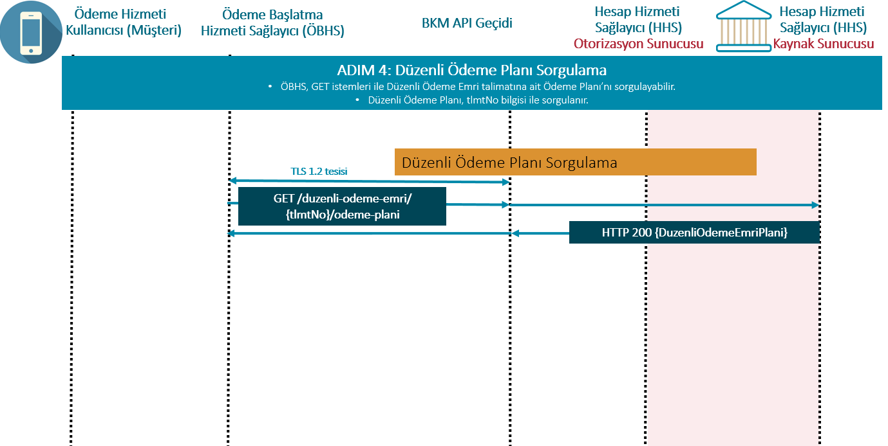

# 8.	Düzenli Ödeme Emri Başlatma Hizmeti

Ödeme hizmeti kullanıcısının düzenli tekrar edene bir ödeme talimatı gerçekleştirmek istediği ödeme emirlerinde bu hizmeti kullanabilir. Ödemenin Havale / PÖS / FAST ödeme sistemlerinden hangisi ile gerçekleşeceğine, ödeme günü geldiğinde HHS karar verir. 

Düzenli ödeme hizmetini online bankacılık sistemlerinde sunan HHS'lerin, ÖHVPS üzerinden bu hizmetleri sunması zorunludur. Mevcutta online kanallarından bu hizmeti sundukları müşteri segmentine (bireysel,kurumsal vb.), ÖHVPS üzerinden hizmet sunmaya devam etmeleri gerekmektedir. YÖS, bireysel müşteri özelinde düzenli ödeme hizmeti vermeyen HHS'ye düzenli ödeme talimatı rızası isteği yapması durumunda HHS tarafından **TR.OHVPS.Business.UnsupportedIndividual** hatası , kurumsal müşteri özelinde düzenli ödeme talimatı rızası isteği yapıldığında HHS tarafından **TR.OHVPS.Business.UnsupportedCorporate** hatası verilmelidir.

 HHS'ler düzenli ödeme hizmetini sunuş bilgilerini HHS API aracılığı ile yayınlayacaklardır. YÖS, düzenli ödeme hizmeti başlatabileceği HHS'lerin listesini HHS API'de yer alan "hizmetTipi":"03" parametresi ile alabilir. YÖS, düzenli ödeme hizmeti sunmayan HHS'ye düzenli ödeme talimat rızası isteği yapması durumunda HHS tarafından **TR.OHVPS.Business.StandingOrderNotSupported** hatası iletilmelidir.

Düzenli ödeme talimatı güncelleme hizmeti bulunmayacaktır. ÖHK aktif olan düzenli ödeme talimat rızasını iptal ederek, yeniden oluşturabilecektir.

 
Düzenli Ödeme Emri Başlatma Hizmeti 5 temel akışdan oluşur:  

0.	**Düzenli Ödeme Emri Rızası Başlatma İsteğinin tetiklenmesi:** ÖHK ÖBHS mobil uygulama ya da websitesinden düzenli ödeme emri rızasını başlatır. 
1.	**Düzenli Ödeme Emri Rıza Hazırlanması:** ÖBHS, “Düzenli Ödeme Emri Rızası Başlatma” işlemi için izin oluşturulması isteğini HHS’ye iletir. 
2.	**Düzenli Ödeme Emri Rızasının Yetkilendirilmesi:** HHS, gerekli gördüğü durumlarda ÖHK’yı GKD ile doğrular ve düzenli ödeme emri rızasına erişim için erişim belirteci tanımlanmasını temin eder.
3.	**Düzenli Ödeme Emrinin Başlatılması:** ÖBHS, “düzenli ödeme emri”ni HHS’ye iletir.
4.	**Düzenli Ödeme Emri Rıza Durumu, Düzenli Ödeme Emri Durumu, Düzenli Ödeme Emri Detayı Sorguları:** ÖBHS, Düzenli Ödeme Emri Rıza Durumu, Düzenli Ödeme Emri Durumu, Düzenli Ödeme Emri Detayı bilgilerini isteğe bağlı olarak sorgulayabilir.
5.	**Düzenli Ödeme Planı Sorguları:** ÖBHS, Düzenli Ödeme Emri için oluşturulan talimata dair ödeme planını sorgulayabilir.

Nezdinde ödeme hesabı bulunduran hesap hizmeti sağlayıcılar(Banka, EPK, Ödeme Kuruluşları)  müşterilerine ait hesapları hesap referansı ya da hesap numarası üzerinden takip etmektedir. YÖS'lerin hem HBH hem de ÖBH servisleri için hesap referansı veya hesap numarası üzerinden işlem yapılabileceğini bilmeleri, sistemlerini API dokümanında belirtilen akışlara göre uyumlandırmaları ve müşteri bilgilendirmesini(önyüzlerinde hesap no ve hesap referansı ayrımını gözeterek) buna paralel yapmaları beklenmektedir. 

YÖS'ler gönderen hesap seçimini aşağıdaki yöntemlerden biri ya da birkaçı ile sağlayabilirler:
- YÖS, müşterisinin ödeme hesabını HHS ekranından seçtirebilir.
- YÖS, müşterisinden Hesap Bilgisi rızası alır. Rıza aldığı hesaplar üzerinden hesap referansı aracılığı ile düzenli ödeme emri başlatabilir. 
- YÖS, müşterisinin ödeme hesabını elle girmesine olanak tanıyabilir. IBAN'ı olmayan HHS'ler düzenli ödeme emri rızası adımında **TR.OHVPS.Business.IBANNotSupported** hatasını vermelidir. IBAN'ı olan HHS'lerin bu akışı desteklemesi zorunludur.
- YÖS; müşterisinin hesap referansını elle girmesini sağlayabilir. Hesap Referansı bilgisi ile başlatılan düzenli ödeme emri işlemlerinde HHS seçimi zorunludur.

 Ödeme Sistemine doğrudan katılımcı olmayan HHS'ler, müşterilerine IBAN sunmadıkları için, YÖS'ler hesap referansı ile ödeme başlatabilirler. Bunların dışındaki HHS'lerin, gönderen IBAN veya hesap referansı ile ödeme akışını desteklemesi zorunludur.
 

## Düzenli Ödeme Emri Başlatma Hizmeti için Erişim Adresleri (Endpoints)

Düzenli Ödeme Emri Başlatma Hizmeti İçin Erişim Adreslerinin Etki Alanı (Scope) = “odeme_emri” olarak belirtilmelidir. Ödeme Emri Hizmeti ile aynı etki alanı(scope) kullanılmaktadır.

**Tablo : Düzenli Ödeme Emri Başlatma Hizmeti İçin Erişim Adresleri**  

| No | Kaynak|HTTP işlemi |Erişim Adresi |Zorunlu / İsteğe Bağlı |Yetkilendirme Türü |İmzalama|İstem Nesnesi |Yanıt Nesnesi |
| --- |--- |--- |--- |--- |--- |--- |--- |--- |
| 1|duzenli-odeme-emri-rizasi|POST |/duzenli-odeme-emri-rizasi |Z |İstemci Kimlik Bilgileri |İmzalı İstek ve Yanıt |DuzenliOdemeEmriRizasiIstegi |DuzenliOdemeEmriRizasi |
| 2|erisim-belirteci (GKD için)|POST | /erisim-belirteci |Z |İstemci Kimlik Bilgileri |İmzalı İstek ve Yanıt |ErisimBelirteciIstegi |ErisimBelirteci |
| 3 |duzenli-odeme-emri-rizasi |GET | /duzenli-odeme-emri-rizasi/{rizaNo} |Z |İstemci Kimlik Bilgileri  |İmzalı Yanıt |- |DuzenliOdemeEmriRizasi |
| 4 |duzenli-odeme-emri |POST | /duzenli-odeme-emri |Z |İstemci Kimlik Bilgileri & Yetkilendirme Kodu (GKD) |İmzalı İstek ve Yanıt |DuzenliOdemeEmriIstegi |DuzenliOdemeEmri |
| 5 |duzenli-odeme-emri |GET | /duzenli-odeme-emri/{talimatNo}|Z |İstemci Kimlik Bilgileri & Yetkilendirme Kodu (GKD) |İmzalı Yanıt |- |DuzenliOdemeEmri |
| 6 |duzenli-odeme-emri-rizasi-iptal |DELETE | /duzenli-odeme-emri-rizasi/{rizaNo}|Z |İstemci Kimlik Bilgileri | - |- |- |
| 7 |duzenli-odeme-talimat-plani |GET | /duzenli-odeme-emri/{talimatNo}/odeme-plani|Z |İstemci Kimlik Bilgileri & Yetkilendirme Kodu (GKD) |İmzalı Yanıt |- |DuzenliOdemeEmriPlani |

## 8.1.	ADIM 0 - Düzenli Ödeme Emri Rızası Başlatma Isteği

- 	ÖHK, ÖBHS uygulamasında (web arayüzü/mobil uygulama) düzenli ödeme emri rızası sürecini başlatır.
-  Gönderen hesap detaylarının bu aşamada belirtilmesi zorunlu değildir.


## 8.2.	ADIM 1 - Düzenli Ödeme Emri Rızasının Hazırlanması

  

**Şekil : Düzenli Ödeme Emri Rızasının Hazırlanması**  

- ÖBHS, ödeme hizmeti kullanıcı hesabının bulunduğu HHS’ye bağlanarak düzenli ödeme emri rıza kaynağının oluşturulmasını (DuzenliOdemeEmriRizasi) sağlar.   

- POST isteği TLS protokolü tesis edilen iletişim katmanı üzerinden gerçekleştirilir. TLS için nitelikli sertifikalar kullanılır.  

- POST isteğinin başlığındaki alanlar ve istemcinin sertifikasındaki özel alanlar kullanılarak istemcinin yetkilendirilmesi sağlanır:
  - İstekte bulunan ÖBHS yetkilendirilmiş mi?
  - İstekte bulunan yetkilendirilmiş ödeme hizmeti sağlayıcısı ÖBHS rolüne sahip mi?
  - İstekte bulunulan HHS kodu doğru mu?
- POST başarılı olursa, HHS, düzenli ödeme emri için içeride rıza olup olmamasına bakılmaksızın yeni bir rıza tanımlayıcısı RizaNo içeren DuzenliOdemeEmriRizasi  yanıt olarak döner.
- 1 ÖHK'nın 1 YÖS için 1 HHS'de istediği kadar rızası olabilir.
- HHS tarafında RizaDurumu değişkeninin durumu “Yetki Bekleniyor” olarak güncellenir.
- YÖS’ün doğrulama ekranı olarak ÖHK’ya açacağı URL adresini de ilgili rıza numarasına göre oluşturur. Burada 2 farklı yöntemle URL oluşturabilir.

  - **Statik URL** :   
  HHS’nin base pathi/alt-dizin/{rızaNo}  
  Örnek hhsYonAdr : https://xbank.com.tr/ohvps/cb54834e36f742d09af3d534ece3352a  
Bu adres için ilgili doğrulama sayfası önden hazırlanmalı ve ÖHK’nın doğrulama sayfasına erişimi için yayınlanmış olmalıdır (publish edilmelidir).
  - **Dinamik URL**:  
HHS’nin base pathi/alt-dizin/GKD Karşılama Ekranı?rizano={rızano}  
Örnek: https://xbank.com.tr/ohvps/gkd?rizano=cb54834e36f742d09af3d534ece3352a

**POST /duzenli-odeme-emri-rizasi**

İSTEK:

ÖBHS, bu API erişim adresinden HHS’ye yeni bir DuzenliOdemeEmriRizasi oluşturulması için istekte bulunur:  
- ÖBHS, düzenli ödeme emri başlatma isteği olduğunu HHS’ye bildirir.  
- ÖBHS, ÖHK’nın, ÖBHS arayüzünden verdiği rızanın (“Ön Onay”) bir kopyasının HHS nezdinde müşteri tarafından onaylanması için HHS’ye gönderilmesini sağlar.  
- HHS; istek mesajında yer alan alanların ÖHVPS API İlke ve Kuralları dökümanında belirtilen şartları sağlayacak şekilde zorunluluk, uzunluk ve içerik kontrollerini yapar. (Zorunlu)  
- HHS; YÖS API ile alınan ÖBHS bilgilerinin içerisinde yer alan yönlendirme adresleri ile düzenli ödeme emri rızası nesnesi request mesajında paylaşılan adreslerin uyumlu olup olmadığının kontrollerini yapar. (Zorunlu)  
- HHS; kimlik bilgileri nesnesinde eğer kimlik bilgileri iletilmiş ise; bu veri ile ÖHK’nın HHS müşterisi olup olmadığının kontrollerini yapar. Bu kontrol hem bireysel hem de kurumsal ÖHK’lar için yapılmalıdır.  (Koşullu Zorunlu)  
- HHS kimlik bilgisi ile gönderen unvanının uyumlu olduğunun kontrol eder. HHS'ler EFT/FAST işlemlerinde kabul ettikleri kontrol kriterleri ile işleme izin verebilirler. (Zorunlu)  
- Gönderen Hesap Numarası ile ilgili Tablo’da belirtilen kontroller yapılmalıdır. (Zorunlu)  
- HHS, ödeme için benzersiz “RizaNo” ile “DuzenliOdemeEmriRizasi” nesnesi oluşturur ve ÖBHS’ye döner.  
- HHS, DuzenliOdemeEmriRizasi oluşturduğu anda durumunu “Yetki Bekleniyor” olarak düzenler.  
Bu aşamada ÖHK’nın HHS tarafından tanımlanmış ve isteğin veri alanında gönderen hesaba (borçlandırılacak hesaba) ilişkin bir bilgisinin olması gerekmez.  
Hesap bakiye kontrolünün rıza aşamasında yapılmaması gerekmektedir. Çünkü ÖHK düzenli ödeme emri gerçekleşene kadar hesabına para eklemesi yapabilir.   

Düzenli ödeme emri rızasında alıcı hesap bilgileri Karekod ya da Kolas ile belirlenebilir. HHS online kanallarında düzenli ödeme hizmetini Karekod ve Kolas aracılığı ile kabul ediyorsa, ÖHVPS servisleri ile de kabul etmek zorundadır. YÖS tarafından düzenli ödeme emri rızası isteği içerisinde alıcı bilgisi için karekod ya da kolas kompleks alanları yer alması durumunda , destek vermeyen HHS'ler tarafından **TR.OHVPS.Business.UnsupportedRecipientAccountType** hatası verilmelidir.

Tek seferlik ödeme işlemlerinde (gönderen kimlik bilgilerinin boş olduğu durumda) ve işyeri ödemelerinde düzenli ödeme emri rızası başlatılmamalıdır. YÖS tarafından başlatılan düzenli ödeme emri rızası işleminde bu gönderen kimlik boş olması ve/veya işyeri ödeme bilgilerinin iletilmesi durumunda **TR.OHVPS.Resource.InvalidFormat** hata kodu iletilmeli ve fieldErrors dolu olacak şekilde hatalı alanı belirten detaylı açıklama gönderilmelidir. InvalidFormat hata kodlarında fieldErrors içeriği gönderilmeli ve anlaşılır açıklama ile message, messageTr alanları doldurulması zorunludur.


**POST /duzenli-odeme-emri-rizasi** isteğinin (REQUEST) gövdesinde (BODY)  “DuzenliOdemeEmriRizasiIstegi” nesnesi (Tablo) kullanılır. İstek başarıyla sonuçlanırsa HHS kaynak sunucusunda “DuzenliOdemeEmriRizasi” (Tablo) nesnesi oluşturulur.


#### **BAŞARILI İSTEK:**

**Tablo : “DuzenliOdemeEmriRizasiIstegi” nesnesi**  

| Alan Adı | JSON Alan Adı |Format: Veri modeli İsmi  |Zorunlu / Koşullu / İsteğe bağlı |Açıklama |HHS tarafından düzenli ödeme emri rızası oluşturulması sırasında yapılması gereken kontrol ve işlemler |
| --- |--- |--- |--- |--- |--- |
| **Katılımcı Bilgisi** | katilimciBlg | Kompleks:KatilimciBilgisi | Z | Katılımcılara atanmış kod bilgileridir. | |
| **>Hesap Hizmeti Sağlayıcısı Kodu** | hhsKod  | AN4  | Z  |  İsteğin iletildiği Hesap Hizmeti Sağlayıcısının kodudur. (Nezdinde ÖH bulunduran kuruluş kodu. Örneğin, Banka, Elektronik Para Kuruluşu ve Ödeme Kuruluşu) | HHS, hhsKod’un kendisine ait olduğunu ve istek başlığındaki x-aspsp-code değeri ile aynı olduğunu kontrol eder. <br>Hata durumunda **TR.OHVPS.Connection.InvalidASPSP** hata kodunu döner.  |
| **> Yetkili Ödeme Hizmeti Sağlayıcısı Kodu** | yosKod		  | AN4  | Z  | İsteği gönderen Yetkili Ödeme Hizmeti Sağlayıcısı (YÖS) kodudur.  | HHS, yosKod’un geçerli bir Ödeme Hizmeti Sağlayıcısı Kodu olduğunu ve istek başlığındaki x-tpp-code değeri ile aynı olduğunu kontrol eder. Hata durumunda **TR.OHVPS.Connection.InvalidTPP** hata kodunu döner. |
| **GKD** | gkd  |  Kompleks:Gkd | Z   |   |  |
| **> Yetkilendirme Yöntemi**	| yetYntm  | AN1  |  İ | **TR.OHVPS.DataCode.GkdTur** sıralı veri türü değerlerinden birini alır. Yetkilendirme yöntemi, ÖBHS tarafından belirtilmeyebilir.  | HHS, HBHS’nin belirlediği yöntemi dikkate alarak süreci ilgili akışa uygun olarak devam ettirir. Desteklemediği yöntem için (örn: Ayrık GKD) ayrıca hata mesajı verilmelidir. |
| **> Yönlenme Adresi** | yonAdr  |  AN1..1024 | K  | Yönlendirmeli güçlü kimlik doğrulama için zorunlu.<br> YÖS’ün ileteceği adrestir.<br> Durum kodu(drmKod), yönlendirme adresine parametre olarak eklenmelidir.| HHS, müşteri uygulama / tarayıcısını bu alanda belirtilen adrese yönlendirir. |
| **> Ayrık GKD**	| ayrikGkd  | Kompleks:AyrikGkd  | K   | Ayrık güçlü kimlik doğrulama için zorunlu.  | yetYntm = A gönderilmiş ise ayrikGkd nesnesinin dolu gönderilmesi zorunludur. <br><br> HHS, YÖS'ün AYRIK_GKD_BASARILI ve AYRIK_GKD_BASARISIZ olay tipleri için olay aboneliğinin varlığını kontrol eder. [Bknz: Ayrık GKD](gkd.html#_5-2-ayr%C4%B1k-guclu-kimlik-dogrulama)  |
| **>> OHK Tanım Tip**	| ohkTanimTip  | AN8  | K   | ÖHK'nın HHS uygulaması tarafından tanınmasını sağlayacak tanım tipleridir. **TR.OHVPS.DataCode.ohkTanimTip** sıralı veri tiplerinden birini alır. |  |
| **>> OHK Tanım Değer**	| ohkTanimDeger  | AN1..30  | K   |ÖHK'nın HHS uygulaması tarafından tanınmasını sağlayacak tanım değeridir. ohkTanimTip'i ile uyumlu değerdir.|  |
| **Ödeme Başlatma** | odmBsltm  | Kompleks: OdemeBaslatma  | Z   |   |  |
| **> Kimlik** | kmlk  | Kompleks:Kimlik  | Z   |   |  |
| **>> Kimlik Türü** | kmlkTur  | AN1| Z | **TR.OHVPS.DataCode.KimlikTur** sıralı veri türü değerlerinden birini alır.| Çerçeve sözleşme kapsamındaki ödemelerde kullanımı zorunludur.<br>HHS geçerli bir Kimlik Numarası Türü olduğunu kontrol eder.<br>Kurum adına yapılan (ticari) ödemelerde, kurum adına işlem yapan kullanıcının kimlik türünün bu alanda gönderilmesi zorunludur. |
| **>> Kimlik Verisi** | kmlkVrs   | AN1..30 |Z  | HHS nezdinde kullanıcı doğrulamasında kullanılan tanımlayıcıdır.<br>**TR.OHVPS.DataCode.KimlikTur** değerine göre uzunluk ve formatı değişir.| Çerçeve sözleşme kapsamındaki ödemelerde kullanımı zorunludur.<br>HHS, ÖBHS tarafından iletilmesi durumunda Kimlik Verisi üzeriden çapraz kontroller uygulamalı ve Kimlik Verisini temel alarak GKD gerçekleştirmelidir.<br> Pasaport numarasına ilişkin kontroller HHS'nin halihazırda kullandığı veri, akış ve tabi olduğu diğer düzenlemelerdeki işleyiş ile aynı şekilde ele alınmalıdır.<br> Kurum adına yapılan (ticari) ödemelerde, kurum adına işlem yapan kullanıcının kimlik türünün bu alanda gönderilmesi zorunludur. |
| **>> Kurum Kimlik Türü** | krmKmlkTur   |   AN1 |Z  | Kurum adına yapılan ödemelerde ÖHK’nın altında tanımlı olduğu tüzel kişilik için kullanılan kurum kimlik türüdür.<br>**TR.OHVPS.DataCode.KurumKimlikTur** sıralı veri türü değerlerinden birini alır.  | Kurum adına yapılan (ticari) ödemelerde kullanımı zorunludur.<br> HHS geçerli bir Kurum Kimlik Numarası Türü olduğunu kontrol eder. |
| **>> Kurum Kimlik Verisi**	| krmKmlkVrs |  AN1..30  |Z  | Kurum adına yapılan ödemelerde ÖHK’nın altında tanımlı olduğu tüzel kişilik için kullanılan kurum kimlik verisidir.<br> **TR.OHVPS.DataCode.KurumKimlikTur** değerine göre uzunluk ve formatı değişir.  |Kurum adına yapılan (ticari) ödemelerde kullanımı zorunludur.<br> HHS, ÖBHS tarafından iletilmesi durumunda Kurum Kimlik Verisi üzeriden çapraz kontroller uygulamalıdır. |
| **>> Ödeme Hizmeti Kullanıcısı Türü** |  ohkTur  | AN1   | Z |**TR.OHVPS.DataCode.OhkTur** sıralı veri türü değerlerinden birini alır **(B: Bireysel, K:Kurumsal)**| Kurum adına yapılan ödemelerde K değerini alır. Kurum Kimlik Türü ve Kurum Kimlik Verisi alanlarının girilmiş olduğu çapraz olarak kontrol edilir. |
| **> Gönderen** | gon   |  Kompleks:Hesap  | İ |   |  |
| **>> Unvan**	| unv   | AN3..140  | Z | Gönderenin unvanıdır.<br> HHS, bu bilgiyi ÖBHS sisteminden gelen veri yerine FAST’a iletirken kendi sisteminden alabilir.<br> |HHS’nin bu veri ile kendi sistemlerindeki verinin farklı olması ve Kimlik Numarası ile eşleşmemesi durumunda düzenli ödeme emri başlatma isteği reddedilir.<br> ÖBHS verisi ile HHS verisinin farklılaşması durumunun ise risk değerlendirme sistemlerine girdi olarak kullanması tavsiye edilir.|
| **>> Hesap Numarası** |  hspNo  |  AN26  | İ | ÖBHS'nin ön yüzünden daha önce kayıt altına alınmış hesaplar arasından seçtirdiği veya müşteriye girdiği IBAN’dır.<br> ÖBHS tarafından iletilmediği durumda, gönderen hesap bilgisini müşteri tarafından HHS’nin dijital kanalında GKD sonrasında seçilebilir. Bu amaçla ÖBHS arayüzünde HHS seçtirilmelidir.<br> Hesap Referansı kullanılıyorsa Hesap Numarası kullanılmayabilir. Hesap referansı ile düzenli ödeme emri rızası başlatılacak ise HHS hesap referansı değeri ile ilişkilendirilmiş mevcut bir hesap bilgisi rızası var mı kontrol etmelidir. Eğer aktif bir rızası yok ise **TR.OHVPS.Business.InvalidContent** hatası verilmelidir. <br> Ödeme Sistemine doğrudan katılımcı olmayan ÖHS'ler müşterilerine IBAN sunmadıkları için hspRef üzerinden ödeme başlatabilirler. Bu durumda hesap numarası boş olacaktır. | ÖBHS tarafından iletildiği durumda; IBAN içerisindeki HHS kodunun istek başlığındaki HHS kodu ile aynı olduğu (hesabın HHS’ye aitliğinin kontrolü), IBAN’ın doğruluğu (kontrol basamağı doğrulaması), Hesap numarasının ÖHK’ya ait olduğu, HHS’ye özel ödeme izni verilmeyen farklı statülerin bulunması durumu kontrol edilir.<br> Kontrol başarısız olduğunda **TR.OHVPS.Business.InvalidAccount** hatası YÖS’e iletilir. |
|**>> Hesap Referansı** | hspRef   |  AN5..40  | İ | HHS tarafından hesap için atanan biricik tanımlıyıcıdır (uuid).<br>YÖS bazında farklılaşması gerekmez.<br> ÖBHS’nin aynı zamanda HBHS olduğu durumda müşteri rızası tesis edilmiş bir hesabın referansı üzerinden de ödeme başaltılabilir.<br> Hesap Numarası kullanılıyorsa Hesap Referansı kullanılmayabilir. <br> Ödeme Sistemine doğrudan katılımcı olmayan HHS'ler müşterilerine IBAN sunmadıkları için hspRef üzerinden ödeme başlatabilirler. Bu durumda hesap numarası boş olacaktır.   | HspRef'e bağlı IBAN değiştiğinde yeni IBAN'ın da ilgili HspRef ile ilişkilendirilmesi beklenmektedir. Bu durumda, HBHS, HspRef ile sorguya geldiğinde HHS'nin yeni IBAN ve hesap hareketlerini dönebilmesi mümkün olacaktır. HspRef’in, IBAN değiştiğinde değiştirilmemesi tavsiye edilmektedir.|
| **> Alıcı** |  alc  |  	Kompleks:Hesap  | Z |   |  |
| **>> Unvan** | unv | AN3..140 | K  | **Kolay Adres Sistemi** kullanılmıyorsa zorunludur.<br> Alıcının unvanıdır. ÖBHS ekranlarından girişi yapılabileceği gibi ÖBHS’nin kayıtlı alıcılarından yapılan seçimle de doldurup gönderebildiği bilgi olabilir.<br> FAST-TR Karekod Veri Organizasyonunda;<br> İşyeri tarafından sunulan uzun karekod yapısının **59:** alanında tanımlı İşyeri adı alanıdır, Kişiden Kişiye Ödeme Karekod Yapısının **07:** alanında tanımlı <br> **Ödeme Alıcısının Adı ve Soyadı** alanıdır. |  |
| **>> Hesap Numarası**	|hspNo | AN26 | K | **Alıcının Hesap Numarası (IBAN)** alanıdır.<br> **Kolay Adres Sistemi** kullanılmıyorsa zorunludur.<br> Karekod akışında, FAST Karekod Veri Organizasyonundaki **30-01:** alanında tanımlı İş Yeri IBAN verisi kullanılır.<br> Alıcının birden fazla hesabının kullanılabilir olduğu durumlarda (özellikle işyeri ödemelerinde HHS nezdindeki hesap (on-us havale akışı) tercih edilmelidir. | HHS (Gönderen Katılımcı) tarafından IBAN doğrulaması (kontrol basamağı doğrulaması) yapılır.  |
| **>> Kolay Adres** | kolas   | Kompleks:Kolas  | K  | Talimatın gerçekleşeceği ana kadar KOLAS tanımınında değişiklik olabileceği için,  KOLAS ile yapılan düzenli ödeme emri işlemleri, talimatın verildiği anda çözülen IBAN'a yapılacaktır.   | Kolas ile düzenli ödeme emri hizmeti desteklenmiyorsa; HHS tarafından TR.OHVPS.Business.UnsupportedRecipientType hatası dönülmelidir. |
| **>>> Kolas Türü**  |  kolasTur   |  AN1   | Z  |  **TR.OHVPS.DataCode.KolasTur** sıralı veri türü değerlerinden birini alır.<br> Alıcı Hesap Numarası girilmediyse kullanımı zorunludur ve **Kolay Adres Tipi** alanıyla birlikte kullanılır. | HHS (Gönderen FAST katılımcısı) tarafından KOLAS Servisine yapılan sorguda girdi olarak kullanılır. |
| **>>> Kolas Değeri**  |  kolasDgr   |  AN7..50   |  Z | Müşterinin eklediği, HHS (FAST katılımcısı) tarafından doğrulanmış Kolay Adres değeridir. Alabileceği değerler BKM “Kolay Adresleme Sistemi Uygulama Kuralları” belgesinde tanımlıdır.<br> Hesap Numarası girilmediyse kullanımı zorunludur ve **Kolay Adres Tipi** alanıyla birlikte kullanılır.  | HHS (Gönderen FAST katılımcısı) tarafından KOLAS Servisine yapılan sorguda girdi olarak kullanılır.  |
| **> Karekod**  | kkod | Kompleks:Karekod   |  	K   |  Karekod ile yapılan düzenli işlemler, talimatın verildiği anda çözülen IBAN'a yapılacaktır.    |Karekod ile düzenli ödeme emri hizmeti desteklenmiyorsa; HHS tarafından TR.OHVPS.Business.UnsupportedRecipientType hatası dönülmelidir.  |
| **>> Akış Türü** |   aksTur  |  AN2   |  Z | **TR.OHVPS.DataCode.KareKodAksTur** sıralı veri değerlerinden birini alır. Kolay Adresi Sistemi ile birlikte kullanılmaz.  |  |
| **>> Referansı** | kkodRef   | AN1..12    | K  |  **Karekod referans numarasını** gösterir.<br>Okunan karekodda referans değeri varsa kullanılması zorunludur.<br> Karekod ilke ve kurallar belgesinde tanımlandığı şekilde kullanılması gerekmektedir.<br> Kolay Adresi Sistemi ile birlikte kullanılmaz. |  |
| **>> Üretici Kodu**	  |  kkodUrtcKod   |   AN4  |Z   | Karekod üreticisinin kodu.<br> Ödeme Hizmeti Sağlayıcıları ve TCMB tarafından uygun görülen ödeme sistemi işleticisi TR Karekod üretebilmek için BKM’ye kayıt başvurusu yaparak karekod üretici kodu alabileceklerdir. Bankalar EFT kodlarını kullanacak olup ayrıca kayıt yaptırmalarına gerek bulunmamaktadır. 4 haneden kısa değerlerin sol tarafı ’0’ karakteri ile tamamlanmalıdır.  |  |
| **> Ödeme Ayrıntıları**	| odmAyr |  Kompleks: OdemeAyrintilari | Z  |   |  |
| **>> Ödeme Kaynağı** |odmKynk   |  AN1   |Z   |  Ödemenin başlatıldığı kaynağı belirtir. **TR.OHVPS.DataCode.OdemeKaynak** sıralı veri veri değerlerinden “O” değeri atanarak iletilmelidir. “O” değeri “Açık bankacılık aracılığı ile gönderilen ödemelerde kullanılır.” anlamını taşımaktadır.  | HHS, YÖS'ün API deseninde "O" kodunu ilettiğini kontrol eder. |
| **>> Ödeme Amacı** |  odmAmc   |   AN2  | Z  |  **TR.OHVPS.DataCode.OdemeAmaci** sıralı veri değerlerinden birini alır. Karekod akışında, FAST Karekod Veri Organizasyonundaki 62-08: alanında tanımlı Ödeme Amacı verisi kullanılır. | HHS geçerli bir Ödeme Amacı kodu olduğunu kontrol eder. |
| **>> Referans Bilgisi**	|  refBlg   |  AN1..140   | K  |  Ödemeye özel **Referans Bilgisi** alanıdır. Karekod işlemi değil ise zorunludur.<br> -	Kişiden kişiye fon aktarımlarında: Gün içerisinde ÖHK özelinde, her işleme özel biricik olarak oluşturulan referans bilgisidir. <br>Karekod P2P akışı için referans bilgisi (Karekod referans numarası değil, işleme özel üretilecek referans bilgisidir.) YÖS tarafından atanacaktır. <br> -	E-ticaret işlemlerinde sipariş/takip numarası/müşteri/abone numarası<br> -	İşyeri Ödemesi Karekod akışında, FAST Karekod Veri Organizasyonundaki<br> -	62-01: alanında tanımlı Fatura Numarası <br> -	62-06: alanında tanımlı Müşteri Numarası <br> verilerinden biri kullanılır. | YÖS bu değeri ÖHK’yı HHS’ye yönlendirmeden önceki ekranda göstermeli, ve HHS bu değeri GKD için kullandığı önyüzünde “işlem doğrulama kodunun” bir unsuru olarak yine ÖHK’ya göstermelidir.  |
| **>> Açıklama**	|  odmAcklm   | AN1..200    | İ  | ÖBHS’nin ÖHK’dan aldığı ya da kendisinin atadığı işlem açıklaması bilgisi. <br>FAST/PÖS sistemi üzerinden yapılan ödemeler için açıklama bilgisi girilirse boşluk karakteri girilerek geçilemez. En az bir alfasayısal karakter girilmesi zorunludur.<br>  |  |


#### **BAŞARILI YANIT:**  

POST işleminin RESPONSE gövdesini (BODY) oluşturan “DuzenliOdemeEmriRizasi” nesnesi Tablo’da parametrelerden oluşur:  


**Tablo : “DuzenliOdemeEmriRizasi” nesnesi**  


| Alan Adı | JSON Alan Adı |Format: Veri modeli İsmi  |Zorunlu / Koşullu / İsteğe bağlı |Açıklama |
| --- |--- |--- |--- |--- |
|  **Riza Bilgileri**	| rzBlg | Kompleks: RizaBilgileri | Z |  |
| **> Rıza No**|rizaNo  | 	AN1..128 | Z  | DuzenliOdemeEmriRızasi nesnesinin oluşturulması esnasında HHS kaynak sunucusu tarafından atanan biricik tanımlayıcı |
| **> Oluşturma Zamanı** | olusZmn | ISODateTime | Z | DuzenliOdemeEmriRizasi nesnesinin oluşturulma zamanı |
| **> Güncellenme Zamanı** | gnclZmn | ISODateTime |  Z | DuzenliOdemeEmriRizasi nesnesinin güncellenme zamanı |
| **> Rıza Durumu** | rizaDrm | AN1 |  Z | **TR.OHVPS.DataCode.RizaDurumu** sıralı veri tipini değerlerinden birini alır. |
| **> Rıza Iptal Detay Kodu**| rizaIptDtyKod | AN2 | K  | **Rıza durumunun iptal olduğu durumda zorunludur. Alabileceği değerler 4. Bölümde detaylandırılmıştır.** |
| **Katılımcı Bilgisi** | katilimciBlg | Kompleks:KatilimciBilgisi | Z | Katılımcılara atanmış kod bilgileridir. |  
| **>Hesap Hizmeti Sağlayıcısı Kodu** | hhsKod  | AN4  | Z  |  İsteğin iletildiği Hesap Hizmeti Sağlayıcısının kodudur. (Nezdinde ÖH bulunduran kuruluş kodu. Örneğin, Banka, Elektronik Para Kuruluşu ve Ödeme Kuruluşu) | 
| **> Yetkili Ödeme Hizmeti Sağlayıcısı Kodu** | yosKod		  | AN4  | Z  | İsteği gönderen Yetkili Ödeme Hizmeti Sağlayıcısı (YÖS) kodudur.  | 
| **GKD** | gkd  |  Kompleks:Gkd | Z   |   |  
| **> Yetkilendirme Yöntemi**	| yetYntm  | AN1  |  Z | **TR.OHVPS.DataCode.GkdTur** sıralı veri türü değerlerinden birini alır.  HHS, ÖBHS’nin belirlediği yöntemi dikkate alarak kendi belirlediği yöntemi kullanır.  |  
| **> Yönlenme Adresi** | yonAdr  |  AN1..1024 | K  | Yönlendirmeli güçlü kimlik doğrulama için zorunlu. HHS, müşteri uygulama / tarayıcısını yönlendirmeli akışta bu alanda belirtilen YÖS adresine yönlendirir.
| **> Ayrık GKD**	| ayrikGkd  | Kompleks:AyrikGkd  | K   | Ayrık güçlü kimlik doğrulama için zorunlu.  | yetYntm = A gönderilmiş ise ayrikGkd nesnesinin dolu gönderilmesi zorunludur. yetYntm = Y için bu nesne iletilmemelidir. |
| **>> OHK Tanım Tip**	| ohkTanimTip  | AN8  | K   | ÖHK'nın HHS uygulaması tarafından tanınmasını sağlayacak tanım tipleridir. İstek içerisindeki veri değiştirilmeden iletilir. |  
| **>> OHK Tanım Değer**	| ohkTanimDeger  | AN1..30  | K   |ÖHK'nın HHS uygulaması tarafından tanınmasını sağlayacak tanım değeridir. ohkTanimTip'i ile uyumlu değerdir.  İstek içerisindeki veri değiştirilmeden iletilir.|  
| **> HHS Yönlenme Adresi**	| hhsYonAdr  |  AN1..1024 | K  | Yönlendirmeli akış türünde GKD doğrulama bilgilerinin girilebilmesi için uygulamadan açılacak yönlendirme sayfasının adresi. Ayrık GKD akışında bu alan dönülmemelidir.
| **> Yetkilendirme Tamamlanma Zamanı**	| yetTmmZmn  |  ISODateTime | Z  | Yetkilendirme akışının tamamlanması gereken son zamanı gösterir. <br> HHS tarafından maksimum 5 dk içinde işlem tamamlanacak şekil zaman damgası oluşturulur. Zaman aşımı olduğunda HHS’nin GKD’ye izin vermeyecek şekilde hata mesajı vermesi gerekmektedir.<br> Rıza durumu Yetkilendirildi statüsüne geçene kadarki süredir.|
| **Ödeme Başlatma** | odmBsltm  | Kompleks: OdemeBaslatma  | Z   |   |  
| **> Kimlik** | kmlk  | Kompleks:Kimlik  | Z   |   |  
| **>> Kimlik Türü** | kmlkTur  | AN1| Z | **TR.OHVPS.DataCode.KimlikTur** sıralı veri türü değerlerinden birini alır.| 
| **>> Kimlik Verisi** | kmlkVrs   | AN1..30 |Z  | HHS nezdinde kullanıcı doğrulamasında kullanılan tanımlayıcıdır.<br>**TR.OHVPS.DataCode.KimlikTur** değerine göre uzunluk ve formatı değişir.| 
| **>> Kurum Kimlik Türü** | krmKmlkTur   |   AN1 |Z  | Kurum adına yapılan ödemelerde ÖHK’nın altında tanımlı olduğu tüzel kişilik için kullanılan kurum kimlik türüdür.<br>**TR.OHVPS.DataCode.KurumKimlikTur** sıralı veri türü değerlerinden birini alır.  | 
| **>> Kurum Kimlik Verisi**	| krmKmlkVrs |  AN1..30  |Z  | Kurum adına yapılan ödemelerde ÖHK’nın altında tanımlı olduğu tüzel kişilik için kullanılan kurum kimlik verisidir.<br> **TR.OHVPS.DataCode.KurumKimlikTur** değerine göre uzunluk ve formatı değişir.  |
| **>> Ödeme Hizmeti Kullanıcısı Türü** |ohkTur| AN1| Z |**TR.OHVPS.DataCode.OhkTur** sıralı veri türü değerlerinden birini alır **(B: Bireysel, K:Kurumsal)**| 
| **> Gönderen** | gon   |  Kompleks:Hesap  | Z |   |
| **>> Unvan**	| unv   | AN3..140  | Z  | Gönderenin unvanıdır.<br> HHS, bu bilgiyi ÖBHS sisteminden gelen veri yerine FAST’a iletirken kendi sisteminden alabilir. <br> Tek seferlik ödeme dışında YÖS'ün gönderen unvanını göndermesi zorunludur.|
| **>> Hesap Numarası** |  hspNo  |  AN26  | İ | ÖBHS'nin ön yüzünden daha önce kayıt altına alınmış hesaplar arasından seçtirdiği veya müşteriye girdiği IBAN’dır.<br> ÖBHS tarafından iletilmediği durumda, gönderen hesap bilgisini müşteri tarafından HHS’nin dijital kanalında GKD sonrasında seçilebilir. Bu amaçla ÖBHS arayüzünde HHS seçtirilmelidir.<br> **GKD sonrası HHS ekranında seçilen Hesap Numarası POST işleminin yanıtında dönülemez ancak isteğe bağlı GET sorgusu ile dönülebilir.** <br> Hesap Referansı kullanılıyorsa Hesap Numarası kullanılmayabilir. <br> Ödeme Sistemine doğrudan katılımcı olmayan ÖHS'ler müşterilerine IBAN sunmadıkları için hspRef üzerinden ödeme başlatabilirler. Bu durumda hesap numarası boş olacaktır.  |
|**>> Hesap Referansı** | hspRef |  AN5..40  | İ | HHS tarafından hesap için atanan biricik tanımlıyıcıdır (uuid).<br>YÖS bazında farklılaşması gerekmez.<br> ÖBHS’nin aynı zamanda HBHS olduğu durumda müşteri rızası tesis edilmiş bir hesabın referansı üzerinden de ödeme başaltılabilir.<br> **GKD sonrası HHS ekranında seçilen Hesap Referansı POST işleminin yanıtında dönülemez ancak isteğe bağlı GET sorgusu ile dönülebilir.** <br> Hesap Numarası kullanılıyorsa Hesap Referansı kullanılmayabilir.  <br> Ödeme Sistemine doğrudan katılımcı olmayan ÖHS'ler müşterilerine IBAN sunmadıkları için hspRef üzerinden ödeme başlatabilirler. Bu durumda hesap numarası boş olacaktır.  |
| **> Alıcı** |  alc  |  	Kompleks:Hesap  | Z | |
| **>> Unvan** | unv | AN3..140 | Z  | Kolay Adres Alıcı Sorgusunda başarılı sorgu sonucunda dönülen adres kaydı yaptırmış olan alıcının maskeli ad-soyadı veya maskeli ticari unvan bilgisidir.<br>Kolas’tan dönen “account owner” alanı kullanılmalıdır.<br>Kolay adres değil ise ÖBHS tarafından istek mesajında iletilen unvan bilgisidir. |
| **>> Hesap Numarası**	|hspNo | AN26 | Z | ÖBHS tarafından istek mesajında iletilip doğrulanan veya Kolay Adres Alıcı Sorgusunda başarılı sorgu sonucunda dönülen alıcı maskeli IBAN bilgisidir. |
| **>> Kolay Adres** | kolas   | Kompleks:Kolas  | K  |  |
| **>>> Kolas Türü**  |  kolasTur   |  AN1   | Z  |  **TR.OHVPS.DataCode.KolasTur** sıralı veri türü değerlerinden birini alır.<br> Alıcı Hesap Numarası girilmediyse kullanımı zorunludur ve **Kolay Adres Tipi** alanıyla birlikte kullanılır. |  
| **>>> Kolas Değeri**  |  kolasDgr   |  AN7..50   |  Z | Müşterinin eklediği, HHS (FAST katılımcısı) tarafından doğrulanmış Kolay Adres değeridir. Alabileceği değerler BKM “Kolay Adresleme Sistemi Uygulama Kuralları” belgesinde tanımlıdır.<br> Hesap Numarası girilmediyse kullanımı zorunludur ve **Kolay Adres Tipi** alanıyla birlikte kullanılır.  |  
| **>>> Kolas Referans Numarası**  |  kolasRefNo   |  N12   |  Z | Kolay Adres Alıcı Sorgusunda başarılı sorgu sonucunda dönülen, BKM Kolay Adresleme Sistemi Uygulama Kuralları’nda tanımlı KOLAS tarafından ilgili sorguya özel olarak üretilmiş referans numarasıdır.|  
| **>>> Kolas Hesap Türü**  |  kolasHspTur   |  AN1   |  Z |Kolay Adres Alıcı Sorgusunda başarılı sorgu sonucunda dönülen, BKM Kolay Adresleme Sistemi Uygulama Kuralları’nda tanımlı hesap türü bilgisidir:<br> **TR.OHVPS.DataCode.KolasHspTur** sıralı veri değerlerinden birini alır.|  
| **> Karekod**  | kkod | Kompleks:Karekod   |  	K   |  |
| **>> Akış Türü** |   aksTur  |  AN2   |  Z | **TR.OHVPS.DataCode.KareKodAksTur** sıralı veri değerlerinden birini alır. Kolay Adresi Sistemi ile birlikte kullanılmaz. |
| **>> Referansı** | kkodRef   | AN1..12    | K  |  **Karekod referans numarasını** gösterir. |
| **>> Üretici Kodu**	  |  kkodUrtcKod   |   AN4  |Z   | Karekod üreticisinin kodu.<br> Ödeme Hizmeti Sağlayıcıları ve TCMB tarafından uygun görülen ödeme sistemi işleticisi TR Karekod üretebilmek için BKM’ye kayıt başvurusu yaparak karekod üretici kodu alabileceklerdir. Bankalar EFT kodlarını kullanacak olup ayrıca kayıt yaptırmalarına gerek bulunmamaktadır. 4 haneden kısa değerlerin sol tarafı ’0’ karakteri ile tamamlanmalıdır.|
| **> Ödeme Ayrıntıları**	| odmAyr |  Kompleks: OdemeAyrintilari | Z    |  |
| **>> Ödeme Kaynağı** |odmKynk   |  AN1   |Z   |  Ödemenin başlatıldığı kaynağı belirtir. **TR.OHVPS.DataCode.OdemeKaynak** sıralı veri değerlerinden “O” değerini alır. “O” değeri “Açık bankacılık aracılığı ile gönderilen ödemelerde kullanılır.” anlamını taşımaktadır.  |  
| **>> Ödeme Amacı** |  odmAmc   |   AN2  | Z  |  **TR.OHVPS.DataCode.OdemeAmaci** sıralı veri değerlerinden birini alır. Karekod akışında, FAST Karekod Veri Organizasyonundaki 62-08: alanında tanımlı Ödeme Amacı verisi kullanılır. |  
| **>> Referans Bilgisi**	|  refBlg   |  AN1..140   | K  |  Ödemeye özel **Referans Bilgisi** alanıdır. Karekod işlemi değil ise zorunludur.<br> -	Kişiden kişiye fon aktarımlarda: Gün içerisinde ÖHK özelinde, her işleme özel biricik olarak oluşturulan referans bilgisidir.<br> Karekod P2P akışı için referans bilgisi (Karekod referans numarası değil, işleme özel üretilecek referans bilgisidir.) YÖS tarafından atanacaktır.<br> -	E-ticaret işlemlerinde sipariş/takip numarası/müşteri/abone numarası<br> - İşyeri Ödemesi Karekod akışında, FAST Karekod Veri Organizasyonundaki<br> -	62-01: alanında tanımlı Fatura Numarası <br> -	62-06: alanında tanımlı Müşteri Numarası <br> verilerinden biri kullanılır. |  
| **>> Açıklama**	|  odmAcklm   | AN1..200    | İ  | ÖBHS’nin ÖHK’dan aldığı ya da kendisinin atadığı işlem açıklaması bilgisi. <br>FAST/PÖS sistemi üzerinden yapılan ödemeler için açıklama bilgisi girilirse boşluk karakteri girilerek geçilemez. En az bir alfasayısal karakter girilmesi zorunludur.|

  

## 8.3.	ADIM 2- Düzenli Ödeme Emri Rızasının Yetkilendirilmesi

  

**Şekil : Düzenli Ödeme Emri Rızasının Yetkilendirilmesi**  

ÖBHS, ÖHK’nın düzenli ödeme emrini yetkilendirmesi isteğini iletir. Ödeme emrinin yetkilendirilmesi, HHS tarafından gerçekleştirilen Yönlendirme veya Ayrık GKD yöntemiyle yapılır.
- **Yönlendirmeli doğrulama akışında**, ÖBHS ÖHK’yı HHS’ye yönlendirir. 
  - ÖBHS tarafından yönlendirme, bir önceki adımdaki RizaNo’yu içerir. 
  - Yönlendirmenin RizaNo’yu içermesi sayesinde, HHS hangi ödeme emriyle ilişkili olarak yönlendirme yapıldığını ilişkilendirebilir.
  -	HHS, ÖHK için GKD sürecini işletir.  

  ÖHK’yı doğrularsa,
    1. 	ÖHK -bir önceki adımda seçmediyse- borçlu hesabını seçer. 
    2. 	HHS, düzenli ödeme emri rıza kaynağının durumunu “Yetkilendirildi” olarak günceller. 
    3.  HHS, ÖHK’yı “olumlu yönlendirme akışı” ile ÖBHS tarafından tanımlanan yönlendirme adresine yönlendirir:  

```
yonAdr?rizaDrm=Y&yetKod=xx&rizaNo=yy&rizaTip=D&drmKod=zzz
```  

  ÖHK’yı doğrulayamazsa,  
    1. HHS, düzenli ödeme emri rıza kaynağının durumunu “Yetki İptal” olarak günceller.   
    2. HHS, ÖHK’yı “olumsuz yönlendirme akışı” ile ÖBHS tarafından tanımlanan yönlendirme adresine yönlendirir:  
    


```
yonAdr?rizaDrm=I&rizaNo=yy&rizaTip=D&drmKod=zzz
```  

HHS tarafında oluşabilecek bir hata durumunun YÖS’e aktarılması gerektiği durumlar olabilir. Bu durumda yonlendirme adresinde hata kodu parametresi zorunlu olarak iletilmelidir.  
Hata açıklamalarının neler olabileceği ve YÖS’ün kendi uygulamasında bu hatayı ne şekilde göstereceği aşağıda tariflenmiştir. 

```
yonAdr?rizaDrm=I&rizaNo=yy&rizaTip=D&rizaIptDtyKod=11&drmKod=zzz
```  


URL’de iletilen “Rıza İptal Detay Kodu” Rıza durumları bölümünde (4. Bölüm) belirtilen hata kodları ile aynı olacak şekilde tasarlanmıştır. GKD sırasında yapılması gereken kontroller 5.3 bölümünde detaylandırılmıştır.


- **Ayrık doğrulama akışında**, HHS, ÖHK’nın düzenli ödeme emri rızasını başlattığı uygulamadan farklı olabilecek bir “doğrulama” uygulamasında işlemi doğrulamasını ister. 
  - Ayrık akış ÖBHS’nin farklı bir kanal kullanarak yetkilendirme isteği göndermesiyle başlatılır. 
  - Bu yetkilendirme isteği, yetkilendirilecek ödeme emri rızasının eşleştirileceği ÖHK’nın bulunması için ilgili veriyi taşır. 
  - HHS, ÖHK’yı doğrular.
  - ÖHK, bir önceki adımda seçmediyse- borçlandırılacak hesabını seçer. 
  - HHS, düzenli ödeme emri rıza kaynağının durumunu “Yetkilendirildi” olarak günceller. 

Başarılı GKD sonrasında (rizaDrm=’Y’) ilgili rıza nesnesi için (belirli bir rizaNo) yetkilendirme kodunun (yetKod) alınmasının ardından erişim belirteci erişim adresine POST çağrısı yapılarak yetkilendirme kodu karşılığında erişim belirteci ve yenileme belirteci alınır. POST /erişim-belirteci erişim noktası EK-3’te açıklanmıştır.  

Erişim belirteci alındıktan sonra; HHS, düzenli ödeme emri rıza kaynağının durumunu “Yetki Kullanıldı” olarak günceller.

## 8.4.	ADIM 2.1 – Düzenli Ödeme Emri Rızasının Sorgulanması (isteğe bağlı)

  

**Şekil 7: “DuzenliOdemeEmriRizasi” nesnesinin sorgulanması (isteğe bağlı)**  

GKD işleminin başarıyla tamamlanıp Düzenli Ödeme Emri Rızasının yetkilendirilmesi esnasında, gönderen hesap seçiminin HHS ekranında yapıldığı durumlar olabilir. Bu durumlarda düzenli ödeme emri isteğinde gönderen hesap bilgilerinin zorunlu olması nedeniyle, **DuzenliOdemeEmriRizasi** nesnesi sorgulanarak bu bilgiler alınmalıdır. HHS, “**ADIM 2 -Düzenli Ödeme Emri Rızasının Yetkilendirilmesi**” akışında ÖHK’nın hesapları arasında seçim yapmasını ve seçilen hesap bilgisinin **DuzenliOdemeEmriRizasi** nesnesine işler.  

**GET /duzenli-odeme-emri-rizasi/{RizaNo}**  

ÖBHS, mevcut durumunu kontrol etmek için, oluşturulan bir **DuzenliOdemeEmriRizasi** kaynağının durumunu isteğe bağlı olarak alabilir.

**Durum**  

**DuzenliOdemeEmriRizasi** kaynağı için kullanılabilecek durum göstergeleri şu şekildedir:
- Yetki Bekleniyor
- Yetkilendirildi
- Yetki Kullanıldı
- Yetki Ödeme Emrine/Talimata Dönüştü
- Yetki Sonlandırıldı
- Yetki İptal

Düzenli Ödeme emri rıza durum değişiklikleri 4.2 bölümünde detaylandırılmıştır.  

**BAŞARILI YANIT:**

**GET /duzenli-odeme-emri-rizasi/{rizaNo}** yanıtının (RESPONSE) gövdesinde (BODY)  “DuzenliOdemeEmriRizasiİstegi” nesnesi kullanılır. İstek başarıyla sonuçlanırsa HHS kaynak sunucusunda Tablo-8’de yer alan parametreleri içeren “DuzenliOdemeEmriRizasi” oluşturulur.  


Gönderen Hesap Bilgisinin, ADIM 2 (İleri Tarihli Ödeme Emri Rızasının Yetkilendirilmesi) sonrasında HHS ekranından seçildiği akışta “DuzenliOdemeEmriRizasi” nesnesi güncellenir ve ÖBHS **GET /duzenli-odeme-emri-rizasi/{rizaNo}** isteği yaparak güncel gönderen hesap bilgisi bilgisini de içeren “DuzenliOdemeEmriRizasi” nesnesini çekmelidir.
 

## 8.5.	ADIM 3- Duzenli Ödeme Emrinin Oluşturulması

  

**Şekil 8: Duzenli Ödeme Emrinin Oluşturulması**  

**POST /duzenli-odeme-emri**

- ÖHK’nın Güçlü Kimlik Doğrulama ile işlemi yetkilendirmesi sonrasında, ÖBHS DuzenliOdemeEmri kaynağını oluşturur. 
- Duzenli Ödeme emri (DuzenliOdemeEmri) uygun ödeme kaynağına POST isteği yapılarak başlatılır. 
  - POST HHS tarafından işlenir: RizaDurumu “Yetki Kullanıldı” ise işleme başlanır.
  - POST /duzenli-odeme-emri-rizasi ile POST /duzenli-odeme-emri isteklerinde istek alanların aynı olması beklenmektedir. HHS tarafından kontrolü sağlanmalıdır.POST verisindeki Gönderen Hesap Numarası ve Alıcı Hesap Numarasının aynı bankaya aitse HAVALE değilse FAST veya PÖS iş akışına geçilir.
  - POST verisinin modele göre kontrolü yapılır (alan kontrolleri)
  -	POST verisinin mantıksal kontrolleri yapılır (IBAN kontrolü, çapraz alan kontroller)
  -	OdemeEmriDurumu bilgisi iletilir.
- POST başarılı olursa, içerisinde tlmtNo ve odmDrm değişkenleri de bulunan DuzenliOdemeEmri nesnesi ÖBHS’ye döner ve RizaDurumu değişkenin değeri “Yetki Ödeme Emrine/Talimata Dönüştü” olarak güncellenir.

**BAŞARILI İSTEK:**  


**Tablo 9: “DuzenliOdemeEmriIstegi” nesnesi**  


| Alan Adı | JSON Alan Adı |Format: Veri modeli İsmi  |Zorunlu / Koşullu / İsteğe bağlı |Açıklama |HHS tarafından düzenli ödeme emri oluşturulması sırasında yapılması gereken kontrol ve işlemler|FAST A01 PÖS M01 mesaj mapping| 
| --- |--- |--- |--- |--- |--- |--- |
| **Riza Bilgileri**	| rzBlg | Kompleks: RizaBilgileri | Z |  | | |
| **> Rıza No**|rizaNo  | 	AN1..128 | Z  | OdemeEmriRızasi nesnesinin oluşturulması esnasında HHS kaynak sunucusu tarafından atanan biricik tanımlayıcı | | |
| **> Oluşturma Zamanı** | olusZmn | ISODateTime | Z | OdemeEmriRizasi nesnesinin oluşturulma zamanı | | |
| **> Rıza Durumu** | rizaDrm | AN1 |  Z | **TR.OHVPS.DataCode.RizaDurumu** sıralı veri tipini değerlerinden birini alır. | | |
| **Katılımcı Bilgisi** | katilimciBlg | Kompleks:KatilimciBilgisi | Z | Katılımcılara atanmış kod bilgileridir. |   | |
| **>Hesap Hizmeti Sağlayıcısı Kodu** | hhsKod  | AN4  | Z  |  İsteğin iletildiği Hesap Hizmeti Sağlayıcısının kodudur. (Nezdinde ÖH bulunduran kuruluş kodu. Örneğin, Banka, Elektronik Para Kuruluşu ve Ödeme Kuruluşu) | HHS, hhsKod’un kendisine ait olduğunu ve istek başlığındaki x-aspsp-code değeri ile aynı olduğunu kontrol eder.<br> Hata durumunda **TR.OHVPS.Connection.InvalidASPSP** hata kodunu döner. |Gönderen katılımcı kodu (yani bankanın FAST/PÖS’teki Katılımcı kodu) |
| **> Yetkili Ödeme Hizmeti Sağlayıcısı Kodu** | yosKod		  | AN4  | Z  | İsteği gönderen Yetkili Ödeme Hizmeti Sağlayıcısı (YÖS) kodudur.  |HHS, yosKod’un geçerli bir Ödeme Hizmeti Sağlayıcısı Kodu olduğunu ve istek başlığındaki x-tpp-code değeri ile aynı olduğunu kontrol eder.<br> Hata durumunda **TR.OHVPS.Connection.InvalidTPP** hata kodunu döner.| **YosKod** |
| **GKD** | gkd  |  Kompleks:Gkd | Z   |   |   | |
| **>Yetkilendirme Yöntemi**	| yetYntm  | AN1  |  Z | **TR.OHVPS.DataCode.GkdTur** sıralı veri türü değerlerinden birini alır.   |   | 
| **>Yönlendirme Adresi** | yonAdr  |  AN1..1024 | K  | Yönlendirmeli güçlü kimlik doğrulama için zorunludur. HHS, müşteri uygulama / tarayıcısını yönlendirmeli akışta bu alanda belirtilen YÖS adresine yönlendirir.
 | | |
| **>Ayrık GKD**	| ayrikGkd  | Kompleks:AyrikGkd  | K   | Ayrık güçlü kimlik doğrulama için zorunlu.  | yetYntm = A gönderilmiş ise ayrikGkd nesnesinin dolu gönderilmesi zorunludur. yetYntm = Y için bu nesne iletilmemelidir. |
| **>>OHK Tanım Tip**	| ohkTanimTip  | AN8  | K   | ÖHK'nın HHS uygulaması tarafından tanınmasını sağlayacak tanım tipleridir. İstek içerisindeki veri değiştirilmeden iletilir. |  
| **>>OHK Tanım Değer**	| ohkTanimDeger  | AN1..30  | K   |ÖHK'nın HHS uygulaması tarafından tanınmasını sağlayacak tanım değeridir. ohkTanimTip'i ile uyumlu değerdir.  İstek içerisindeki veri değiştirilmeden iletilir.|  
| **>HHS Yönlenme Adresi**	| hhsYonAdr  |  AN1..1024 | K  | Yönlendirmeli akış türünde GKD doğrulama bilgilerinin girilebilmesi için uygulamadan açılacak yönlendirme sayfasının adresi. Ayrık GKD akışında bu alan dönülmemelidir. | | |
| **>Yetkilendirme Tamamlanma Zamanı**	| yetTmmZmn  |  ISODateTime | Z  | Yetkilendirme akışının tamamlanması gereken son zamanı gösterir. <br> Rıza durumu Yetkilendirildi statüsüne geçene kadarki süredir.| | |
| **Ödeme Başlatma** | odmBsltm  | Kompleks: OdemeBaslatma  | Z   |   |   | |
| **> Kimlik** | kmlk  | Kompleks:Kimlik  | Z   |   |   | |
| **>> Kimlik Türü** | kmlkTur  | AN1| Z | **TR.OHVPS.DataCode.KimlikTur** sıralı veri türü değerlerinden birini alır.| Çerçeve sözleşme kapsamındaki ödemelerde kullanımı zorunludur.<br>Duzenli Ödeme Emri Rizası Nesnesindeki Kimlik Numarası Türü verisi ile aynı olmalıdır.<br>Kurum adına yapılan (ticari) ödemelerde, kurum adına işlem yapan kullanıcının kimlik türünün bu alanda gönderilmesi zorunludur. | |
| **>> Kimlik Verisi** | kmlkVrs   | AN1..30 |Z  | HHS nezdinde kullanıcı doğrulamasında kullanılan tanımlayıcıdır.<br>**TR.OHVPS.DataCode.KimlikTur** değerine göre uzunluk ve formatı değişir.| Çerçeve sözleşme kapsamındaki ödemelerde kullanımı zorunludur.<br>HHS, ÖBHS tarafından iletilmesi durumunda Kimlik Verisi üzeriden çapraz kontroller uygulamalı ve Kimlik Verisini temel alarak GKD gerçekleştirmelidir.<br>Duzenli Ödeme Emri Rizası Nesnesindeki Kimlik Numarası verisi ile aynı olmalıdır.<br>Gerçek kişi tarafından yapılan ödemelerde,<br>1. HHS, Gönderen Adı ve Gönderen Hesap Numarasını düzenli ödeme emri isteğinde (Havale/FAST/PÖS) gönderir.<br>- Gönderen Adı ve diğer tüm müşteri bilgileri, Kimlik Numarası üzerinden elde edillir.<br>Pasaport numarasına ilişkin kontroller HHS'nin halihazırda kullandığı veri, akış ve tabi olduğu diğer düzenlemelerdeki işleyiş ile aynı şekilde ele alınmalıdır.<br>Kurum adına yapılan (ticari) ödemelerde, kurum adına işlem yapan kullanıcının kimlik verisi bu alanda gönderilebilmesi zorunludur. | **GonKimN / Psp** |
| **>> Kurum Kimlik Türü** | krmKmlkTur   |   AN1 |K  | Kurum adına yapılan ödemelerde ÖHK’nın altında tanımlı olduğu tüzel kişilik için kullanılan kurum kimlik türüdür.<br>**TR.OHVPS.DataCode.KurumKimlikTur** sıralı veri türü değerlerinden birini alır.  | Kurum adına yapılan (ticari) ödemelerde kullanımı zorunludur.<br>Duzenli Ödeme Emri Rizası Nesnesindeki Kurum Kimlik Türü verisi ile aynı olmalıdır. | |
| **>> Kurum Kimlik Verisi**	| krmKmlkVrs |  AN1..30  |K  | Kurum adına yapılan ödemelerde ÖHK’nın altında tanımlı olduğu tüzel kişilik için kullanılan kurum kimlik verisidir.<br> **TR.OHVPS.DataCode.KurumKimlikTur** değerine göre uzunluk ve formatı değişir.  |Kurum adına yapılan (ticari) ödemelerde kullanımı zorunludur.<br>Duzenli Ödeme Emri Rizası Nesnesindeki Kurum Kimlik Verisi ile aynı olmalıdır. |**GonKimN / VKN** |
| **>> Ödeme Hizmeti Kullanıcısı Türü** |ohkTur| AN1| Z |**TR.OHVPS.DataCode.OhkTur** sıralı veri türü değerlerinden birini alır **(B: Bireysel, K:Kurumsal)**|Kurum adına yapılan ödemelerde K değerini alır. Kurum Kimlik Türü ve Kurum Kimlik Verisi alanlarının giilmiş olduğu çapraz olarak kontrol edilir.<br> Duzenli Ödeme Emri Rizası Nesnesindeki ÖHK Türü ile aynı olmalıdır. | |
| **> Gönderen** | gon   |  Kompleks:Hesap  | Z |   | | |
| **>> Unvan**	| unv   | AN3..140  | Z  | Gönderen kişinin ad soyad ya da ticari unvan bilgisi.<br>| HHS ve ÖBHS verisi tutarlı olmalıdır.<br> ÖBHS verisi ile HHS verisinin farklılaşması durumunun ise risk değerlendirme sistemlerine girdi olarak kullanması tavsiye edilir.| **GonAd** |
| **>> Hesap Numarası** |  hspNo  |  AN26  | K | ÖBHS'nin ön yüzünden seçtirdiği/kullanıcıya girdiği IBAN<br>Hesap numarası ya da Hesap Referansı alanlarından en az birinin dolu olarak gelmesi gerekmektedir.|Duzenli Ödeme Emri Rizası Yanıtı Nesnesindeki Gönderen Hesap Numarası verisi ile aynı olmalıdır. |**GonHesN** |
|**>> Hesap Referansı** | hspRef |  AN5..40  | K |ÖBHS’nin aynı zamanda HBHS olduğu durumda müşteri rızası tesis edilmiş bir hesabın referansı üzerinden de ödeme başlatılabilir.<br>GKD sonrası HHS ekranında seçilen Hesap Referansı POST işleminin yanıtında dönülemez ancak isteğe bağlı GET sorgusu ile dönülebilir.<br>Hesap Numarası kullanılıyorsa Hesap Referansı kullanılmayabilir. <br> Ödeme Sistemine doğrudan katılımcı olmayan ÖHS'ler müşterilerine IBAN sunmadıkları için hspRef üzerinden ödeme başlatabilirler. Bu durumda hesap numarası boş olacaktır.  | | |
| **> Alıcı** |  alc  |  	Kompleks:Hesap  | Z | | | |
| **>> Unvan** | unv | AN3..140 | Z  | Kolay Adres Alıcı Sorgusunda başarılı sorgu sonucunda dönülen adres kaydı yaptırmış olan alıcının maskeli ad-soyadı veya maskeli ticari unvan bilgisidir.<br>Kolay adres değil ise ÖBHS tarafından istek mesajında iletilen unvan bilgisidir. |YÖS’ten alıcı ad soyad bilgisi geliyorsa ve HHS'nin kontrolünden başarılı bir şekilde geçti ise HHS'nin tekrar alıcı ad soyad bilgisi için giriş yaptırmasına gerek bulunmamaktadır.  |**AlAd** |
| **>> Hesap Numarası**	|hspNo | AN26 | Z | Alıcının Hesap Numarası alanıdır (IBAN).<br>Kolay Adres  sorgusunda dönülen adres kaydı yaptırmış olan alıcının maskeli IBAN bilgisidir.<br>Kolay adres değil ise ÖBHS tarafından istek mesajında iletilen IBAN bilgisidir. Karekod akışında, FAST Karekod Veri Organizasyonundaki 30-01: alanında tanımlı İş Yeri IBAN verisi kullanılır.|Duzenli Ödeme Emri Rizası Yanıtı Nesnesindeki Alıcı Hesap Numarası verisi ile aynı olmalıdır.<br> Kontroller başarıyla sonuçlanırsa, bilgi FAST/PÖS AlHesN alanına doğrudan aktarır ve FAST/PÖS Alan Katılımcı Kodu (AlKK) olarak Alıcı HHS Kodu kullanılır.<br> KOLAS sorgusu sonucunda düzenli ödeme emrinde iletilen maskeli bilgi ile HHS’nin kendi düzenli ödeme emri rızası isteğinde tuttuğu KOLAS sorgusundan dönülen bilgi maskelenerek karşılaştırılır. Eğer aynı değilse uygun hata kodu dönülerek işlem sonlandırılır. |**AlHesN** |
| **>> Kolay Adres** | kolas   | Kompleks:Kolas  | K  |  | | |
| **>>> Kolas Türü**  |  kolasTur   |  AN1   | Z  |  Müşterinin sorgulamak istediği Kolay Adres Tipi değeridir. <br>**TR.OHVPS.DataCode.KolasTur** sıralı veri türü değerlerinden birini alır.<br> Alıcı Hesap Numarası girilmediyse kullanımı zorunludur ve **Kolay Adres Tipi** alanıyla birlikte kullanılır. | Duzenli Ödeme Emri Rizası Yanıtı Nesnesindeki Kolay Adres Tipi verisi ile aynı olmalıdır. | |
| **>>> Kolas Değeri**  |  kolasDgr   |  AN7..50   |  Z | Müşterinin eklediği, HHS (FAST katılımcısı) tarafından doğrulanmış Kolay Adres değeridir. Alabileceği değerler BKM “Kolay Adresleme Sistemi Uygulama Kuralları” belgesinde tanımlıdır.<br> Alıcı Hesap Numarası girilmediyse kullanımı zorunludur ve **Kolay Adres Tipi** alanıyla birlikte kullanılır.  | Duzenli Ödeme Emri Rizası Yanıtı Nesnesindeki Kolay Adres Değeri verisi ile aynı olmalıdır. | **FAST (KolasRef)**|
| **>>> Kolas Referans Numarası**  |  kolasRefNo   |  N12   |  Z |Kolay Adres Alıcı Sorgusunda başarılı sorgu sonucunda dönülen, BKM Kolay Adresleme Sistemi Uygulama Kuralları’nda tanımlı KOLAS tarafından ilgili sorguya özel olarak üretilmiş referans numarasıdır.|   | **KolasRef ( hem FAST hem de PÖS için aynı)**|
| **>>> Kolas Hesap Türü**  |  kolasHspTur   |  AN1   |  Z |Kolay Adres Alıcı Sorgusunda başarılı sorgu sonucunda dönülen, BKM Kolay Adresleme Sistemi Uygulama Kuralları’nda tanımlı hesap türü bilgisidir:<br> **TR.OHVPS.DataCode.KolasHspTur** sıralı veri değerlerinden birini alır.|   | |
| **> Karekod**  | kkod | Kompleks:Karekod   |  	K   |  | | |
| **>> Akış Türü** |   aksTur  |  AN2   |  Z | Karekod Akış Türü Karekod ödemesinin hangi akışla gerçekleştirildiğini gösterir.<br> Kolay Adresi Sistemi ile birlikte kullanılmaz.<br> 01: FAST katılımcısından dinamik doğrulama hizmeti alınan işyeri ödemesi<br> 02: FAST katılımcısından statik doğrulama hizmeti alınan işyeri ödemesi<br>03: Kişiden kişiye ödemeler|Duzenli Ödeme Emri Rizası Nesnesindeki Kare Kod Akış Türü verisi ile aynı olmalıdır. | **FAST: KrkdAksTur** |
| **>> Referansı** | kkodRef   | AN1..12    | K  |  Karekod referans numarasını gösterir.<br> Okunan karekodda referans değeri varsa kullanılması zorunludur.<br>Kolay Adresi Sistemi ile birlikte kullanılmaz. |Duzenli Ödeme Emri Rizası Nesnesindeki Karekod Referansı verisi ile aynı olmalıdır.<br> Çevrimiçi doğrulama hizmeti alınmayan statik karekodlar için Referans numarasının bulunmadığı durumlarda HHS tarafından “NONREF” ifadesi girilir.<br> |**FAST: Karekod Referansı (KrkdRef)** |
| **>> Üretici Kodu**	  |  kkodUrtcKod   |   AN4  |Z   | Karekod üreticisinin kodu.<br> Ödeme Hizmeti Sağlayıcıları ve TCMB tarafından uygun görülen ödeme sistemi işleticisi TR Karekod üretebilmek için BKM’ye kayıt başvurusu yaparak karekod üretici kodu alabileceklerdir. Bankalar EFT kodlarını kullanacak olup ayrıca kayıt yaptırmalarına gerek bulunmamaktadır. 4 haneden kısa değerlerin sol tarafı ’0’ karakteri ile tamamlanmalıdır.| | |
| **> Ödeme Ayrıntıları**	| odmAyr |  Kompleks: OdemeAyrintilari | Z    |  | | |
| **>> Ödeme Kaynağı** |odmKynk   |  AN1   |Z   |  Ödemenin başlatıldığı kaynağı belirtir. **TR.OHVPS.DataCode.OdemeKaynak** sıralı veri değerlerinden “O” değeri atanarak iletilmelidir. “O” değeri “Açık bankacılık aracılığı ile gönderilen ödemelerde kullanılır.” anlamını taşımaktadır.  |Duzenli Ödeme Emri Rizası Nesnesindeki Ödeme Kaynağı verisi ile aynı olmalıdır.<br>HHS tarafından ödeme mesajında (FAST/PÖS) aynen taşınmak durumundadır. | **FAST/PÖS: OdmKynk**|
| **>> Ödeme Amacı** |  odmAmc   |   AN2  | Z  |  **TR.OHVPS.DataCode.OdemeAmaci** sıralı veri değerlerinden birini alır.  |Duzenli Ödeme Emri Rizası Nesnesindeki Ödeme Amacı verisi ile aynı olmalıdır.<br>HHS tarafından ödeme mesajında (FAST/PÖS) aynen taşınmak durumundadır.  |**FAST (OdmAmc)/PÖS(OdmAmaci)** |
| **>> Referans Bilgisi**	|  refBlg   |  AN1..140   | K  |  Ödemeye özel **Referans Bilgisi** alanıdır. Karekod işlemi değil ise zorunludur.<br> -	Kişiden kişiye fon aktarımlarda: Gün içerisinde ÖHK özelinde, her işleme özel biricik olarak oluşturulan referans bilgisidir.<br> Karekod P2P akışı için referans bilgisi (Karekod referans numarası değil, işleme özel üretilecek referans bilgisidir.) YÖS tarafından atanacaktır.<br> -	E-ticaret işlemlerinde sipariş/takip numarası/müşteri/abone numarası<br> -İşyeri Ödemesi Karekod akışında, FAST Karekod Veri Organizasyonundaki<br> -	62-01: alanında tanımlı Fatura Numarası <br> -	62-06: alanında tanımlı Müşteri Numarası <br> verilerinden biri kullanılır. | Duzenli Ödeme Emri Rizası Nesnesindeki Referans Bilgisi verisi ile aynı olmalıdır. |**RefBlg (Hem FAST hem de PÖS için aynı)** |
| **>> Açıklama**	|  odmAcklm   | AN1..200    | İ  | ÖBHS’nin ÖHK’dan aldığı ya da kendisinin atadığı işlem açıklaması bilgisi. <br>FAST/PÖS sistemi üzerinden yapılan ödemeler için açıklama bilgisi girilirse boşluk karakteri girilerek geçilemez. En az bir alfasayısal karakter girilmesi zorunludur.| | **FAST/PÖS Acklm**|


  
**BAŞARILI YANIT:**  

POST işleminin RESPONSE gövdesini (BODY) oluşturan “DuzenliOdemeEmri” nesnesi Tablo-10’daki parametrelerden oluşur:

**Tablo 10: “DuzenliOdemeEmri” nesnesi**  


| Alan Adı | JSON Alan Adı |Format: Veri modeli İsmi  |Zorunlu / Koşullu / İsteğe bağlı |Açıklama |
| --- |--- |--- |--- |--- |
| **Riza Bilgileri**	| rzBlg | Kompleks: RizaBilgileri | Z |  |
| **> Rıza No**|rizaNo  | 	AN1..128 | Z  | OdemeEmriRızasi nesnesinin oluşturulması esnasında HHS kaynak sunucusu tarafından atanan biricik tanımlayıcı | 
| **> Oluşturma Zamanı** | olusZmn | ISODateTime | Z | OdemeEmriRizasi nesnesinin oluşturulma zamanıdır. | 
| **> Rıza Durumu** | rizaDrm | AN1 |  Z | **TR.OHVPS.DataCode.RizaDurumu** sıralı veri tipini değerlerinden birini alır. | 
| **Katılımcı Bilgisi** | katilimciBlg | Kompleks:KatilimciBilgisi | Z | Katılımcılara atanmış kod bilgileridir. |   
| **>Hesap Hizmeti Sağlayıcısı Kodu** | hhsKod  | AN4  | Z  |  İsteğin iletildiği Hesap Hizmeti Sağlayıcısının kodudur. (Nezdinde ÖH bulunduran kuruluş kodu. Örneğin, Banka, Elektronik Para Kuruluşu ve Ödeme Kuruluşu) | 
| **> Yetkili Ödeme Hizmeti Sağlayıcısı Kodu** | yosKod		  | AN4  | Z  | İsteği gönderen Yetkili Ödeme Hizmeti Sağlayıcısı (YÖS) kodudur.  |
| **GKD** | gkd  |  Kompleks:Gkd | Z   |   |   
| **> Yetkilendirme Yöntemi**	| yetYntm  | AN1  |  Z | **TR.OHVPS.DataCode.GkdTur** sıralı veri türü değerlerinden birini alır.   | 
| **> Yönlenme Adresi** | yonAdr  |  AN1..1024 | Z  | Yönlendirmeli güçlü kimlik doğrulama için zorunlu. HHS, müşteri uygulama / tarayıcısını yönlendirmeli akışta bu alanda belirtilen YÖS adresine yönlendirir. | 
| **> Ayrık GKD**	| ayrikGkd  | Kompleks:AyrikGkd  | K   | Ayrık güçlü kimlik doğrulama için zorunlu.  | yetYntm = A gönderilmiş ise ayrikGkd nesnesinin dolu gönderilmesi zorunludur. yetYntm = Y için bu nesne iletilmemelidir. |
| **>> OHK Tanım Tip**	| ohkTanimTip  | AN8  | K   | ÖHK'nın HHS uygulaması tarafından tanınmasını sağlayacak tanım tipleridir. İstek içerisindeki veri değiştirilmeden iletilir. |  
| **>> OHK Tanım Değer**	| ohkTanimDeger  | AN1..30  | K   |ÖHK'nın HHS uygulaması tarafından tanınmasını sağlayacak tanım değeridir. ohkTanimTip'i ile uyumlu değerdir.  İstek içerisindeki veri değiştirilmeden iletilir.|  
| **> HHS Yönlenme Adresi**	| hhsYonAdr  |  AN1..1024 | K  | Yönlendirmeli akış türünde GKD doğrulama bilgilerinin girilebilmesi için uygulamadan açılacak yönlendirme sayfasının adresi. Ayrık GKD akışında bu alan dönülmemelidir.   |
| **> Yetkilendirme Tamamlanma Zamanı**	| yetTmmZmn  |  ISODateTime | Z  | Yetkilendirme akışının tamamlanması gereken son zamanı gösterir. <br> Rıza durumu Yetkilendirildi statüsüne geçene kadarki süredir.| 
| **Ödeme Başlatma** | odmBsltm  | Kompleks: OdemeBaslatma  | Z   |   |  
| **> Kimlik** | kmlk  | Kompleks:Kimlik  | Z   |   |  
| **>> Kimlik Türü** | kmlkTur  | AN1| Z | **TR.OHVPS.DataCode.KimlikTur** sıralı veri türü değerlerinden birini alır.| 
| **>> Kimlik Verisi** | kmlkVrs   | AN1..30 |Z  | HHS nezdinde kullanıcı doğrulamasında kullanılan tanımlayıcıdır.<br>**TR.OHVPS.DataCode.KimlikTur** değerine göre uzunluk ve formatı değişir.|
| **>> Kurum Kimlik Türü** | krmKmlkTur   |   AN1 |K  | Kurum adına yapılan ödemelerde ÖHK’nın altında tanımlı olduğu tüzel kişilik için kullanılan kurum kimlik türüdür.<br>**TR.OHVPS.DataCode.KurumKimlikTur** sıralı veri türü değerlerinden birini alır.  | 
| **>> Kurum Kimlik Verisi**	| krmKmlkVrs |  AN1..30  |K  | Kurum adına yapılan ödemelerde ÖHK’nın altında tanımlı olduğu tüzel kişilik için kullanılan kurum kimlik verisidir.<br> **TR.OHVPS.DataCode.KurumKimlikTur** değerine göre uzunluk ve formatı değişir.  |
| **>> Ödeme Hizmeti Kullanıcısı Türü** |ohkTur| AN1| Z |**TR.OHVPS.DataCode.OhkTur** sıralı veri türü değerlerinden birini alır **(B: Bireysel, K:Kurumsal)**|
| **> Gönderen** | gon   |  Kompleks:Hesap  | Z |   | 
| **>> Unvan**	| unv   | AN3..140  | Z  | Gönderen kişinin ad soyad ya da ticari unvan bilgisi.| 
| **>> Hesap Numarası** |  hspNo  |  AN26  | K | ÖBHS tarafından iletilip doğrulanan veya HHS ekranında seçilen Gönderen Hesap Numarası dönülür.|
|**>> Hesap Referansı** | hspRef |  AN5..40  | K |HHS tarafından hesap için atanan biricik tanımlıyıcıdır (uuid)<br> YÖS bazında farklılaşması gerekmez.<br>ÖBHS’nin aynı zamanda HBHS olduğu durumda müşteri rızası tesis edilmiş bir hesabın referansı üzerinden de ödeme başaltılabilir.<br>GKD sonrası HHS ekranında seçilen Hesap Referansı POST işleminin yanıtında dönülemez ancak isteğe bağlı GET sorgusu ile dönülebilir.<br>Hesap Numarası kullanılıyorsa Hesap Referansı kullanılmayabilir.<br> Ödeme Sistemine doğrudan katılımcı olmayan ÖHS'ler müşterilerine IBAN sunmadıkları için hspRef üzerinden ödeme başlatabilirler. Bu durumda hesap numarası boş olacaktır.  | 
| **> Alıcı** |  alc  |  	Kompleks:Hesap  | Z | | 
| **>> Unvan** | unv | AN3..140 | Z  | Kolay Adres Alıcı Sorgusunda başarılı sorgu sonucunda dönülen adres kaydı yaptırmış olan alıcının maskeli ad-soyadı veya maskeli ticari unvan bilgisidir. Kolas’tan dönen “account owner” alanı kullanılmalıdır.<br>Kolay adres değil ise ÖBHS tarafından istek mesajında iletilen unvan bilgisidir. |
| **>> Hesap Numarası**	|hspNo | AN26 | Z | Alıcının Hesap Numarası alanıdır (IBAN).<br>Kolay Adres  sorgusunda dönülen adres kaydı yaptırmış olan alıcının maskeli IBAN bilgisidir.<br>Kolay adres değil ise ÖBHS tarafından istek mesajında iletilen IBAN bilgisidir. Karekod akışında, FAST Karekod Veri Organizasyonundaki 30-01: alanında tanımlı İş Yeri IBAN verisi kullanılır.|
| **>> Kolay Adres** | kolas   | Kompleks:Kolas  | K  |  | 
| **>>> Kolas Türü**  |  kolasTur   |  AN1   | Z  |  Müşterinin sorgulamak istediği Kolay Adres Tipi değeridir. <br>**TR.OHVPS.DataCode.KolasTur** sıralı veri türü değerlerinden birini alır.<br> Alıcı Hesap Numarası girilmediyse kullanımı zorunludur ve **Kolay Adres Tipi** alanıyla birlikte kullanılır. | 
| **>>> Kolas Değeri**  |  kolasDgr   |  AN7..50   |  Z | Müşterinin eklediği, HHS (FAST katılımcısı) tarafından doğrulanmış Kolay Adres değeridir. Alabileceği değerler BKM “Kolay Adresleme Sistemi Uygulama Kuralları” belgesinde tanımlıdır.<br> Alıcı Hesap Numarası girilmediyse kullanımı zorunludur ve **Kolay Adres Tipi** alanıyla birlikte kullanılır.  |  
| **>>> Kolas Referans Numarası**  |  kolasRefNo   |  N12   |  Z |Kolay Adres Alıcı Sorgusunda başarılı sorgu sonucunda dönülen, BKM Kolay Adresleme Sistemi Uygulama Kuralları’nda tanımlı KOLAS tarafından ilgili sorguya özel olarak üretilmiş referans numarasıdır.| 
| **>>> Kolas Hesap Türü**  |  kolasHspTur   |  AN1   |  Z |Kolay Adres Alıcı Sorgusunda başarılı sorgu sonucunda dönülen, BKM Kolay Adresleme Sistemi Uygulama Kuralları’nda tanımlı hesap türü bilgisidir:<br> **TR.OHVPS.DataCode.KolasHspTur** sıralı veri değerlerinden birini alır.| 
| **> Karekod**  | kkod | Kompleks:Karekod   |  	K   |  | 
| **>> Akış Türü** |   aksTur  |  AN2   |  Z | Karekod Akış Türü Karekod ödemesinin hangi akışla gerçekleştirildiğini gösterir.<br> Kolay Adresi Sistemi ile birlikte kullanılmaz.<br> 01: FAST katılımcısından dinamik doğrulama hizmeti alınan işyeri ödemesi<br> 02: FAST katılımcısından statik doğrulama hizmeti alınan işyeri ödemesi<br>03: Kişiden kişiye ödemeler|
| **>> Referansı** | kkodRef   | AN1..12    | K  |  Karekod referans numarasını gösterir.<br> Okunan karekodda referans değeri varsa kullanılması zorunludur.<br>Kolay Adresi Sistemi ile birlikte kullanılmaz. |
| **>> Üretici Kodu**	  |  kkodUrtcKod   |   AN4  |Z   | Karekod üreticisinin kodu.<br> Ödeme Hizmeti Sağlayıcıları ve TCMB tarafından uygun görülen ödeme sistemi işleticisi TR Karekod üretebilmek için BKM’ye kayıt başvurusu yaparak karekod üretici kodu alabileceklerdir. Bankalar EFT kodlarını kullanacak olup ayrıca kayıt yaptırmalarına gerek bulunmamaktadır. 4 haneden kısa değerlerin sol tarafı ’0’ karakteri ile tamamlanmalıdır.|
| **> Ödeme Ayrıntıları**	| odmAyr |  Kompleks: OdemeAyrintilari | Z    |  |
| **>> Ödeme Kaynağı** |odmKynk   |  AN1   |Z   |  Ödemenin başlatıldığı kaynağı belirtir. **TR.OHVPS.DataCode.OdemeKaynak** sıralı veri değerlerinden “O”  değerini alır. “O” değeri “Açık bankacılık aracılığı ile gönderilen ödemelerde kullanılır.” anlamını taşımaktadır.  |
| **>> Ödeme Amacı** |  odmAmc   |   AN2  | Z  |  **TR.OHVPS.DataCode.OdemeAmaci** sıralı veri değerlerinden birini alır.  | 
| **>> Referans Bilgisi**	|  refBlg   |  AN1..140   | K  |  Ödemeye özel **Referans Bilgisi** alanıdır. Karekod işlemi değil ise zorunludur.<br> -	Kişiden kişiye fon aktarımlarda: Gün içerisinde ÖHK özelinde, her işleme özel biricik olarak oluşturulan referans bilgisidir.<br> Karekod P2P akışı için referans bilgisi (Karekod referans numarası değil, işleme özel üretilecek referans bilgisidir.) YÖS tarafından atanacaktır.<br> -	E-ticaret işlemlerinde sipariş/takip numarası/müşteri/abone numarası<br> - İşyeri Ödemesi Karekod akışında, FAST Karekod Veri Organizasyonundaki<br> -	62-01: alanında tanımlı Fatura Numarası <br> -	62-06: alanında tanımlı Müşteri Numarası <br> verilerinden biri kullanılır. | 
| **>> Açıklama**	|  odmAcklm   | AN1..200    | İ  | ÖBHS’nin ÖHK’dan aldığı ya da kendisinin atadığı işlem açıklaması bilgisi. <br>FAST/PÖS sistemi üzerinden yapılan ödemeler için açıklama bilgisi girilirse boşluk karakteri girilerek geçilemez. En az bir alfasayısal karakter girilmesi zorunludur.|
| **> Talimat Bilgileri**	|  tlmtBlg   | Kompleks: TalimatBilgileri  | -  | | |
| **>> Talimat Numarası**  | tlmtNo  | AN1..128   | Z |  Düzenli Ödeme Emri nesnesinin UID'sidir. Düzenli Ödeme Emri kaydı'na dair İlişkin sorgular bu ID üzerinden yapılır. |
| **>> Talimat Oluşma Zamanı**  | tlmtOlsZmn  | ISODateTime   | Z |  duzenliOdemeEmri nesnesinin oluşturulma zamanıdır.|
| **>> Talimat Tutarı**  | tlmtTtr   | AN1..24   | Z |  ÖBHS'nin HHS'de belirlediği tutar bilgisidir. Talimata ait ilk ödeme emri kaydının tutar bilgisi iletilmelidir. <br> Karekod akışında, FAST Karekod Veri Organizasyonundaki **54: (Tutar)** alanında tanımlı Tutar verisi kullanılır. <br> Tutar alanı regex patterni şu şekildedir: '^\d{1,18}$\|^\d{1,18}\\.\d{1,5}$'|  |  
| **>> Para Birimi** 	| prBrm   |  AN3  | Z | Para Birimi. <br> Karekod akışında, FAST Karekod Veri Organizasyonundaki **53: (Para Birimi)** alanında tanımlı Para Birimi verisi kullanılır.  | HHS geçerli bir para birimi olduğu kontrol eder.|
| **>> İlk Ödeme Günü**  | ilkOdmGun   | ISODate  | Z | ÖBHS'nin HHS'de belirlediği ilk ödeme günü bilgisidir.   Alabileceği minimum tarih değeri düzenli ödemenin verildiği tarihin 1 gün sonrası olabilir. Maksimum değer ise 30 gün olacak şekilde seçilebilir. <br>
| **>> Son Ödeme Günü**  | sonOdmGun   | ISODate  | Z |  ÖBHS'nin HHS'de belirlediği son ödeme günü bilgisidir. Alabileceği minimum gün değeri ilk ödeme gününün 1 gün sonrası olabilir. Maksimum değer ise 2 yıl olmalıdır. <br>
| **>> Ödeme Sayısı**	|  odmSayi   | AN1..200  | Z  | ÖBHS'nin HHS'de belirlediği ödeme sayısıdır. Minimum değer 2 adet olmalıdır.|
| **>> Ödeme Periyodu**	|  odmPryt   | AN1  | Z  | ÖBHS'nin HHS'de belirlediği ödeme periyot bilgisidir. TR.OHVPS.DataCode.OdemePeriyodu sıralı veri değerlerinden birini alır. |
| **>> Talimat Rumuzu**	|  tlmtRmz   | AN1..180  | İ  | ÖBHS'nin HHS'de belirlediği talimata dair rumuz açıklamasıdır. İlgili alan isteğe bağlı olup HHS'lerin inisiyatifindedir. |


## 8.6.	ADIM 3.1- Duzenli Ödeme Emri Sorgusu (İsteğe bağlı) 

  

**Şekil 9: Duzenli Ödeme Emri Sorgusu**  

**GET /duzenli-odeme-emri/{tlmtNo}**  

ÖBHS, bu erişim adresi aracılığıyla düzenli ödeme emrini sorgulayabilir. Maksimum talimata dair son ödeme gününün 5 gün sonrasına kadar sorgulama yapılabilir. Sonrasında yapılacak sorgulamalarda erişim belirtecinin yetki süresi sonlandığı için HHS **TR.OHVPS.Resource.ConsentRevoked** hatasını dönmelidir.
İptal edilmiş talimatın bilgileri sorgulanmak istendiğinde de yine **TR.OHVPS.Resource.ConsentRevoked** hatası verilmelidir.

YÖS sadece kendi uygulaması üzerinden verilmiş düzenli ödemeleri sorgulayabilir. Erişim izni olmayan bir ödeme emri numarası ile sorgulama yaptığında HHS'den **TR.OHVPS.Resource.NotFound** hatasını alır.


**BAŞARILI YANIT:**

GET /duzenli-odeme-emri/{tlmtNo} yanıtının (RESPONSE) gövdesinde (BODY)  “DuzenliOdemeEmri” nesnesi bulunur. İstek başarıyla sonuçlanırsa HHS kaynak sunucusunda Tablo-10’da yer alan parametreleri içeren “DuzenliOdemeEmri” nesnesi döner.

## 8.7.	ADIM 4- Düzenli Ödeme Planı Sorgulama



**Şekil 10: Düzenli Ödeme Planı Sorgulama** 

**GET /duzenli-odeme-emri/{talimatNo}/odeme-plani**

ÖBHS, bu erişim adresi aracılığıyla düzenli ödeme planını görüntüleyebilir. İptal edilen bir ödeme emri rızasına dair talimat ödeme planı görüntülenemeyecektir. İptal edilmiş bir talimata ait istek geldiğinde HHS tarafından "TR.OHVPS.Resource.ConsentRevoked" hatası dönülmelidir.

**BAŞARILI YANIT:**

POST işleminin RESPONSE gövdesini (BODY) oluşturan "DuzenliOdemeEmriPlani" nesnesi Tablo-11’deki parametrelerden oluşur:

**Tablo 11: DuzenliOdemeEmriPlani nesnesi**  

| Alan Adı | JSON Alan Adı |Format: Veri modeli İsmi  |Zorunlu / Koşullu / İsteğe bağlı |Açıklama |
| --- |--- |--- |--- |--- |
| **Ödeme Sıra Numarası**	| odmSiraNo | AN1..999 | Z | Ödeme planı içerisindeki sırayı belirten değerdir.  |
| **Ödeme Tutarı**|odmTtr | 	AN1..24   | Z |  Ödeme planı içerisinde ödeme numarası kaydına ait ödenecek tutar bilgisi <br> Karekod akışında, FAST Karekod Veri Organizasyonundaki **54: (Tutar)** alanında tanımlı Tutar verisi kullanılır. <br> Tutar alanı regex patterni şu şekildedir: '^\d{1,18}$\|^\d{1,18}\\.\d{1,5}$' | 
| **Gerçekleşen Ödeme Tutarı**|grckOdmTtr | 	AN1..24   | K |  Ödeme planı içerisinde ödeme numarası kaydına ait ödenmiş  tutar bilgisi. Kısmi ödeme yapılan işlemlerde kısmi ödeme tutar bilgisi eklenmelidir. Kısmi ödeme yerine ödenecek tutarın tamamı ödenmesi durumunda ilgili tutar bilgisi iletilmelidir. Ödeme Durumu 01 olan kayıtlar için bu alanın gönderilmesi zorunludur.<br> Karekod akışında, FAST Karekod Veri Organizasyonundaki **54: (Tutar)** alanında tanımlı Tutar verisi kullanılır. <br> Tutar alanı regex patterni şu şekildedir: '^\d{1,18}$\|^\d{1,18}\\.\d{1,5}$' |
| **Ödeme Tutarı Para Birimi**	| prBrm | AN3 | Z | Tutara ait Para Birimi. <br> Karekod akışında, FAST Karekod Veri Organizasyonundaki **53: (Para Birimi)** alanında tanımlı Para Birimi verisi kullanılır.  | HHS geçerli bir para birimi olduğu kontrol eder.  |
| **Ödeme Talimat Tarihi**	| odmTlmtTrh | ISODate | Z | Ödeme planı içerisindeki ilgili ödemenin gerçekleşmesi beklenen tarih bilgisidir.  |
| **Ödeme Gerçekleşme Zamanı**	| odmGrckZmn | ISODateTime | K | Ödeme planı içerisindeki ilgili ödemenin gerçekleştiği tarih bilgisidir. Ödeme durumu 01 olan kayıtlar için bu alanın gönderilmesi zorunludur.  |
| **Ödeme Durumu**	| odmDrm | AN2 | Z | Ödeme planı içerisindeki ödemelere ait durumu belirten değerdir. **TR.OHVPS.DataCode.OdemeDurumu** sıralı veri değerlerinden birini alır.  |


## 8.8.	ADIM 5- Düzenli Ödeme Emri Rıza İptali


**Şekil 10: Düzenli Ödeme Emri Rızası İptali** 

**DELETE /duzenli-odeme-emri-rizasi/{rizaNo}**

ÖBHS, bu erişim adresi aracılığıyla düzenli ödeme emri rızasını iptal edebilir. Rıza iptal edilirken, ilişkili düzenli ödeme emri talimatları da iptal edilmelidir. Düzenli ödeme talimat planı içerisinde yer alan odmDrm değeri 04 ve 05 olan kayıtlar 07 durum kodu ile güncellenecektir. Diğer durum kodları için 07 durum kod güncellemesi yapılmayacaktır.

Rıza durumu I ve S olmayan kayıtlar için rıza iptali sağlanacaktır. I ve S olan kayıtlar için rıza iptal edilmek istendiğinde HHS'ler tarafından **TR.OHVPS.Resource.ConsentRevoked** hatası dönülecektir.

DELETE /duzenli-odeme-emri-rizasi çağrısı, bir ÖBHS'nin önceden oluşturulmuş bir düzenli ödeme emri rızasını silmesine izin verir. Müşteri, rızasını HHS üzerinden iptal etmek yerine, ÖBHS üzerinden bu rızasını kaldırmak isteyebilir.

Bu API çağrısı, müşterinin ÖBHS üzerinden hesap bilgisi rızasını iptal etmesine ve HHS nezdindeki hesap bilgisi rızası nesnesinin silinmesini sağlar.
Müşterinin ÖBHS’nin veri erişim iznini iptal etmesi durumunda ÖBHS, HHS’de mevcut olan DuzenliOdemeEmriRizasi'na dair rıza ve talimat bilgilerini pratik olarak mümkün olan en kısa sürede silmelidir. Bu ise, ilgili kaynağa
DELETE /duzenli-odeme-emri-rizasi/{RizaNo}
çağrısı aracılığı ile yerine getirilir.

Servis istek parametresi olarak sadece path’de iletilen Rıza No bilgisine ihtiyaç duymaktadır.
ÖHK rızası başarı ile silindiğinde HTTP 204 response kodu ile işlem sonucu iletilir. Rıza tipi “I” yani “Yetki İptal” ve durum kodu "02" olarak güncellenir ve gnclZmn zaman damgası vurularak güncellenir.
ÖHK ile rıza iptali sırasında kurulacak iletişimde (e-posta, sms gibi) aşağıdaki alanların iletilmesi tavsiye edilmektedir:
YÖS Adı, HHS adı, Rıza Oluşturma Zamanı, Servis Tipi Bilgisi (ÖBHS)


